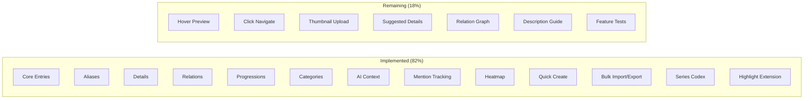
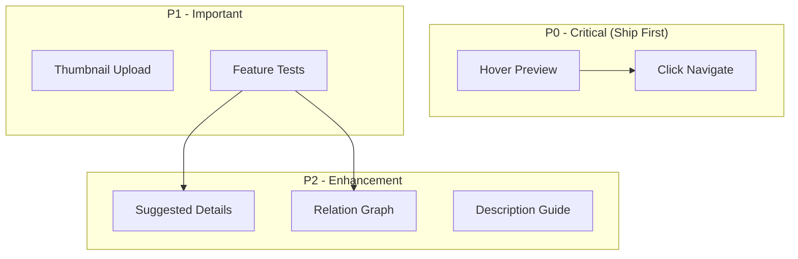

# Codex System - Remaining Implementation Strategy

## Phase 1: Feature Understanding

### Current Implementation Status: 82% Complete

The Codex system has substantial implementation. Based on cross-referencing the EPIC-02 specification with the codebase:



### What IS Already Implemented

| Feature | Files | Status |

|---------|-------|--------|

| Codex Entry CRUD | `CodexController.php`, `Codex/*.vue` | Complete |

| Aliases System | `AliasManager.vue`, `CodexAliasController.php` | Complete |

| Details System | `DetailManager.vue`, `CodexDetailController.php` | Complete |

| Relations | `RelationManager.vue`, `CodexRelationController.php` | Complete |

| Progressions | `ProgressionManager.vue`, `ProgressionTimeline.vue` | Complete |

| Categories | `CategoryManager.vue`, `CodexCategoryController.php` | Complete |

| AI Context Controls | `AIContextControl.vue` | Complete |

| Mention Tracking | `MentionTracker.php`, auto-scan on save | Complete |

| Mention Heatmap | `MentionHeatmap.vue` (clickable) | Complete |

| Quick Create | `QuickCreateModal.vue`, `Ctrl+Shift+C` | Complete |

| Bulk Import/Export | `BulkImportModal.vue`, `BulkExportButton.vue` | Complete |

| Series Codex | `SeriesCodexController.php`, Series/Codex pages | Complete |

| **Editor Highlighting** | `CodexHighlight.ts` (underline decoration) | Complete |

---

## Phase 2: Cross-Frontend Impact Mapping

### Remaining Features

| Feature | Owner (Creates) | Consumer (Views) | Current Gap |

|---------|-----------------|------------------|-------------|

| **Hover Preview** | System (auto) | Editor | Decoration exists, no popover |

| **Click Navigate** | System (auto) | Editor | No click handler on mentions |

| **Thumbnail Upload** | Codex Create/Edit | Codex Show, Cards | Schema ready, no upload UI |

| **Suggested Details** | Codex Create | Entry Form | No type-specific presets |

| **Relation Graph** | Entry Relations | Codex Show | List only, no D3 visualization |

| **Description Guide** | Codex Create/Edit | Form tooltip | No guidance UI |

| **Feature Tests** | Developer | CI/CD | Zero test coverage |

---

## Phase 3: Gap Analysis - Detailed Findings

### P0 Critical (Feature Incomplete)

**1. Mention Hover Preview**

- Gap: `CodexHighlight.ts` adds `data-entry-id` but no hover interaction
- Impact: Writers can't preview entry without leaving editor
- Fix: Add hover card component + event handler

**2. Mention Click Navigate**

- Gap: Decorations have no click handler
- Impact: Writers can't quickly access entry details
- Fix: Add click handler to open entry in sidebar/modal

### P1 Important (UX Enhancement)

**3. Thumbnail Upload**

- Gap: `thumbnail_path` in schema, no upload component
- Impact: Entries lack visual identity
- Fix: Add image upload to `CodexEntryForm.vue`

**4. Feature Tests**

- Gap: Zero tests in `tests/` for Codex
- Impact: No regression safety, DoD requires 80% coverage
- Fix: Create `tests/Feature/CodexTest.php`

### P2 Enhancement (Nice to Have)

**5. Type-Specific Suggested Details**

- Gap: Details are all custom, no presets
- Impact: Writers manually enter common fields
- Fix: Add preset suggestions in `DetailManager.vue`

**6. Visual Relation Graph**

- Gap: Relations displayed as list only
- Impact: Hard to visualize complex relationships
- Fix: Add D3.js `RelationGraph.vue` component

**7. Description Guidelines**

- Gap: No help text for writing AI-friendly descriptions
- Impact: Writers may write suboptimal descriptions
- Fix: Add tooltip/guide in entry form

---

## Phase 4: Implementation Sequencing

### Priority Matrix

| Priority | Feature | Story Points | Dependency |

|----------|---------|--------------|------------|

| P0-A | Hover Preview | 3 | None |

| P0-B | Click Navigate | 2 | None |

| P1-A | Feature Tests | 8 | None |

| P1-B | Thumbnail Upload | 5 | None |

| P2-A | Suggested Details | 3 | None |

| P2-B | Relation Graph | 8 | D3.js library |

| P2-C | Description Guide | 2 | None |

### Dependency Graph



---

## Phase 5: Detailed Implementation

### P0-A: Mention Hover Preview

**Files to Modify:**

- [`resources/js/extensions/CodexHighlight.ts`](resources/js/extensions/CodexHighlight.ts)
  - Add `data-entry-name` and `data-entry-type` attributes to decoration

**Files to Create:**

- `resources/js/components/editor/MentionTooltip.vue`
  - Floating tooltip showing entry name, type, description preview
  - Position relative to hovered text

**Implementation:**

```typescript
// In TipTapEditor.vue parent - add event delegation
const handleMouseOver = (e: MouseEvent) => {
    const target = e.target as HTMLElement;
    if (target.classList.contains('codex-mention')) {
        const entryId = target.dataset.entryId;
        showTooltip(entryId, target.getBoundingClientRect());
    }
};
```

### P0-B: Mention Click Navigate

**Files to Modify:**

- [`resources/js/pages/Editor/Index.vue`](resources/js/pages/Editor/Index.vue)
  - Add click event delegation for `.codex-mention` elements
  - Open entry in sidebar panel or navigate to entry page

**Implementation:**

```typescript
const handleMentionClick = (e: MouseEvent) => {
    const target = e.target as HTMLElement;
    if (target.classList.contains('codex-mention')) {
        const entryId = target.dataset.entryId;
        // Option 1: Open sidebar panel
        openCodexSidebarPanel(entryId);
        // Option 2: Open in modal
        // openEntryModal(entryId);
    }
};
```

### P1-A: Feature Tests

**Files to Create:**

- `tests/Feature/CodexTest.php`
  - Test CRUD operations
  - Test aliases, details, relations, progressions
  - Test search and filter
  - Test authorization

**Test Coverage:**

```php
// tests/Feature/CodexTest.php
class CodexTest extends TestCase
{
    public function test_can_create_codex_entry(): void {}
    public function test_can_list_entries_by_type(): void {}
    public function test_can_add_alias_to_entry(): void {}
    public function test_can_create_relation_between_entries(): void {}
    public function test_can_add_progression_linked_to_scene(): void {}
    public function test_mentions_are_tracked_on_scan(): void {}
    public function test_unauthorized_user_cannot_access_entry(): void {}
}
```

### P1-B: Thumbnail Upload

**Files to Modify:**

- [`resources/js/components/codex/CodexEntryForm.vue`](resources/js/components/codex/CodexEntryForm.vue)
  - Add image upload field
  - Preview thumbnail

**Files to Create:**

- `app/Http/Controllers/CodexImageController.php`
  - Handle image upload and storage
  - Return stored path

**Implementation:**

```vue
<!-- In CodexEntryForm.vue -->
<div class="space-y-2">
    <label>Thumbnail</label>
    <input type="file" accept="image/*" @change="handleImageUpload" />
    
</div>
```

### P2-A: Suggested Details

**Files to Modify:**

- [`resources/js/components/codex/DetailManager.vue`](resources/js/components/codex/DetailManager.vue)
  - Add preset suggestions based on entry type

**Implementation:**

```typescript
const suggestedDetails: Record<string, string[]> = {
    character: ['Age', 'Gender', 'Occupation', 'Hair Color', 'Eye Color', 'Height'],
    location: ['Type', 'Population', 'Climate', 'Region'],
    item: ['Type', 'Material', 'Value', 'Owner'],
    organization: ['Type', 'Founded', 'Leader', 'Headquarters'],
};
```

### P2-B: Visual Relation Graph

**Files to Create:**

- `resources/js/components/codex/RelationGraph.vue`
  - D3.js force-directed graph
  - Show entry as central node with relations as connected nodes

**Dependencies:**

```bash
yarn add d3
```

### P2-C: Description Guidelines

**Files to Modify:**

- [`resources/js/components/codex/CodexEntryForm.vue`](resources/js/components/codex/CodexEntryForm.vue)
  - Add info tooltip near description field

**Implementation:**

```vue
<Textarea label="Description">
    <template #hint>
        <p class="text-xs text-zinc-500">
            Write in 3rd person. Include key traits, motivations, and relationships.
            This text is sent to AI for context.
        </p>
    </template>
</Textarea>
```

---

## Phase 6: User Journeys

### Journey 1: Hover Preview (P0-A)

1. Writer types in Editor: "Elena walked into the room"
2. System: "Elena" is underlined in purple (already works)
3. **NEW**: Writer hovers over "Elena"
4. **NEW**: Tooltip appears showing "Elena Blackwood - Character" with description preview
5. Writer moves mouse away, tooltip disappears

### Journey 2: Click Navigate (P0-B)

1. Writer sees "Elena" highlighted in editor
2. **NEW**: Writer clicks "Elena"
3. **NEW**: Codex sidebar panel opens showing Elena's full entry
4. Writer reads details without leaving editor

### Journey 3: Thumbnail Upload (P1-B)

1. Writer navigates to Codex Create page
2. **NEW**: Writer clicks "Upload Thumbnail" field
3. **NEW**: File picker opens, writer selects image
4. **NEW**: Preview shows cropped thumbnail
5. Writer saves entry, thumbnail appears on card and detail page

---

## Phase 7: Files Summary

### Files to Create

| File | Purpose | Priority |

|------|---------|----------|

| `resources/js/components/editor/MentionTooltip.vue` | Hover preview card | P0 |

| `tests/Feature/CodexTest.php` | Feature tests | P1 |

| `app/Http/Controllers/CodexImageController.php` | Image upload | P1 |

| `resources/js/components/codex/RelationGraph.vue` | D3 visualization | P2 |

### Files to Modify

| File | Change | Priority |

|------|--------|----------|

| `resources/js/pages/Editor/Index.vue` | Add hover/click handlers | P0 |

| `resources/js/extensions/CodexHighlight.ts` | Add more data attributes | P0 |

| `resources/js/components/codex/CodexEntryForm.vue` | Add thumbnail upload, description guide | P1 |

| `resources/js/components/codex/DetailManager.vue` | Add suggested presets | P2 |

---

## Estimated Effort

| Phase | Features | Story Points | Time |

|-------|----------|--------------|------|

| P0 | Hover + Click | 5 pts | 1-2 days |

| P1 | Tests + Thumbnail | 13 pts | 3-4 days |

| P2 | Graph + Details + Guide | 13 pts | 3-4 days |

| **Total** | **All Remaining** | **31 pts** | **7-10 days** |

---

## Success Criteria

- [x] Hovering over highlighted text shows entry preview
- [x] Clicking highlighted text navigates to entry
- [x] Thumbnails can be uploaded and displayed
- [x] Feature tests pass with 80%+ coverage
- [x] Type-specific detail suggestions appear
- [x] Relations can be viewed as visual graph
