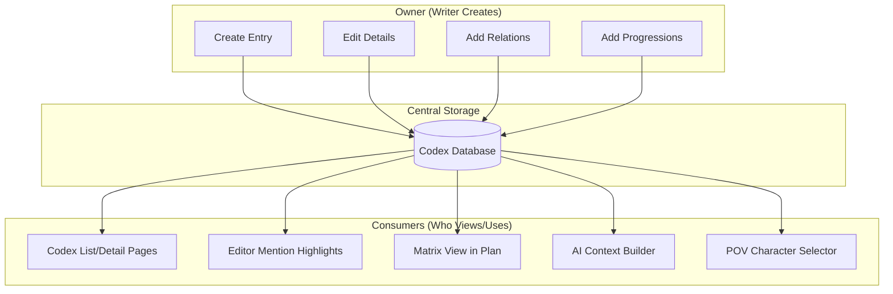
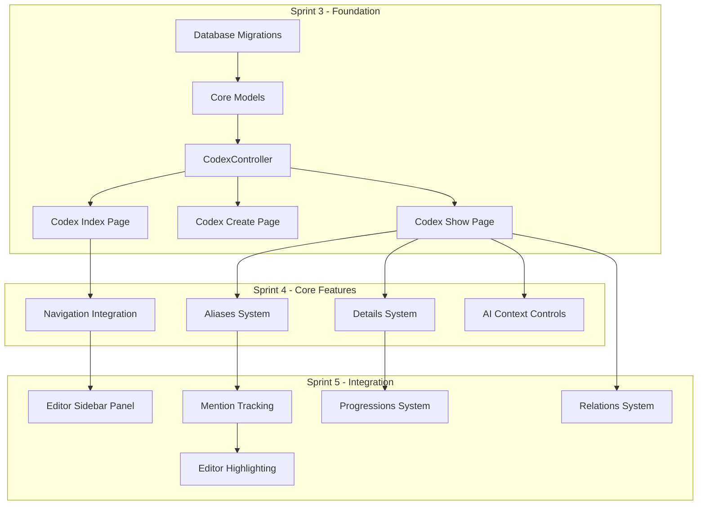

# EPIC-02: Codex System - Development Strategy

## Executive Summary

The Codex is the **central world-building database** for the novel writing app. It stores characters, locations, items, lore, organizations, and subplots with aliases, details, relations, and progressions. The system integrates with AI for context awareness and the Editor for mention highlighting.

---

## Phase 1: Feature Understanding

### What Data is Being Created/Managed?

| Data Type | Description | Example |

|-----------|-------------|---------|

| **Codex Entry** | Core story element | "Elena Blackwood" (Character) |

| **Aliases** | Alternate names | "Elena", "The Duchess", "E" |

| **Details** | Key-value attributes | Age: 34, Hair: Black |

| **Relations** | Connections between entries | Elena --"mother of"--> Marcus |

| **Progressions** | Timeline changes | "Chapter 5: Elena learns magic" |

| **Categories** | Custom groupings | "Main Characters", "Villains" |

| **Mentions** | Where entries appear | Scene 3 (5 mentions) |

### Data Flow Diagram



---

## Phase 2: Cross-Frontend Impact Mapping

| Feature | Owner (Who Creates) | Consumer (Who Views) | Data Flow |

|---------|---------------------|---------------------|-----------|

| **Codex Entries** | Codex Create/Edit Page | Codex List, Editor sidebar, Plan Matrix | Create -> Store -> Display |

| **Aliases** | Codex Entry Detail | Editor (mention detection), Search | Create -> Store -> Match text |

| **Details** | Codex Entry Detail | Codex Detail, AI Context | Create -> Store -> Display/AI |

| **Relations** | Codex Entry Detail | Relation Graph, both entries | Create -> Store -> Both entries |

| **Progressions** | Codex Entry Detail | Timeline view, AI (contextual) | Create -> Store -> Scene-aware display |

| **Mentions** | System (auto-detected) | Entry Detail, Plan Matrix | Scan text -> Store -> Display |

| **Categories** | Codex Settings | Codex List filters | Create -> Store -> Filter |

| **AI Context** | Entry settings | AI generation calls | Set mode -> Filter -> Include/exclude |

---

## Phase 3: Missing Implementation Detection

### Owner Side (Data Creation) Checklist

**Core Entry Management:**

- [x] UI form for creating entries (specified in US-02.2)
- [x] Validation rules (name/type required)
- [x] Edit/Update capability (US-02.2)
- [x] Delete/Archive capability (soft delete)
- [ ] **MISSING: Preview entry before publishing** (not critical, add as enhancement)
- [ ] **MISSING: Bulk entry import from text/CSV** (useful for migration)

**Aliases Management:**

- [x] Add multiple aliases (US-02.6)
- [x] Remove individual aliases
- [ ] **MISSING: Bulk alias suggestions from text analysis**

**Relations Management:**

- [x] Create relations (US-02.11)
- [x] Bidirectional option
- [ ] **MISSING: Relation type presets per entry type** (e.g., Character has "parent_of", "sibling_of")

**Progressions Management:**

- [x] Create progression linked to scene (US-02.12)
- [x] Edit/delete progressions
- [ ] **MISSING: Scene picker UI for linking progressions**

### Consumer Side (Data Display) Checklist

**Codex List Page:**

- [x] Where users FIND entries (Codex Index page)
- [x] Search/filter functionality (US-02.5.3)
- [x] Grid view with cards (US-02.4)
- [ ] **MISSING: Mobile-optimized list view** (only grid mentioned)

**Codex Detail Page:**

- [x] Structured layout (US-02.3)
- [x] All sections: description, aliases, details, relations, progressions
- [ ] **MISSING: Breadcrumb navigation back to list**

**Editor Integration:**

- [x] Mention highlighting (US-02.8)
- [x] Hover preview, click to open
- [ ] **MISSING: Codex sidebar panel in Editor** (only mentioned in US-02.4 "Sidebar integration")
- [ ] **MISSING: Quick-create entry from selected text**
- [ ] **MISSING: POV character selector using Codex** (Scene has pov_character_id but no UI)

**Plan Integration:**

- [x] Matrix view columns from Codex (EPIC-03 US-03.4)
- [ ] **MISSING: POV character filter in Plan** (filter scenes by POV)

**AI Integration:**

- [x] Context modes (US-02.15)
- [ ] **MISSING: Visual preview of what AI receives** (mentioned but not detailed)

### Integration Points Checklist

**Backend:**

- [ ] API endpoints (specified)
- [ ] Database schema (specified)
- [ ] Services: CodexService, MentionTracker, RelationManager

**Frontend:**

- [ ] **MISSING: Navigation menu item for Codex** (need to add to EditorSidebar or main nav)
- [ ] **MISSING: Codex icon in editor toolbar** (quick access)
- [ ] Routes for Codex pages

---

## Phase 4: Gap Analysis - Critical Findings

### Critical Gaps (Feature Unusable Without)

| Gap | Impact | Recommendation |

|-----|--------|----------------|

| **No navigation to Codex from Editor** | Users can't access Codex while writing | Add Codex tab to EditorSidebar |

| **No POV character selector in Editor** | Scene metadata shows `pov_character_id` but no picker | Add CodexEntryPicker component |

| **No mention detection trigger** | System won't know when to scan | Add background job on scene save |

### Important Gaps (Feature Incomplete Without)

| Gap | Impact | Recommendation |

|-----|--------|----------------|

| **No Codex panel in Editor** | Writers must leave editor to view entries | Add slide-out panel |

| **No quick-create from text** | Tedious entry creation workflow | Add "Create entry from selection" action |

| **No scene picker for progressions** | Hard to link progression to story point | Add scene/chapter dropdown |

### UI/UX Gaps

| Gap | Impact | Recommendation |

|-----|--------|----------------|

| **Mobile Codex list** | Grid view may be cramped | Add compact list view option |

| **Relation graph visualization** | Complex UI needed | Use D3.js or vis-network |

| **Progression timeline** | Timeline view mentioned but not detailed | Design timeline component |

---

## Phase 5: Implementation Sequencing

### Priority Matrix

**P0 - Critical (Must Ship):**

1. Database migrations (all tables)
2. Core models (CodexEntry, CodexAlias, CodexDetail)
3. CodexController with CRUD
4. Codex Index page (list view)
5. Codex Create/Edit page
6. Codex Show page (detail view)
7. Aliases system
8. Navigation integration
9. AI context controls

**P1 - Important (Feature Incomplete Without):**

1. Relations system with graph
2. Progressions system
3. Mention tracking
4. Editor mention highlighting
5. Editor Codex sidebar panel
6. Categories system
7. Search and filter

**P2 - Enhancement (Can Ship Later):**

1. Auto-detection of mentions
2. Quick create from text
3. Series Codex (shared)
4. Bulk import/export
5. Timeline view for progressions

### Dependency Graph



---

## Phase 6: Detailed Recommendations

### New Pages/Routes Needed

| Page | Route | Purpose | Priority |

|------|-------|---------|----------|

| Codex Index | `GET /novels/{novel}/codex` | List all entries | P0 |

| Codex Create | `GET /novels/{novel}/codex/create` | Create new entry | P0 |

| Codex Show | `GET /codex/{entry}` | View entry details | P0 |

| Codex Edit | `GET /codex/{entry}/edit` | Edit entry | P0 |

| Categories Manage | `GET /novels/{novel}/codex/categories` | Manage categories | P1 |

### Updates to Existing Pages

| Page | Add | Location | Priority |

|------|-----|----------|----------|

| `Editor/Index.vue` | Codex sidebar tab | EditorSidebar | P0 |

| `Editor/Index.vue` | Mention highlighting | TipTapEditor | P1 |

| `Editor/Index.vue` | POV character picker | SceneMetadataPanel | P1 |

| `Plan/Index.vue` | Matrix view with Codex | New view component | P1 |

| `Plan/Index.vue` | POV filter | SearchFilter | P2 |

### Navigation/Menu Changes

| Location | Add Item | Parent | Priority |

|----------|----------|--------|----------|

| EditorSidebar | "Codex" tab | Tab bar at top | P0 |

| Novel header | "Codex" link | Novel navigation | P0 |

| Dashboard | "Codex" badge on NovelCard | Card footer | P2 |

### New Components Needed

**Core Components (P0):**

- `Codex/CodexEntryCard.vue` - Card for list view
- `Codex/CodexEntryForm.vue` - Create/edit form
- `Codex/CodexTypeIcon.vue` - Type icons (character, location, etc.)
- `Codex/CodexTypeBadge.vue` - Type badge with color

**Detail Components (P0):**

- `Codex/AliasManager.vue` - Add/remove aliases
- `Codex/CodexDetailList.vue` - Key-value details table
- `Codex/CodexDetailForm.vue` - Add/edit detail

**Relation Components (P1):**

- `Codex/CodexRelationList.vue` - List of relations
- `Codex/CodexRelationForm.vue` - Add relation
- `Codex/CodexRelationGraph.vue` - Visual graph (D3.js)

**Progression Components (P1):**

- `Codex/CodexProgressionList.vue` - Timeline list
- `Codex/CodexProgressionForm.vue` - Add progression

**Integration Components (P1):**

- `Codex/AIContextControl.vue` - Context mode selector
- `Codex/MentionsList.vue` - Where entry appears
- `Editor/CodexSidebarPanel.vue` - Sidebar in editor
- `Editor/MentionHighlight.vue` - TipTap extension

**Utility Components (P1):**

- `Codex/CodexEntryPicker.vue` - Select entry (for relations, POV)
- `Codex/CodexCategoryTree.vue` - Category hierarchy
- `Codex/CodexSearch.vue` - Search with filters

---

## Phase 7: Example User Journeys

### Journey 1: Create a Character Entry (P0)

**Owner Journey:**

1. User navigates to: `/novels/1/codex` (Codex Index)
2. User clicks: "+ New Entry" button
3. User selects type: "Character" from dropdown
4. User fills: Name, Description (rich text), uploads thumbnail
5. User clicks: "Save Entry"
6. System: Creates entry, redirects to detail page
7. User sees: Entry detail with empty aliases, details, relations

**Consumer Journey (Editor):**

1. User navigates to: `/novels/1/write/5` (Editor)
2. User types: "Elena walked into the room"
3. System: Detects "Elena" as alias match
4. User sees: "Elena" highlighted in purple (Character color)
5. User hovers: Mini card shows "Elena Blackwood - Character"
6. User clicks: Slide-out panel shows full entry

### Journey 2: Add Character Relation (P1)

**Owner Journey:**

1. User navigates to: Entry detail page for "Elena"
2. User scrolls to: Relations section
3. User clicks: "+ Add Relation"
4. User selects: Target entry "Marcus" from picker
5. User sets: Relation type "Mother of"
6. User toggles: Bidirectional ON (creates "Son of" reverse)
7. User clicks: "Save"
8. System: Creates relation, updates both entries

**Consumer Journey:**

1. User views: Elena's entry detail
2. User sees: Relations section shows "Mother of Marcus"
3. User clicks: "Marcus" link
4. User sees: Marcus's entry with "Son of Elena"
5. User clicks: "View Graph"
6. User sees: Visual graph showing family tree

### Journey 3: Track Character Progression (P1)

**Owner Journey:**

1. User navigates to: Entry detail for "Elena"
2. User scrolls to: Progressions section
3. User clicks: "+ Add Progression"
4. User selects: Scene/Chapter dropdown -> "Chapter 5: The Revelation"
5. User types: "Elena discovers she has magical powers"
6. User optionally sets: Story timestamp "Year 1, Day 45"
7. User clicks: "Save"

**Consumer Journey (AI Context):**

1. User writes: Scene in Chapter 7
2. System: Builds AI context
3. System: Includes progressions UP TO Chapter 7
4. AI receives: "Elena discovered magical powers (Chapter 5)"
5. AI generates: Text aware of Elena's abilities

---

## Backend Implementation Summary

### Models to Create

```
app/Models/
├── CodexEntry.php
├── CodexAlias.php
├── CodexDetail.php
├── CodexRelation.php
├── CodexProgression.php
├── CodexCategory.php
└── CodexMention.php
```

### Services to Create

```
app/Services/Codex/
├── CodexService.php          # Core CRUD operations
├── MentionTracker.php        # Scan text for mentions
├── RelationManager.php       # Handle bidirectional relations
├── ProgressionManager.php    # Timeline-aware progressions
└── AIContextBuilder.php      # Build context for AI calls
```

### Key Model Relationships

- `Novel hasMany CodexEntry`
- `CodexEntry hasMany Alias, Detail, Relation, Progression, Mention`
- `CodexEntry belongsToMany Category`
- `CodexMention belongsTo Scene`
- `CodexProgression belongsTo Scene (optional)`

---

## Frontend Implementation Summary

### Pages Structure

```
resources/js/Pages/Codex/
├── Index.vue      # List all entries with filters
├── Create.vue     # Create new entry form
├── Show.vue       # Entry detail view
└── Edit.vue       # Edit entry form
```

### Component Structure

```
resources/js/Components/Codex/
├── Core/
│   ├── CodexEntryCard.vue
│   ├── CodexEntryForm.vue
│   ├── CodexTypeIcon.vue
│   └── CodexTypeBadge.vue
├── Details/
│   ├── AliasManager.vue
│   ├── CodexDetailList.vue
│   └── CodexDetailForm.vue
├── Relations/
│   ├── CodexRelationList.vue
│   ├── CodexRelationForm.vue
│   └── CodexRelationGraph.vue
├── Progressions/
│   ├── CodexProgressionList.vue
│   └── CodexProgressionForm.vue
├── AI/
│   ├── AIContextControl.vue
│   └── AIContextPreview.vue
├── Navigation/
│   ├── CodexSidebar.vue
│   └── CodexSearch.vue
└── Utility/
    ├── CodexEntryPicker.vue
    ├── CodexCategoryTree.vue
    └── MentionsList.vue
```

---

## Risk Mitigation

| Risk | Mitigation Strategy |

|------|---------------------|

| Mention detection performance | Use background jobs, cache results, debounce |

| Large Codex (100+ entries) | Virtual scrolling, pagination, lazy load |

| Complex relation graphs | Limit visible nodes, use D3.js with zoom |

| Progression complexity | Clear UI with scene picker, timeline view |

| Mobile UX | Responsive design, simplified mobile views |

---

## Success Metrics

- [ ] Writer can create 6 entry types
- [ ] Aliases detected in editor within 500ms
- [ ] Relations display on both entries
- [ ] AI context includes relevant entries
- [ ] Search returns results under 200ms
- [ ] Mobile users can browse and create entries
