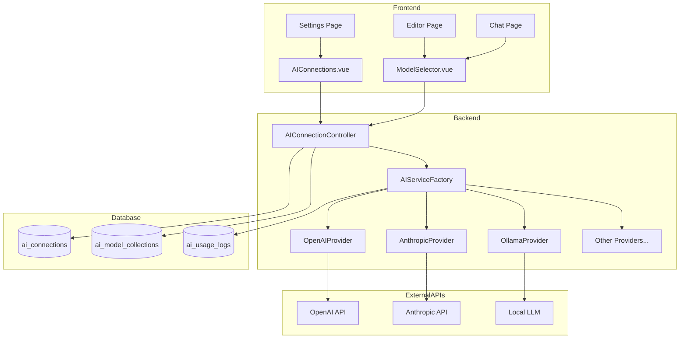

# EPIC-01: AI Connections Development Strategy

## Phase 1: Feature Understanding

### Data Model Summary

- **AI Connections**: Provider configurations with encrypted API keys (user-owned)
- **AI Model Collections**: Favorite model groupings (user-owned)
- **AI Usage Logs**: Token/cost tracking per request (system-generated)

### Primary User Goal

Connect personal AI providers (OpenAI, Anthropic, etc.) with secure API key storage, select preferred models, and monitor usage/costs.

---

## Phase 2: Cross-Frontend Impact Mapping

| Feature | Owner (Creates) | Consumer (Uses) | Data Flow |

|---------|-----------------|-----------------|-----------|

| Provider Connections | Settings/AIConnections | Settings + ModelSelector (everywhere) | Create -> Store -> Use in AI calls |

| Model Selection UI | Settings (defaults) + In-context | Editor, Chat, Prompts | Select -> Apply to feature |

| Model Collections | Settings/Collections | ModelSelector dropdown | Create -> Filter available models |

| Connection Test | Settings (inline button) | N/A (immediate) | Test -> Validate -> Feedback |

| Usage Tracking | Automatic (AI service) | Settings/Usage | Log -> Aggregate -> Display |

---

## Phase 3: Implementation Checklist

### Owner Side (Data Creation) 

- [x] UI for adding connection (spec: `AIConnectionForm.vue`)
- [x] Validation rules (spec: `StoreAIConnectionRequest.php`)
- [x] Edit/Update capability (PATCH endpoint)
- [x] Delete capability (DELETE endpoint)
- [ ] **MISSING**: Bulk operations (e.g., test all connections)
- [ ] **MISSING**: Import/Export connections backup

### Consumer Side (Data Display)

- [x] Settings page with connections list (spec defined)
- [x] Model selector dropdown (spec: `ModelSelector.vue`)
- [ ] **GAP**: Where exactly ModelSelector appears in Editor/Chat not specified
- [ ] **GAP**: Empty state when no connections configured
- [ ] **GAP**: First-time onboarding flow for AI setup
- [x] Loading states (connection testing spinner)
- [x] Mobile responsive design mentioned

### Integration Points

- [x] API endpoints defined (13 endpoints)
- [x] Database schema defined (3 tables)
- [ ] **MISSING**: Navigation update (user menu needs "AI Settings" link)
- [ ] **MISSING**: Global state for current model selection
- [ ] **MISSING**: Real-time updates if connection status changes

---

## Phase 4: Gap Analysis

### Critical Gaps (Features Unusable Without)

1. **ModelSelector Integration Location**

   - Spec defines `ModelSelector.vue` component
   - **GAP**: No specification for WHERE it appears in Editor, Chat pages
   - **Recommendation**: Add ModelSelector to EditorToolbar.vue for scene-level AI selection

2. **Navigation Access**

   - Current: User menu only shows "Profile Settings"
   - **GAP**: No path to AI Connections settings
   - **Recommendation**: Add "AI Settings" link to user dropdown menu

3. **Empty State Flow**

   - **GAP**: What happens when user has no AI connections but tries to use AI?
   - **Recommendation**: Show inline prompt to "Connect an AI provider" with link to settings

### Important Gaps (Feature Incomplete Without)

4. **Per-Feature Model Override**

   - Spec mentions "Per-prompt model override"
   - **GAP**: UI for this override not detailed
   - **Recommendation**: Add model dropdown next to AI action buttons

5. **CORS Configuration Guidance**

   - Spec mentions CORS guidance for Ollama/LM Studio
   - **GAP**: No UI for displaying setup instructions
   - **Recommendation**: Add collapsible help section in local LLM connection forms

6. **Connection Health Monitoring**

   - Spec mentions "Connection health indicators"
   - **GAP**: Passive monitoring vs manual test not specified
   - **Recommendation**: Test on page load + show last-tested timestamp

---

## Phase 5: Implementation Sequencing

### Dependency Order

```
┌────────────────────────────────────────────────────────────────┐
│                        SPRINT 3 (Core)                         │
├────────────────────────────────────────────────────────────────┤
│  PARALLEL TRACK A          │  PARALLEL TRACK B                 │
│  (Backend Services)        │  (Frontend UI)                    │
│                            │                                   │
│  1. Database migrations    │  1. Settings page route/layout    │
│  2. AIConnection model     │  2. AIConnections.vue page        │
│  3. AIServiceInterface     │  3. AIConnectionCard.vue          │
│  4. OpenAIService          │  4. AIConnectionForm.vue          │
│  5. AnthropicService       │  5. ConnectionStatus.vue          │
│  6. AIConnectionController │  6. Navigation menu update        │
│                            │                                   │
│  SEQUENTIAL (After Both)   │                                   │
│  7. Connection Test API    │                                   │
│  8. Models fetch endpoint  │                                   │
└────────────────────────────────────────────────────────────────┘

┌────────────────────────────────────────────────────────────────┐
│                    SPRINT 3 Part 2 (Extended)                  │
├────────────────────────────────────────────────────────────────┤
│  SEQUENTIAL                                                    │
│  9. OpenRouterService                                          │
│  10. OllamaService (local LLM)                                 │
│  11. ModelSelector.vue component                               │
│  12. ModelSelector integration in EditorToolbar                │
└────────────────────────────────────────────────────────────────┘

┌────────────────────────────────────────────────────────────────┐
│                        SPRINT 4 (Enhanced)                     │
├────────────────────────────────────────────────────────────────┤
│  PARALLEL                                                      │
│  13. GroqService                                               │
│  14. LMStudioService                                           │
│  15. OpenAICompatibleService                                   │
│  16. Model Collections UI                                      │
│  17. Usage tracking (AIUsageLog)                               │
│  18. Usage dashboard page                                      │
└────────────────────────────────────────────────────────────────┘
```

### Priority Matrix

| ID | Feature | Priority | Reason |

|----|---------|----------|--------|

| F-01.1.1 | OpenAI Connection | P0 | Most common provider |

| F-01.1.2 | Anthropic Connection | P0 | Second most popular |

| F-01.3.1 | API Key Encryption | P0 | Security requirement |

| F-01.3.2 | Connection Test | P0 | Usability requirement |

| F-01.3.3 | Settings Page UI | P0 | Entry point for all AI config |

| F-01.2.1 | Model Selection UI | P0 | Required to use AI |

| F-01.1.3 | OpenRouter Connection | P1 | Multi-provider access |

| F-01.1.4 | Ollama (Local) | P1 | Privacy-conscious users |

| F-01.1.5 | Groq | P1 | Fast inference option |

| F-01.1.6 | LM Studio | P1 | Local alternative |

| F-01.2.2 | Model Collections | P1 | Power user feature |

| F-01.1.7 | OpenAI Compatible | P2 | Advanced users |

| F-01.2.3 | Manage AI Models List | P2 | Enhancement |

| F-01.3.4 | Usage & Cost Tracking | P2 | Nice to have |

---

## Phase 6: Detailed Recommendations

### New Pages/Routes Needed

| Page | Purpose | Route | Priority |

|------|---------|-------|----------|

| Settings/Index.vue | Settings hub with tabs | `/settings` | P0 |

| Settings/AIConnections.vue | Manage AI providers | `/settings/ai` | P0 |

| Settings/Usage.vue | Usage statistics | `/settings/usage` | P2 |

### Updates to Existing Pages

| Page | Change | Location | Priority |

|------|--------|----------|----------|

| AuthenticatedLayout.vue | Add "AI Settings" to user menu | User dropdown | P0 |

| Editor/Index.vue | Add ModelSelector | EditorToolbar or sidebar | P1 |

| (Future) Chat page | Add ModelSelector | Chat header | P1 |

### Navigation/Menu Changes

| Frontend | Add Item | Parent | Priority |

|----------|----------|--------|----------|

| AuthenticatedLayout | "AI Settings" link | User dropdown menu | P0 |

| AuthenticatedLayout | "Settings" nav item | Main nav (optional) | P2 |

### New Components

| Component | Used By | Priority |

|-----------|---------|----------|

| AIConnectionCard.vue | Settings/AIConnections | P0 |

| AIConnectionForm.vue | Settings/AIConnections | P0 |

| ConnectionStatus.vue | AIConnectionCard | P0 |

| ModelSelector.vue | Editor, Chat, Prompts | P0 |

| ModelCollectionManager.vue | Settings | P1 |

| UsageDashboard.vue | Settings/Usage | P2 |

### Backend Structure

```
app/
├── Services/
│   └── AI/
│       ├── Contracts/
│       │   └── AIProviderInterface.php
│       ├── AIServiceFactory.php
│       ├── Providers/
│       │   ├── OpenAIProvider.php
│       │   ├── AnthropicProvider.php
│       │   ├── OpenRouterProvider.php
│       │   ├── OllamaProvider.php
│       │   ├── GroqProvider.php
│       │   ├── LMStudioProvider.php
│       │   └── OpenAICompatibleProvider.php
│       └── UsageTracker.php
├── Models/
│   ├── AIConnection.php
│   ├── AIModelCollection.php
│   └── AIUsageLog.php
├── Http/
│   ├── Controllers/
│   │   ├── SettingsController.php
│   │   └── AIConnectionController.php
│   └── Requests/
│       ├── StoreAIConnectionRequest.php
│       └── UpdateAIConnectionRequest.php
```

---

## Phase 7: Example User Journeys

### Journey 1: First-Time AI Setup (P0)

**Owner Journey:**

1. User clicks avatar -> "AI Settings" from dropdown
2. User lands on empty Settings/AIConnections page
3. User clicks "Add Connection" button
4. User selects "OpenAI" from provider list
5. User enters API key, optionally names it ("My OpenAI")
6. User clicks "Test Connection" -> sees spinner -> success message with "15 models available"
7. User clicks "Save" -> redirected to connections list
8. Connection card shows green status indicator

**Consumer Journey (later in Editor):**

1. User opens Editor for a novel
2. User sees ModelSelector in toolbar showing "GPT-4o" (default)
3. User can click to change model if needed
4. When using AI feature, selected model is used

### Journey 2: Adding Local LLM (P1)

**Owner Journey:**

1. User navigates to AI Settings
2. User clicks "Add Connection" -> selects "Ollama"
3. Form shows URL field (pre-filled with `http://localhost:11434`)
4. Collapsible "Setup Guide" section explains CORS config
5. User clicks "Test Connection"
6. If success: shows locally installed models (llama2, codellama, etc.)
7. If failed: shows error with troubleshooting tips
8. User saves connection

### Journey 3: Viewing Usage Stats (P2)

**Consumer Journey:**

1. User navigates to Settings -> Usage tab
2. User sees dashboard with:

   - Total tokens this month: 150,000
   - Estimated cost: $3.45
   - Chart showing daily usage
   - Breakdown by provider

3. User can export to CSV
4. User can filter by date range

---

## Architecture Diagram



---

## Risks and Mitigations

| Risk | Impact | Mitigation |

|------|--------|------------|

| API key exposed to frontend | Critical | Never send decrypted key to frontend, only masked version |

| Provider API changes | High | Use interface pattern, version-specific handling |

| CORS issues with local LLMs | Medium | Provide detailed setup documentation in UI |

| Rate limiting | Medium | Implement retry with exponential backoff |

---

## Recommended Sprint 3 Scope

Focus on **P0 features only** to deliver a working AI connection system:

1. Database migrations (3 tables)
2. AIConnection model with encryption
3. AIServiceInterface + OpenAIProvider + AnthropicProvider
4. AIConnectionController (CRUD + test)
5. Settings page with AI Connections tab
6. AIConnectionCard + AIConnectionForm components
7. ConnectionStatus component
8. Navigation menu update
9. Basic ModelSelector component
10. Feature tests for all endpoints

**Estimated Points:** 30-35 (aligns with spec's ~55 total for full epic)
