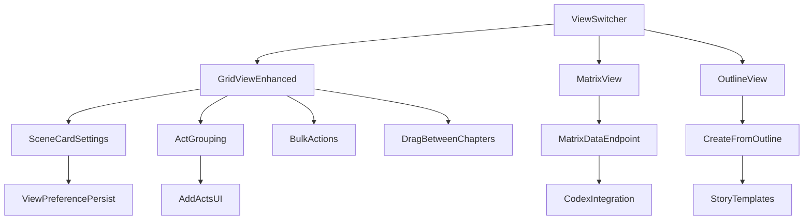

# EPIC-03: Story Planning - Development Strategy

## Phase 1: Feature Understanding

### Data Flow Analysis

| Feature | Owner (Creates) | Consumer (Views) | Data Flow |

|---------|-----------------|------------------|-----------|

| Plan Views | Writer (Plan Page) | Writer (Plan Page) | ViewState -> LocalStorage -> Display |

| Scene Cards | Writer (Editor/Plan) | Writer (Plan Page) | Scene -> API -> GridView/MatrixView/OutlineView |

| Scene Labels | Writer (Settings/Plan) | Writer (Plan/Editor) | Label -> DB -> Scene -> Display |

| Acts/Chapters | Writer (Plan) | Writer (Plan/Editor) | Structure -> DB -> Plan Views |

| Outline Import | Writer (Plan) | Writer (Plan) | Text -> Parser -> Structure -> DB |

| Story Templates | System/Writer | Writer (Plan) | Template -> Parser -> Structure |

| Matrix Data | Writer (Codex/Editor) | Writer (Matrix View) | Scene+Codex -> MatrixBuilder -> Display |

---

## Phase 2: Current Implementation Status

### Already Implemented (in `resources/js/pages/Plan/Index.vue`)

- Basic Grid View with scene cards grouped by chapters
- Search & filter by title, status, and labels
- Drag & drop reordering within chapters
- Scene card component with labels, status, word count
- Context menu for scenes and chapters
- Basic PlanController with search endpoint

### Key Files

- [resources/js/pages/Plan/Index.vue](resources/js/pages/Plan/Index.vue) - Main Plan page (Grid only)
- [resources/js/components/plan/SceneCard.vue](resources/js/components/plan/SceneCard.vue) - Scene card component
- [resources/js/components/plan/ChapterGroup.vue](resources/js/components/plan/ChapterGroup.vue) - Chapter grouping
- [resources/js/components/plan/SearchFilter.vue](resources/js/components/plan/SearchFilter.vue) - Search/filter
- [app/Http/Controllers/PlanController.php](app/Http/Controllers/PlanController.php) - Backend controller

---

## Phase 3: Missing Implementation Detection

### Owner Side (Missing)

- [ ] View Switcher UI (Grid/Matrix/Outline toggle)
- [ ] Scene Card Appearance Settings modal
- [ ] Add Act button and form
- [ ] Create from Outline modal and parser
- [ ] Story Templates selector
- [ ] Bulk selection mode
- [ ] POV character selector per scene

### Consumer Side (Missing)

- [ ] Matrix View component (scenes vs codex entries)
- [ ] Outline View component (hierarchical list)
- [ ] Timeline View component (optional, low priority)
- [ ] Scene card size customization display
- [ ] Act grouping display in Grid View

### Integration Points (Missing)

- [ ] `GET /api/novels/{novel}/plan/matrix` - Matrix data endpoint
- [ ] `POST /api/novels/{novel}/plan/from-outline` - Parse outline endpoint
- [ ] `GET /api/templates` - Story templates endpoint
- [ ] `POST /api/novels/{novel}/plan/bulk-action` - Bulk operations
- [ ] View preference persistence per novel
- [ ] Scene card settings persistence

---

## Phase 4: Gap Analysis

### Critical Gaps (Feature Unusable Without)

- **View Switcher**: Users cannot switch views without this
- **Matrix View**: Core feature from EPIC spec, depends on Codex (EPIC-02)
- **Outline View**: Core feature, relatively simple to implement

### Important Gaps (Feature Incomplete)

- **Scene Card Customization**: User cannot customize card display
- **Add Acts**: Cannot create hierarchical structure
- **Drag between chapters**: Currently only within-chapter drag works
- **POV Display**: Scene cards don't show POV character

### Enhancement Gaps (Can Ship Later)

- **Create from Outline**: Nice-to-have for importing
- **Story Templates**: Nice-to-have for new users
- **Timeline View**: Explicitly marked optional in spec
- **Bulk Actions**: Useful but not critical for MVP

---

## Phase 5: Implementation Sequencing

### Build Order (Dependencies)



### Priority Matrix

**P0 - Critical (Sprint 1)**

- View Switcher component
- Matrix View (basic)
- Outline View (basic)
- Matrix data API endpoint

**P1 - Important (Sprint 2)**

- Scene card appearance settings
- Act grouping in Grid View
- Add Acts/Chapters UI
- Drag & drop between chapters
- POV character display

**P2 - Enhancement (Sprint 3)**

- Create from Outline parser
- Story Templates
- Bulk Actions Menu
- View preferences persistence

---

## Phase 6: Detailed Recommendations

### New Components Needed

| Component | Location | Purpose | Priority |

|-----------|----------|---------|----------|

| `ViewSwitcher.vue` | `components/plan/` | Toggle Grid/Matrix/Outline | P0 |

| `MatrixView.vue` | `components/plan/` | Scenes vs Codex entries table | P0 |

| `OutlineView.vue` | `components/plan/` | Hierarchical outline list | P0 |

| `ActGroup.vue` | `components/plan/` | Group chapters by act | P1 |

| `SceneCardSettings.vue` | `components/plan/` | Card appearance modal | P1 |

| `CreateFromOutline.vue` | `components/plan/` | Outline import modal | P2 |

| `TemplateSelector.vue` | `components/plan/` | Story template picker | P2 |

| `BulkActionsMenu.vue` | `components/plan/` | Multi-select actions | P2 |

### Updates to Existing Components

| Component | Change | Priority |

|-----------|--------|----------|

| `Plan/Index.vue` | Add ViewSwitcher, conditional view rendering | P0 |

| `SceneCard.vue` | Add POV display, customizable fields | P1 |

| `ChapterGroup.vue` | Support cross-chapter drag | P1 |

| `SearchFilter.vue` | Add POV filter, Codex mention filter | P1 |

### Backend Endpoints Needed

| Method | Endpoint | Purpose | Priority |

|--------|----------|---------|----------|

| GET | `/api/novels/{novel}/plan/matrix` | Matrix view data | P0 |

| POST | `/api/novels/{novel}/scenes/reorder-across` | Cross-chapter reorder | P1 |

| POST | `/api/novels/{novel}/plan/from-outline` | Parse outline text | P2 |

| GET | `/api/templates` | List story templates | P2 |

| POST | `/api/novels/{novel}/plan/bulk-action` | Bulk operations | P2 |

| PATCH | `/api/novels/{novel}/plan-settings` | Save view preferences | P2 |

---

## Phase 7: Example User Journeys

### Journey 1: Using Matrix View (P0)

**Owner Journey (Setting up Matrix):**

1. User navigates to `/novels/{id}/plan`
2. User clicks "Matrix" in ViewSwitcher
3. System fetches matrix data from API
4. User sees scenes as rows, Codex entries as columns
5. User can click cells to navigate to scenes
6. User can change "Show" dropdown to filter by entry type

**Consumer Journey (Viewing Matrix):**

1. Matrix displays scenes with character/location columns
2. Cells show indicator dots where entries are mentioned
3. Hover reveals mention count and details
4. Click navigates to scene editor
5. Sticky headers allow scrolling large matrices

### Journey 2: Create from Outline (P2)

**Owner Journey:**

1. User clicks "Create from Outline" button
2. Modal opens with textarea and template dropdown
3. User pastes formatted outline or selects template
4. Preview panel shows parsed structure
5. User can edit structure before confirming
6. System creates acts/chapters/scenes
7. Plan view refreshes with new structure

### Journey 3: Scene Card Customization (P1)

**Owner Journey:**

1. User clicks appearance/settings icon in Plan header
2. Modal shows card customization options
3. User toggles: show summary, show POV, show word count
4. User selects card size: compact/normal/large
5. Settings persist to localStorage/novel settings
6. All scene cards update immediately

---

## Technical Architecture

### Frontend Component Structure

```
resources/js/
├── pages/
│   └── Plan/
│       └── Index.vue (enhanced)
├── components/
│   └── plan/
│       ├── ViewSwitcher.vue (NEW)
│       ├── GridView.vue (extract from Index)
│       ├── MatrixView.vue (NEW)
│       ├── OutlineView.vue (NEW)
│       ├── ActGroup.vue (NEW)
│       ├── ChapterGroup.vue (enhanced)
│       ├── SceneCard.vue (enhanced)
│       ├── SceneCardSettings.vue (NEW)
│       ├── CreateFromOutline.vue (NEW)
│       ├── TemplateSelector.vue (NEW)
│       ├── BulkActionsMenu.vue (NEW)
│       ├── SearchFilter.vue (enhanced)
│       └── PlanHeader.vue (NEW - extract header)
```

### Backend Service Structure

```
app/
├── Http/Controllers/
│   └── PlanController.php (enhanced)
├── Services/Plan/
│   ├── MatrixDataBuilder.php (NEW)
│   └── OutlineParser.php (NEW)
```

---

## Mobile UX Considerations

Per user requirements, mobile UX is critical:

- **Grid View**: 1 column on mobile, cards stack vertically
- **Matrix View**: Horizontal scroll with sticky first column, or pivot to vertical list on mobile
- **Outline View**: Natural fit for mobile, collapsible sections
- **View Switcher**: Bottom tab bar on mobile instead of header toggle
- **Drag & Drop**: Touch-friendly with long-press to drag
- **Scene Cards**: Compact mode default on mobile

---

## Definition of Done Checklist

- [ ] View Switcher allows toggle between Grid/Matrix/Outline
- [ ] Matrix View shows scenes vs Codex entries with mentions
- [ ] Outline View shows hierarchical collapsible structure
- [ ] Scene cards display POV character when set
- [ ] Card appearance is customizable (size, visible fields)
- [ ] Acts can be created and group chapters
- [ ] Drag & drop works between chapters
- [ ] Mobile responsive for all views
- [ ] Search includes Codex mention filtering
- [ ] Unit tests for new components
- [ ] Feature tests for new endpoints
