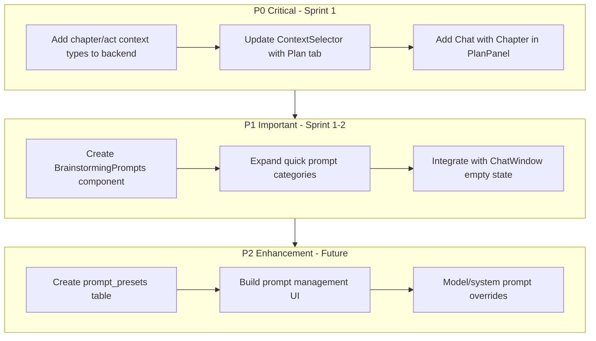

# FG-04.4: Uses & Workflows - Development Strategy

## Feature Understanding

**Primary User Goal:** Writers want specialized brainstorming tools and seamless integration with their story plan to enhance creative ideation and plot development.

**Data Flow Overview:**

- Prompt Presets: User creates/manages -> stored in DB -> displayed in Chat
- Brainstorming sessions: User triggers -> AI generates -> optionally extracts to Codex/Scenes
- Plan context: User selects outline items -> injected into Chat context

---

## Cross-Frontend Impact Mapping

| Feature | Owner (Creates) | Consumer (Views/Uses) | Data Flow |

|---------|-----------------|----------------------|-----------|

| F-04.4.1 Brainstorming Tools | User via Chat UI | User in Chat Panel | UI triggers -> AI responds -> Extract to Codex/Scene |

| F-04.4.2 Chat with Plan | User via Plan Panel | User in Chat Panel | Plan data -> Context injection -> AI conversation |

| F-04.4.3 Quick Prompts | Admin/User | User in Chat Panel | DB/Config -> Quick buttons in UI |

---

## Current Implementation Status

### Already Implemented:

- Basic quick prompts (hardcoded in `ChatWindow.vue` lines 44-48):
```43:48:resources/js/components/chat/ChatWindow.vue
// Quick prompt suggestions
const quickPrompts = [
    'Help me brainstorm ideas for this story',
    'Suggest a plot twist',
    'Describe a character in detail',
];
```

- Context injection with scenes and codex (`useChatContext.ts`)
- Transfer to scene (`TransferMenu.vue`)
- Extract to Codex (`ExtractToCodexModal.vue`)
- Plan Panel with Outline view (`PlanPanel.vue`, `OutlineView.vue`)

### Missing Implementation:

- **Brainstorming Tools:** No categorized prompts, no character/plot/setting-specific tools
- **Chat with Plan:** No way to add outline/chapter/act as context
- **Quick Prompts:** No user-customizable prompts, no prompt presets system

---

## Gap Analysis

| Gap | Impact | Priority |

|-----|--------|----------|

| Cannot add outline as context | Users can't discuss plan with AI | P0 (Critical) |

| Quick prompts are hardcoded | No personalization, limited options | P1 (Important) |

| No brainstorming categories | Writers lack specialized tools | P1 (Important) |

| No prompt preset system | Can't save/reuse custom prompts | P2 (Enhancement) |

| No "Chat with this chapter" button in Plan | Disconnected UX | P1 (Important) |

---

## Phase 1: Chat with Plan Integration (F-04.4.2)

**Priority: P0 - Critical**

### 1.1 Backend Changes

**Add outline/chapter/act context types to `chat_context_items`:**

File: [`app/Http/Controllers/ChatContextController.php`](app/Http/Controllers/ChatContextController.php)

- Add `chapter`, `act` context types to validation
- Build context content from chapter summaries and scene summaries

**New service method in** [`app/Services/Chat/ContextBuilder.php`](app/Services/Chat/ContextBuilder.php):

```php
public function buildChapterContext(Chapter $chapter): string
{
    $content = "Chapter: {$chapter->title}\n\n";
    foreach ($chapter->scenes as $scene) {
        $content .= "- {$scene->title}: {$scene->summary}\n";
    }
    return $content;
}

public function buildActContext(Act $act): string
{
    $content = "Act: {$act->title}\n\n";
    foreach ($act->chapters as $chapter) {
        $content .= "Chapter {$chapter->position}: {$chapter->title}\n";
    }
    return $content;
}

public function buildOutlineContext(Novel $novel): string
{
    // Returns full outline with acts, chapters, scenes
}
```

### 1.2 Frontend Changes

**Update** [`resources/js/composables/useChatContext.ts`](resources/js/composables/useChatContext.ts):

- Add `chapter`, `act`, `outline` to ContextItem types

**Update** [`resources/js/components/chat/ContextSelector.vue`](resources/js/components/chat/ContextSelector.vue):

- Add "Plan" tab alongside Scenes and Codex
- Show chapters/acts as selectable context items

**Add "Chat with Plan" button to** [`resources/js/components/workspace/PlanPanel.vue`](resources/js/components/workspace/PlanPanel.vue):

```vue
<!-- In chapter context menu -->
{
    label: 'Chat about this chapter',
    action: () => emit('chatWithChapter', chapter)
}
```

---

## Phase 2: Brainstorming Tools (F-04.4.1)

**Priority: P1 - Important**

### 2.1 Create BrainstormingPrompts Component

New file: `resources/js/components/chat/BrainstormingPrompts.vue`

**Categories based on NovelCrafter reference:**

- **Character Development:**
  - "Help me develop a backstory for [character]"
  - "What are [character]'s motivations and fears?"
  - "Describe [character]'s personality traits"
- **Plot Development:**
  - "Suggest a plot twist for this chapter"
  - "What conflict could arise here?"
  - "How can I raise the stakes?"
- **World Building:**
  - "Describe the setting in more detail"
  - "What cultural elements should I include?"
  - "Help me build the magic/tech system"
- **General Brainstorming:**
  - "What if..." prompts
  - "Generate names for..."
  - "Help me brainstorm ideas for..."

### 2.2 UI Design

```
┌─────────────────────────────────────────┐
│  Brainstorming Tools                  ▼ │
├─────────────────────────────────────────┤
│ [Character] [Plot] [World] [General]    │
├─────────────────────────────────────────┤
│ ┌─────────────────────────────────────┐ │
│ │ Develop backstory                   │ │
│ └─────────────────────────────────────┘ │
│ ┌─────────────────────────────────────┐ │
│ │ Explore motivations                 │ │
│ └─────────────────────────────────────┘ │
└─────────────────────────────────────────┘
```

### 2.3 Integration with Existing Chat

- Show in ChatWindow empty state (replace current hardcoded prompts)
- Accessible via button in ChatInput area
- Auto-detect relevant codex entries and inject as context

---

## Phase 3: Quick Prompts System (F-04.4.3)

**Priority: P1 - Important (P2 for full preset system)**

### 3.1 Phase 3a: Enhanced Static Prompts (P1)

Expand current hardcoded prompts in `ChatWindow.vue`:

```typescript
const quickPromptCategories = {
    character: [
        { label: 'Develop character', prompt: 'Help me develop the character {{character_name}}' },
        { label: 'Character dialogue', prompt: 'Write sample dialogue for {{character_name}}' },
    ],
    plot: [
        { label: 'Plot twist', prompt: 'Suggest a plot twist for this scene' },
        { label: 'Raise stakes', prompt: 'How can I raise the stakes in this moment?' },
    ],
    setting: [
        { label: 'Describe location', prompt: 'Describe this location in vivid detail' },
        { label: 'Atmosphere', prompt: 'Help me establish the mood and atmosphere' },
    ],
    general: [
        { label: 'What if...', prompt: 'What if {{scenario}}?' },
        { label: 'Generate names', prompt: 'Generate {{count}} names for {{type}}' },
    ]
};
```

### 3.2 Phase 3b: User-Customizable Prompts (P2 - Future)

**Database Schema:**

```sql
CREATE TABLE chat_prompt_presets (
    id BIGINT UNSIGNED PRIMARY KEY AUTO_INCREMENT,
    user_id BIGINT UNSIGNED NOT NULL,
    novel_id BIGINT UNSIGNED NULL, -- NULL = global
    name VARCHAR(255) NOT NULL,
    category VARCHAR(50) NOT NULL,
    prompt_template TEXT NOT NULL,
    description TEXT NULL,
    model_override VARCHAR(255) NULL,
    system_prompt_override TEXT NULL,
    is_default BOOLEAN DEFAULT FALSE,
    sort_order INTEGER DEFAULT 0,
    created_at TIMESTAMP,
    updated_at TIMESTAMP,
    
    FOREIGN KEY (user_id) REFERENCES users(id) ON DELETE CASCADE,
    FOREIGN KEY (novel_id) REFERENCES novels(id) ON DELETE CASCADE
);
```

**Frontend: Settings page for managing prompts** (future sprint)

---

## Implementation Sequence



---

## User Journeys

### Journey 1: Chat with Plan (P0)

**Owner Journey (Plan Panel):**

1. User opens Workspace, navigates to Plan mode
2. User right-clicks on a chapter
3. User selects "Chat about this chapter"
4. System switches to Chat panel with chapter added as context
5. User sees chapter summary injected

**Consumer Journey (Chat Panel):**

1. User is in Chat panel
2. User clicks context selector (+) button
3. User selects "Plan" tab
4. User sees list of Acts and Chapters
5. User selects "Chapter 3: The Storm"
6. System adds chapter outline to context
7. User asks "How can I make this chapter more tense?"

### Journey 2: Brainstorming Tools (P1)

**User Journey:**

1. User starts new chat (empty state shown)
2. User sees categorized brainstorming buttons
3. User clicks "Character" category
4. User clicks "Develop backstory"
5. System auto-detects POV character from current scene context
6. Prompt "Help me develop a backstory for Elena" appears in input
7. User sends, AI responds with ideas
8. User clicks "Extract to Codex" on response
9. Character backstory saved to Codex entry

### Journey 3: Quick Prompts (P1)

**User Journey:**

1. User is mid-conversation
2. User wants a quick prompt without typing
3. User clicks prompt suggestions icon near input
4. Dropdown shows categorized prompts
5. User selects "Suggest a plot twist"
6. Prompt inserted and sent
7. AI responds with creative suggestions

---

## Files to Create

| File | Purpose | Priority |

|------|---------|----------|

| `resources/js/components/chat/BrainstormingPrompts.vue` | Categorized brainstorm UI | P1 |

| `resources/js/components/chat/QuickPromptMenu.vue` | Dropdown menu for prompts | P1 |

| `database/migrations/XXXX_create_chat_prompt_presets_table.php` | Custom prompts storage | P2 |

| `app/Models/ChatPromptPreset.php` | Prompt preset model | P2 |

| `app/Http/Controllers/ChatPromptPresetController.php` | CRUD for presets | P2 |

## Files to Modify

| File | Changes | Priority |

|------|---------|----------|

| [`app/Services/Chat/ContextBuilder.php`](app/Services/Chat/ContextBuilder.php) | Add chapter/act/outline context builders | P0 |

| [`resources/js/composables/useChatContext.ts`](resources/js/composables/useChatContext.ts) | Add chapter/act/outline types | P0 |

| [`resources/js/components/chat/ContextSelector.vue`](resources/js/components/chat/ContextSelector.vue) | Add Plan tab | P0 |

| [`resources/js/components/workspace/PlanPanel.vue`](resources/js/components/workspace/PlanPanel.vue) | Add "Chat with chapter" action | P0 |

| [`resources/js/components/chat/ChatWindow.vue`](resources/js/components/chat/ChatWindow.vue) | Replace quick prompts with BrainstormingPrompts | P1 |

| [`resources/js/components/chat/ChatInput.vue`](resources/js/components/chat/ChatInput.vue) | Add quick prompt button | P1 |

---

## Mobile Considerations

- BrainstormingPrompts should be collapsible/drawer-based on mobile
- Quick prompts accessible via floating action button or input bar icon
- Context selector tabs should be swipeable
- Chapter selection should use bottom sheet modal

---

## Definition of Done

- [ ] User can add chapters/acts as chat context
- [ ] "Chat with chapter" button works from PlanPanel
- [ ] Categorized brainstorming prompts displayed
- [ ] Quick prompt dropdown functional
- [ ] Context-aware prompts auto-detect relevant entities
- [ ] Mobile-responsive implementation
- [ ] Unit tests for ContextBuilder service methods
- [ ] Feature tests for new API endpoints
