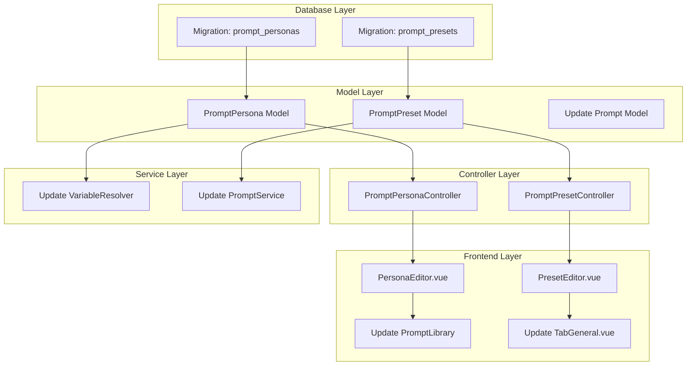

# FG-05.3: Personas and Presets Implementation Strategy

## Phase 1: Feature Understanding

### What is Being Built

Based on Novelcrafter's documentation:

**Personas** - Global instruction sets that:

- Share instructions across multiple prompt types (chat, prose, text replacement, summarization)
- Apply across multiple projects/series or all novels
- Contain a "system message" that gets injected into prompts
- Are comparable to "memory" features in AI chat apps
- Can be scoped by interaction types and projects

**Presets** - Saved prompt configurations that:

- Save model selection, temperature, max tokens, and other model settings
- Store prompt input values for quick reuse
- Are attached to specific prompts (parent-child relationship)
- Appear alongside prompts in the library with a "Preset" tag
- Can be created from the Prompt Library or "Tweak and Generate" panel

### Key Difference (Persona vs Preset)

- **Persona**: Use when sharing info across multiple prompt types and projects (pen name, style guides)
- **Preset**: Use for specific prompt configurations (favorite prompt versions, specific model for a prompt)

---

## Phase 2: Cross-Frontend Impact Mapping

| Feature | Owner (Creates) | Consumer (Views/Uses) | Data Flow |

|---------|-----------------|----------------------|-----------|

| Personas | User in Prompt Library | All prompts matching interaction types | Create -> Store -> Inject into prompts at runtime |

| Presets | User in Prompt Library or Tweak & Generate | Prompt execution, Prompt Library sidebar | Create from prompt -> Store -> Quick-apply to prompts |

| Persona Scope | User in Persona Editor | Prompt resolution service | Define scope -> Filter by project/type -> Apply |

| Preset Selection | User in prompt execution UI | AI request builder | Select -> Override defaults -> Execute |

---

## Phase 3: Missing Implementation Detection

### Current State Analysis

The database schema currently has:

- `prompts` table (exists, but **missing** `persona_id` and `preset_id` columns per EPIC spec)
- `prompt_personas` table - **DOES NOT EXIST**
- `prompt_presets` table - **DOES NOT EXIST**

The frontend has:

- `PromptModal.vue` with tabs (General, Instructions, Advanced, Description, Preview)
- `TabGeneral.vue` with model settings - **but no preset selector**
- No persona management UI
- No preset management UI

### Owner Side (Data Creation) - Missing

**Personas:**

- [ ] Create persona UI in Prompt Library
- [ ] Persona editor with: name, system message content, markdown support
- [ ] Interaction type selector (scene beat, summarization, text replacement, chat)
- [ ] Project scope selector (all projects vs specific novels/series)
- [ ] Archive/delete persona capability
- [ ] Persona history view

**Presets:**

- [ ] Create preset button in prompt's General tab
- [ ] Preset editor with: name, model selection, model settings
- [ ] Preset input values storage
- [ ] Create preset from "Tweak and Generate" panel
- [ ] Edit preset from multiple entry points (library, parent prompt, tweak panel)
- [ ] Delete/archive preset

### Consumer Side (Data Display) - Missing

**Personas:**

- [ ] Personas section in Prompt Library sidebar
- [ ] Persona injection into prompt execution
- [ ] Active personas indicator in prompt editor
- [ ] `{personas}` variable in prompt function system (per Novelcrafter docs)

**Presets:**

- [ ] Preset list in Prompt Library (with "Preset" badge)
- [ ] Preset selector in prompt execution/tweak panel
- [ ] "Manage Presets" option in Tweak and Generate
- [ ] Apply preset to override prompt settings

---

## Phase 4: Gap Analysis

| Gap | Type | Impact |

|-----|------|--------|

| No `prompt_personas` table | Backend | Personas feature completely blocked |

| No `prompt_presets` table | Backend | Presets feature completely blocked |

| No persona_id/preset_id on prompts table | Backend | Cannot link personas/presets to prompts |

| No Persona UI in Prompt Library | Frontend | Users cannot create personas |

| No Preset selector in TabGeneral | Frontend | Users cannot select/create presets |

| No `{personas}` variable resolver | Backend | Personas won't be injected into prompts |

| PromptService missing persona/preset logic | Backend | Prompt resolution incomplete |

---

## Phase 5: Implementation Sequencing

### Priority Matrix

**P0 (Critical - Feature Unusable Without):**

1. Database migrations for `prompt_personas` and `prompt_presets`
2. Eloquent models: `PromptPersona`, `PromptPreset`
3. Basic CRUD controllers
4. API routes for personas/presets

**P1 (Important - Feature Incomplete Without):**

1. Persona editor UI component
2. Preset editor UI component  
3. Persona/Preset sections in Prompt Library sidebar
4. `{personas}` variable resolver in PromptService
5. Preset selector in TabGeneral.vue

**P2 (Enhancement - Can Ship Later):**

1. Persona history view
2. Create preset from Tweak & Generate panel
3. Bulk persona/preset operations
4. Project-level persona scoping UI

### Dependency Graph



---

## Phase 6: Detailed Recommendations

### New Database Tables

**`prompt_personas`** (per EPIC spec):

```sql
CREATE TABLE prompt_personas (
    id BIGINT UNSIGNED PRIMARY KEY AUTO_INCREMENT,
    user_id BIGINT UNSIGNED NOT NULL,
    name VARCHAR(255) NOT NULL,
    description TEXT NULL,
    system_message LONGTEXT NOT NULL,
    interaction_types JSON NULL, -- ['chat', 'prose', 'replacement', 'summary']
    project_ids JSON NULL, -- null = all projects
    is_default BOOLEAN DEFAULT FALSE,
    is_archived BOOLEAN DEFAULT FALSE,
    created_at TIMESTAMP,
    updated_at TIMESTAMP,
    FOREIGN KEY (user_id) REFERENCES users(id) ON DELETE CASCADE
);
```

**`prompt_presets`** (per EPIC spec):

```sql
CREATE TABLE prompt_presets (
    id BIGINT UNSIGNED PRIMARY KEY AUTO_INCREMENT,
    user_id BIGINT UNSIGNED NOT NULL,
    prompt_id BIGINT UNSIGNED NOT NULL,
    name VARCHAR(255) NOT NULL,
    model VARCHAR(255) NULL,
    temperature DECIMAL(3,2) DEFAULT 0.7,
    max_tokens INT UNSIGNED NULL,
    top_p DECIMAL(3,2) NULL,
    frequency_penalty DECIMAL(3,2) NULL,
    presence_penalty DECIMAL(3,2) NULL,
    stop_sequences JSON NULL,
    input_values JSON NULL, -- saved prompt input values
    is_default BOOLEAN DEFAULT FALSE,
    created_at TIMESTAMP,
    updated_at TIMESTAMP,
    FOREIGN KEY (user_id) REFERENCES users(id) ON DELETE CASCADE,
    FOREIGN KEY (prompt_id) REFERENCES prompts(id) ON DELETE CASCADE
);
```

### Backend Files to Create

| File | Purpose | Priority |

|------|---------|----------|

| `app/Models/PromptPersona.php` | Persona Eloquent model | P0 |

| `app/Models/PromptPreset.php` | Preset Eloquent model | P0 |

| `app/Http/Controllers/PromptPersonaController.php` | Persona CRUD API | P0 |

| `app/Http/Controllers/PromptPresetController.php` | Preset CRUD API | P0 |

| `database/migrations/xxxx_create_prompt_personas_table.php` | DB migration | P0 |

| `database/migrations/xxxx_create_prompt_presets_table.php` | DB migration | P0 |

### Backend Files to Update

| File | Change | Priority |

|------|--------|----------|

| [`app/Services/Prompts/VariableResolver.php`](app/Services/Prompts/VariableResolver.php) | Add `{personas}` variable support | P1 |

| [`app/Services/Prompts/PromptService.php`](app/Services/Prompts/PromptService.php) | Inject personas into prompt resolution | P1 |

| `routes/api.php` | Add persona/preset routes | P0 |

### Frontend Files to Create

| File | Purpose | Priority |

|------|---------|----------|

| `resources/js/components/prompts/PersonaEditor.vue` | Persona create/edit modal | P1 |

| `resources/js/components/prompts/PresetEditor.vue` | Preset create/edit modal | P1 |

| `resources/js/components/prompts/PersonaCard.vue` | Persona list item | P1 |

| `resources/js/components/prompts/PresetCard.vue` | Preset list item | P1 |

| `resources/js/components/prompts/PersonaSelector.vue` | Multi-select for active personas | P2 |

| `resources/js/components/prompts/PresetSelector.vue` | Dropdown to select/apply preset | P1 |

| `resources/js/composables/usePersonas.ts` | Persona state management | P0 |

| `resources/js/composables/usePresets.ts` | Preset state management | P0 |

### Frontend Files to Update

| File | Change | Priority |

|------|--------|----------|

| [`resources/js/components/prompts/editor/TabGeneral.vue`](resources/js/components/prompts/editor/TabGeneral.vue) | Add "+ New Preset" button, preset list | P1 |

| [`resources/js/components/prompts/PromptModal.vue`](resources/js/components/prompts/PromptModal.vue) | Add preset context when editing | P1 |

| `resources/js/components/workspace/PromptsQuickList.vue` | Show personas section, preset badges | P1 |

### API Endpoints to Add

| Method | Endpoint | Description |

|--------|----------|-------------|

| GET | `/api/prompt-personas` | List user personas |

| POST | `/api/prompt-personas` | Create persona |

| GET | `/api/prompt-personas/{id}` | Get persona |

| PATCH | `/api/prompt-personas/{id}` | Update persona |

| DELETE | `/api/prompt-personas/{id}` | Delete/archive persona |

| GET | `/api/prompts/{prompt}/presets` | List presets for a prompt |

| POST | `/api/prompts/{prompt}/presets` | Create preset for prompt |

| GET | `/api/prompt-presets/{id}` | Get preset |

| PATCH | `/api/prompt-presets/{id}` | Update preset |

| DELETE | `/api/prompt-presets/{id}` | Delete preset |

---

## Phase 7: Example User Journeys

### Journey 1: Creating a Persona

**Owner Journey:**

1. User navigates to: Prompt Library (sidebar icon or `/prompts`)
2. User clicks: "+ New" dropdown -> "Persona"
3. User fills: Name, System Message (with markdown), Interaction Types checkboxes, Project Scope selector
4. System does: POST `/api/prompt-personas`, stores persona
5. User sees: Persona appears in library sidebar under "Personas" section

**Consumer Journey (Prompt Execution):**

1. User navigates to: Workshop Chat or Scene Editor
2. User executes: Any prompt matching persona's interaction type
3. System does: Injects persona's system_message into prompt context
4. User sees: AI response influenced by persona instructions

### Journey 2: Creating a Preset

**Owner Journey:**

1. User navigates to: Prompt Library -> Select a prompt -> General tab
2. User clicks: "+ New Preset" button
3. User fills: Preset name, selects Model, adjusts Temperature/Max Tokens, fills Prompt Inputs
4. System does: POST `/api/prompts/{id}/presets`, creates preset
5. User sees: Preset appears in library with "Preset" badge, linked to parent prompt

**Consumer Journey (Using Preset):**

1. User navigates to: Prompt execution (Workshop, Scene Editor)
2. User opens: "Tweak and Generate" panel
3. User clicks: "Presets" -> selects saved preset
4. System does: Applies preset's model settings and input values
5. User achieves: Quick prompt configuration without manual input

### Journey 3: Persona or Preset Decision

**Scenario A - Use Persona:**

- Writer wants all chat prompts to know their pen name "J.K. Mystery"
- Creates persona with system message about writing style
- Scopes to "Workshop Chat" and "Text Replacement"
- Applied automatically to all matching prompts across all projects

**Scenario B - Use Preset:**

- Writer has a "Character Voice Generator" prompt
- Creates preset with specific model (Claude) and inputs (character name, traits)
- Uses preset only for this specific prompt
- Can have multiple presets (one per character)

---

## Navigation and Menu Updates

| Frontend | Menu Item | Parent | Priority |

|----------|-----------|--------|----------|

| Prompt Library | "Personas" section | Library sidebar | P1 |

| Prompt Library | "+ New -> Persona" | Create dropdown | P1 |

| Prompt Modal | "Presets" section | General tab | P1 |

| Tweak & Generate | "Presets" button | Panel header | P2 |

| Tweak & Generate | "Manage Presets" | Presets dropdown | P2 |

---

## Mobile Considerations

- Persona editor: Use full-screen modal on mobile
- Preset selector: Bottom sheet on mobile for easy thumb access
- Interaction type checkboxes: Stack vertically on mobile
- Project selector: Searchable select with virtual scroll for many projects
