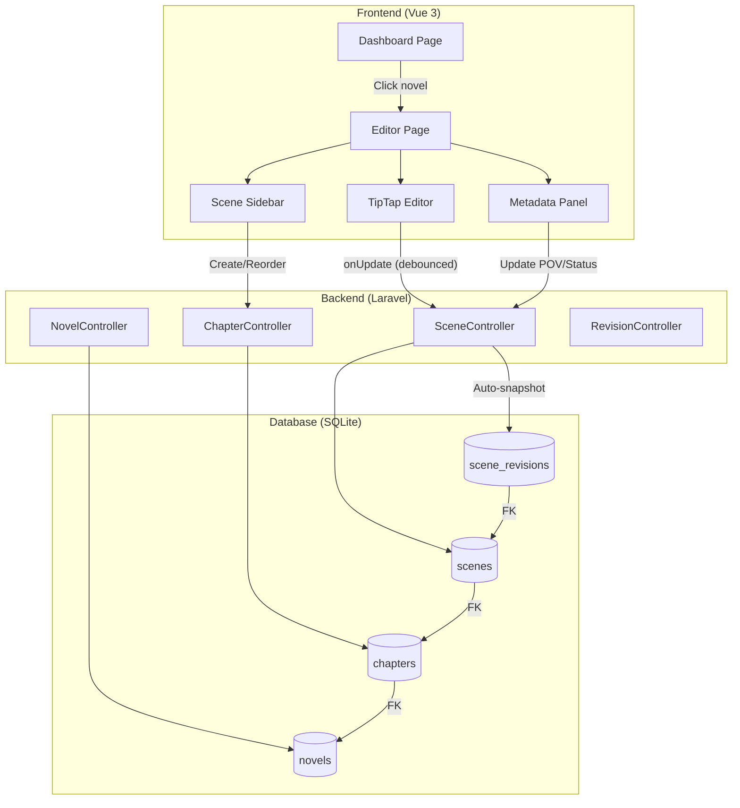
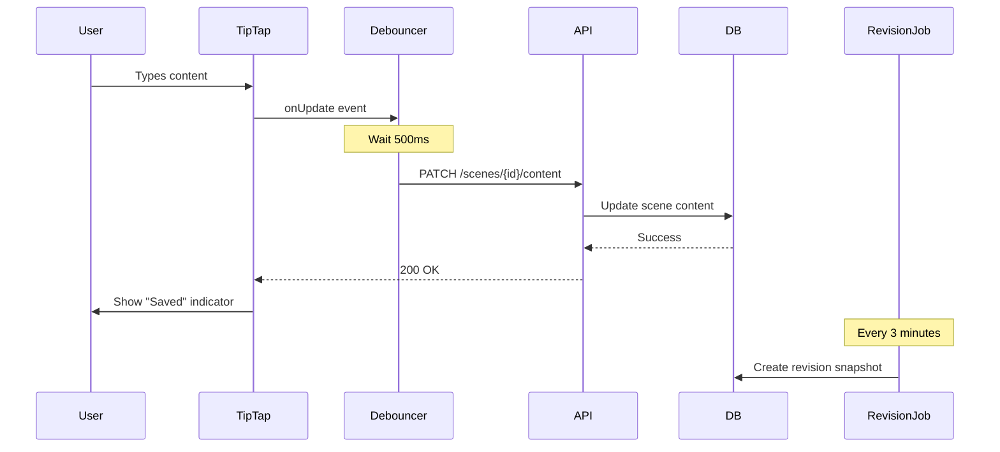

# Manuscript Editor Implementation Strategy

## Phase 1: Feature Understanding

### Core Data Entities

- **Novel** (existing) - Parent container for all writing content
- **Chapter** (new) - Grouping for scenes, organizational hierarchy
- **Scene** (new) - Primary writing unit, contains prose content
- **SceneRevision** (new) - Version history for undo beyond session

### User Goal

Writers want a **distraction-free environment** to write prose with:

- Instant auto-save (typing = saving)
- Full undo/redo support (Ctrl+Z/Y)
- Organized structure (Chapter > Scene)
- AI assistance without leaving editor

---

## Phase 2: Cross-Frontend Impact Mapping

| Feature | Owner (Who Creates) | Consumer (Who Views) | Data Flow |

|---------|---------------------|---------------------|-----------|

| Scene Content | Editor Page | Editor, Plan View, Export | Write→AutoSave→DB→Display |

| Chapter Structure | Sidebar + Editor | Editor, Plan, Dashboard | Create→Store→Navigate |

| Scene Metadata | Metadata Panel | Editor, Plan Views | Edit→Store→Display |

| AI Generation | Slash Command | Editor (preview/apply) | Command→AI→Preview→Insert |

| Highlights | Toolbar | Editor, Highlight List | Mark→Store→Navigate |

| Revisions | Auto-created | Scene History Panel | Type→Create→Browse→Restore |

---

## Phase 3: Missing Implementation Detection (Gap Analysis)

### Database Schema (MISSING - Critical)

- [ ] `chapters` table
- [ ] `scenes` table with JSON content field
- [ ] `scene_revisions` table for history
- [ ] `scene_highlights` table (or JSON in scene)

### Backend (MISSING)

- [ ] `Chapter` Model, Factory, Migration
- [ ] `Scene` Model, Factory, Migration
- [ ] `SceneRevision` Model
- [ ] `ChapterController` API
- [ ] `SceneController` API with auto-save endpoint
- [ ] `SceneRevisionController` for history

### Frontend Pages (MISSING)

- [ ] `/novels/{id}/write` - Main editor page
- [ ] Scene editor component with TipTap
- [ ] Chapter/Scene sidebar navigation
- [ ] Scene metadata panel
- [ ] Slash command palette
- [ ] Text selection toolbar
- [ ] Focus mode toggle
- [ ] Theme/display settings

### Key Missing Features from Spec

| Feature | Spec Status | Gap |

|---------|-------------|-----|

| **Real-time auto-save** | "30 seconds or pause" | User wants **typing = saving** (debounced ~500ms) |

| **Undo/Redo** | Not specified | User wants **Ctrl+Z/Y** support |

| **Revision History** | Mentioned in NovelCrafter | Need auto-snapshot every 3 minutes |

| **Mobile editor** | "Responsive" | Need touch-friendly toolbar, gestures |

---

## Phase 4: Gap Flags

- Owner can create scenes BUT no navigation to view them from Dashboard
- Scene revisions auto-create BUT no UI to browse/restore
- AI generates content BUT no streaming response UI
- Highlights can be added BUT no sidebar list to find them
- Focus mode hides UI BUT no mobile gesture to exit

---

## Phase 5: Implementation Sequencing

### P0 - Critical (Feature unusable without)

**Sprint 1 - Core Editor Foundation**

1. Database migrations (chapters, scenes, scene_revisions)
2. Eloquent models with relationships
3. Basic TipTap editor with undo/redo (History extension)
4. Real-time auto-save with debounce (typing = saving)
5. Scene CRUD API endpoints
6. Basic editor page (`/novels/{id}/write`)

### P1 - Important (Feature incomplete without)

**Sprint 1 continued**

1. Chapter/Scene sidebar navigation
2. Scene metadata panel
3. Theme toggle (dark/light)
4. Font settings (family, size)
5. Revision auto-snapshot (every 3 mins)

**Sprint 2**

1. Context menu (right-click actions)
2. Drag & drop reorder
3. Scene split/merge
4. POV character selection (requires Codex)

### P2 - Enhancement (Can ship later)

**Sprint 3+**

1. Slash command generation
2. Text transformation prompts
3. Collapsible AI sections
4. Marker/Highlighter tool
5. Focus mode
6. Typewriter mode

---

## Phase 6: Detailed Recommendations

### New Database Tables

```sql
-- chapters (Novel → Chapter)
chapters: id, novel_id, title, position, settings(JSON), created_at, updated_at

-- scenes (Chapter → Scene)  
scenes: id, chapter_id, title, content(JSON), summary, position, pov_character_id,
        status, word_count, subtitle, notes, exclude_from_ai, metadata(JSON),
        created_at, updated_at, archived_at

-- scene_revisions (Scene → Revisions)
scene_revisions: id, scene_id, content(JSON), word_count, created_at
```

### New Routes Needed

| Route | Purpose | Priority |

|-------|---------|----------|

| `GET /novels/{id}/write` | Main editor page | P0 |

| `GET /novels/{id}/write/{sceneId}` | Deep link to scene | P0 |

| `GET /api/novels/{id}/chapters` | List chapters | P0 |

| `POST /api/chapters/{id}/scenes` | Create scene | P0 |

| `PATCH /api/scenes/{id}/content` | Auto-save endpoint | P0 |

| `GET /api/scenes/{id}/revisions` | List revisions | P1 |

| `POST /api/scenes/{id}/revisions/{revId}/restore` | Restore revision | P1 |

### Frontend Components Needed

| Component | Location | Purpose | Priority |

|-----------|----------|---------|----------|

| `TipTapEditor.vue` | `components/editor/` | Rich text editor core | P0 |

| `EditorSidebar.vue` | `components/editor/` | Chapter/scene navigation | P0 |

| `SceneMetadataPanel.vue` | `components/editor/` | Scene info panel | P1 |

| `SlashCommandMenu.vue` | `components/editor/` | Command palette | P2 |

| `TextSelectionToolbar.vue` | `components/editor/` | Transform actions | P2 |

| `HighlightList.vue` | `components/editor/` | Navigate highlights | P2 |

| `RevisionHistory.vue` | `components/editor/` | Browse/restore versions | P1 |

### TipTap Configuration

```typescript
// Key extensions for requirements
import { History } from '@tiptap/extension-history'  // Ctrl+Z/Y
import { Placeholder } from '@tiptap/extension-placeholder'
import { CharacterCount } from '@tiptap/extension-character-count'

// Auto-save implementation
const editor = useEditor({
  extensions: [
    StarterKit.configure({ history: true }), // Enable undo/redo
    History.configure({ depth: 100 }),       // 100 undo steps
    CharacterCount,
  ],
  onUpdate: useDebounceFn(({ editor }) => {
    // typing = saving (debounced 500ms)
    saveScene(editor.getJSON())
  }, 500),
})
```

### Keyboard Shortcuts

| Shortcut | Action | Implementation |

|----------|--------|----------------|

| `Ctrl+Z` | Undo | TipTap History extension (built-in) |

| `Ctrl+Y` / `Ctrl+Shift+Z` | Redo | TipTap History extension (built-in) |

| `Ctrl+S` | Manual save | Trigger save + toast confirmation |

| `Ctrl+B/I/U` | Bold/Italic/Underline | TipTap StarterKit |

| `/` | Open command menu | Custom slash command extension |

| `Escape` | Exit focus mode | Vue keyboard listener |

| `F11` | Toggle focus mode | Vue keyboard listener |

---

## Phase 7: User Journeys

### Journey 1: First Writing Session (P0)

**Owner Journey:**

1. User navigates to: Dashboard → clicks novel card
2. User sees: Empty editor with "Start writing..." placeholder
3. User types: First paragraph of prose
4. System does: Auto-saves every 500ms of pause, shows "Saved" indicator
5. User presses: Ctrl+Z to undo last sentence
6. System does: Instantly reverts text (no server call)
7. User sees: Previous text restored, "Saved" indicator updates

**Consumer Journey:**

1. User returns to Dashboard
2. User sees: Novel card with updated word count, "Last edited: just now"
3. User clicks: Novel card to continue writing
4. User sees: Editor opens with cursor at last position

### Journey 2: Organizing Chapters (P1)

**Owner Journey:**

1. User navigates to: Editor sidebar
2. User clicks: "+" button next to "Chapters"
3. User fills: Chapter title "Chapter 1: The Beginning"
4. User clicks: "Add Scene" within chapter
5. System does: Creates scene, auto-focuses editor
6. User sees: New scene ready to write

**Reorganization Flow:**

1. User drags: Scene 3 above Scene 2 in sidebar
2. System does: Reorders with spring animation, saves new positions
3. User sees: Updated order with haptic feedback (mobile)

### Journey 3: AI Generation with Slash Command (P2)

**Owner Journey:**

1. User types: "/" in editor
2. User sees: Command palette with options (Scene Beat, Continue, Dialogue...)
3. User selects: "Scene Beat"
4. User types: "The hero discovers the hidden door"
5. User submits: Enter key
6. System does: Shows loading skeleton, streams AI response
7. User sees: Generated prose in preview panel
8. User clicks: "Apply" to insert OR "Retry" for different version
9. System does: Inserts text, highlights temporarily, auto-saves

---

## Architecture Diagram



---

## Data Flow: Auto-Save Implementation



---

## Mobile UX Considerations

| Feature | Desktop | Mobile Adaptation |

|---------|---------|-------------------|

| Sidebar | Always visible | Drawer with swipe gesture |

| Toolbar | Floating top | Bottom sheet on tap |

| Context menu | Right-click | Long-press |

| Focus mode exit | Escape key | Swipe down gesture |

| Undo/Redo | Ctrl+Z/Y | Shake to undo OR toolbar buttons |

| Slash command | Type "/" | FAB button + bottom sheet |

---

## Sprint 1 Implementation Priority

1. **Migrations & Models** - chapters, scenes, scene_revisions
2. **API Endpoints** - CRUD for chapters/scenes, auto-save endpoint
3. **TipTap Setup** - Editor with History, StarterKit, CharacterCount
4. **Auto-Save Hook** - Debounced onUpdate with "Saved" indicator
5. **Editor Page** - Basic layout with sidebar placeholder
6. **Sidebar Navigation** - Chapter/scene tree with create actions
7. **Theme Toggle** - Dark/light mode persistence
8. **Tests** - Feature tests for scene CRUD, auto-save

---

## Files to Create/Modify

### Backend (Laravel)

- `database/migrations/*_create_chapters_table.php` (new)
- `database/migrations/*_create_scenes_table.php` (new)
- `database/migrations/*_create_scene_revisions_table.php` (new)
- `app/Models/Chapter.php` (new)
- `app/Models/Scene.php` (new)
- `app/Models/SceneRevision.php` (new)
- `app/Http/Controllers/ChapterController.php` (new)
- `app/Http/Controllers/SceneController.php` (new)
- `database/factories/ChapterFactory.php` (new)
- `database/factories/SceneFactory.php` (new)
- `routes/web.php` (add editor routes)

### Frontend (Vue)

- `resources/js/pages/Editor/Index.vue` (new)
- `resources/js/components/editor/TipTapEditor.vue` (new)
- `resources/js/components/editor/EditorSidebar.vue` (new)
- `resources/js/components/editor/SceneMetadataPanel.vue` (new)
- `resources/js/composables/useAutoSave.ts` (new)
- `resources/js/composables/useEditor.ts` (new)

### Dependencies

- `@tiptap/vue-3`
- `@tiptap/starter-kit`
- `@tiptap/extension-history`
- `@tiptap/extension-placeholder`
- `@tiptap/extension-character-count`
- `@vueuse/core` (for useDebounceFn)