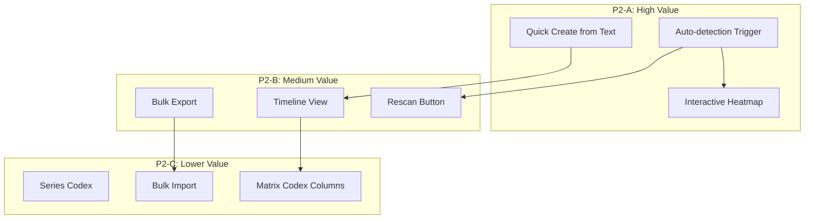

# P2 Codex Enhancements - Development Strategy

## Executive Summary

P2 represents enhancement features that extend the core Codex functionality. Based on NovelCrafter's reference implementation, these features significantly improve writer productivity but are not blocking for the core Codex experience.

---

## Phase 1: Feature Understanding

### P2 Features Overview

| Feature | Description | NovelCrafter Reference |

|---------|-------------|------------------------|

| **Auto-detection mentions** | Background scanning of scenes for codex entry mentions | Mentions tracker in header with heatmap visualization |

| **Quick create from text** | Create codex entry from selected text in editor | "Extract" feature via slash command |

| **Series Codex** | Shared codex entries across novels in a series | Series-level codex inheritance |

| **Bulk import/export** | CSV/JSON import/export of codex entries | Not explicitly documented (migration feature) |

| **Timeline view** | Visual timeline for progressions | Codex additions visible in write interface |

### Data Flow for P2 Features

```mermaid
flowchart TB
    subgraph AutoDetection["Auto-detection Flow"]
        SS[Scene Saved] --> BJ[Background Job]
        BJ --> MT[MentionTracker Service]
        MT --> DB[(codex_mentions)]
        DB --> HM[Heatmap Component]
    end

    subgraph QuickCreate["Quick Create Flow"]
        ST[Select Text in Editor] --> SC[Slash Command /codex]
        SC --> QCM[Quick Create Modal]
        QCM --> API[API: Create Entry]
        API --> CE[New CodexEntry]
    end

    subgraph SeriesCodex["Series Codex Flow"]
        SE[Series Entry] --> INH{Inherit?}
        INH -->|Yes| NE[Novel Entry Copy]
        INH -->|No| OV[Override Locally]
    end

    subgraph BulkOps["Bulk Operations Flow"]
        CSV[CSV/JSON File] --> IMP[Import Service]
        IMP --> VAL[Validation]
        VAL --> DB2[(codex_entries)]
        DB2 --> EXP[Export Service]
        EXP --> FILE[Downloaded File]
    end
```



---

## Phase 2: Cross-Frontend Impact Mapping

| Feature | Owner (Who Creates) | Consumer (Who Views) | Data Flow |

|---------|---------------------|---------------------|-----------|

| **Auto-detection** | System (ScanSceneMentionsJob) | Codex Show page, Editor sidebar | Scene save -> Job -> Store -> Display heatmap |

| **Quick create** | Editor (selection + slash command) | Codex pages, Editor sidebar | Select -> Create -> Store -> Highlight |

| **Series Codex** | Series Settings page | Novel Codex pages | Series config -> Inherit -> Novel display |

| **Bulk import** | Codex Index (import button) | Codex Index (new entries) | Upload -> Validate -> Store -> List |

| **Timeline view** | Codex Show (progressions) | Codex Show, Editor write | Create -> Store -> Timeline display |

---

## Phase 3: Missing Implementation Detection

### Owner Side (Data Creation)

**Auto-detection of Mentions:**

- [x] MentionTracker service exists (basic scanning)
- [x] ScanSceneMentionsJob exists
- [ ] **MISSING: Auto-trigger on scene save (event listener)**
- [ ] **MISSING: Debounced scanning (prevent excessive jobs)**
- [ ] **MISSING: Manual rescan button on Codex entry**

**Quick Create from Text:**

- [ ] **MISSING: TipTap slash command `/codex`**
- [ ] **MISSING: Quick Create Modal component**
- [ ] **MISSING: Pre-fill form with selected text**
- [ ] **MISSING: Type suggestion based on context**

**Series Codex:**

- [ ] **MISSING: Series model and relationship to novels**
- [ ] **MISSING: Series-level codex entries table**
- [ ] **MISSING: Inheritance/override logic**
- [ ] **MISSING: Series management UI**

**Bulk Import/Export:**

- [ ] **MISSING: Import service with CSV/JSON parsing**
- [ ] **MISSING: Export service with formatting**
- [ ] **MISSING: Validation and error reporting**
- [ ] **MISSING: Progress indicator for large imports**

**Timeline View:**

- [x] Progressions list exists (basic)
- [ ] **MISSING: Visual timeline component**
- [ ] **MISSING: Scene position calculation**
- [ ] **MISSING: Zoom/pan for long timelines**
- [ ] **MISSING: Link to scene from timeline**

### Consumer Side (Data Display)

**Codex Entry Detail:**

- [x] MentionHeatmap component exists
- [ ] **MISSING: Interactive heatmap (click to navigate)**
- [ ] **MISSING: Timeline visualization for progressions**

**Editor Integration:**

- [x] CodexSidebarPanel exists
- [ ] **MISSING: Slash command menu**
- [ ] **MISSING: Quick create modal in editor**
- [ ] **MISSING: Mention underline highlighting (TipTap extension)**

**Plan Integration:**

- [ ] **MISSING: Codex column in Matrix view showing mentions per scene**

---

## Phase 4: Gap Analysis - Critical Findings

### P2 Feature Gaps

| Gap | Impact | Recommendation | Priority |

|-----|--------|----------------|----------|

| No auto-trigger on scene save | Mentions never update automatically | Add Observer/Listener on Scene model | P2-Critical |

| No slash command for quick create | Workflow interruption to create entries | Add TipTap extension for /codex command | P2-Critical |

| No timeline visualization | Progressions hard to understand visually | Build TimelineView component with D3 or CSS | P2-Important |

| No Series model | Cannot share codex across novels | New migration, model, relationships | P2-Can-Defer |

| No bulk import UI | Tedious manual entry for large codexes | Add import/export buttons to Index | P2-Can-Defer |

### Integration Gaps

| Gap | Impact | Recommendation |

|-----|--------|----------------|

| Mention detection not triggered | Writers must manually rescan | Add event listener or queue on scene update |

| Heatmap not clickable | Can't navigate to scene from heatmap | Add click handler with router navigation |

| No keyboard shortcut for quick create | Slower workflow | Add `Ctrl+Shift+C` shortcut in editor |

---

## Phase 5: Implementation Sequencing

### P2 Priority Breakdown

**P2-A (Ship First - High Value):**

1. Auto-detection trigger on scene save
2. Quick create from selected text
3. Interactive mention heatmap

**P2-B (Ship Second - Medium Value):**

1. Timeline view for progressions
2. Bulk export (simpler than import)
3. Manual rescan button

**P2-C (Ship Later - Lower Value):**

1. Series Codex (requires new data model)
2. Bulk import with validation
3. Matrix view codex columns

### Dependency Graph



---

## Phase 6: Detailed Recommendations

### Backend Changes

**Events/Listeners:**

```php
// app/Listeners/ScanSceneMentions.php
class ScanSceneMentions
{
    public function handle(SceneUpdated $event): void
    {
        ScanSceneMentionsJob::dispatch($event->scene)
            ->delay(now()->addSeconds(5)); // Debounce
    }
}
```

**New API Endpoints:**

| Endpoint | Method | Purpose | Priority |

|----------|--------|---------|----------|

| `/api/codex/quick-create` | POST | Create entry with minimal data | P2-A |

| `/api/codex/{entry}/rescan` | POST | Manually rescan mentions | P2-B |

| `/api/novels/{novel}/codex/export` | GET | Export all entries as JSON/CSV | P2-B |

| `/api/novels/{novel}/codex/import` | POST | Import entries from file | P2-C |

### Frontend Components

**New Components Needed:**

| Component | Purpose | Priority |

|-----------|---------|----------|

| `QuickCreateModal.vue` | Modal for creating entry from selection | P2-A |

| `ProgressionTimeline.vue` | Visual timeline for progressions | P2-B |

| `BulkExportButton.vue` | Export button with format selection | P2-B |

| `BulkImportModal.vue` | Import modal with file upload | P2-C |

**TipTap Extensions:**

| Extension | Purpose | Priority |

|-----------|---------|----------|

| `SlashCommand.ts` | Handle `/codex` command | P2-A |

| `CodexMention.ts` | Underline detected mentions | P2-B |

### Updates to Existing Components

| Component | Change | Priority |

|-----------|--------|----------|

| `MentionHeatmap.vue` | Add click handler to navigate to scene | P2-A |

| `TipTapEditor.vue` | Integrate slash command extension | P2-A |

| `ProgressionManager.vue` | Add timeline view toggle | P2-B |

| `Codex/Index.vue` | Add import/export buttons in header | P2-B |

---

## Phase 7: Example User Journeys

### Journey 1: Auto-detection of Mentions (P2-A)

**System Flow:**

1. Writer saves scene content in Editor
2. System dispatches `ScanSceneMentionsJob` after 5s debounce
3. Job scans text for codex entry names and aliases
4. Job creates/updates `codex_mentions` records
5. Writer views Codex entry, sees updated heatmap
6. Heatmap shows scene with mentions highlighted

**Consumer Journey:**

1. User navigates to: `/codex/{entry}` (Entry detail)
2. User sees: Mention heatmap in header (already exists)
3. User clicks: A highlighted segment in heatmap
4. System: Navigates to `/novels/{novel}/write/{scene}`
5. User sees: Editor opens at the scene with mentions

### Journey 2: Quick Create from Text (P2-A)

**Owner Journey:**

1. User writes in Editor: "Elena walked into the castle"
2. User selects: "Elena"
3. User types: `/codex` or presses `Ctrl+Shift+C`
4. User sees: Quick Create Modal opens
5. Modal pre-fills: Name = "Elena", Type = "Character" (suggested)
6. User fills: Optional description
7. User clicks: "Create Entry"
8. System: Creates entry, adds alias "Elena"
9. User sees: "Elena" now highlighted in editor

**Implementation Flow:**

```
Select text -> Slash command -> Modal opens
     -> Name pre-filled
     -> Type auto-suggested (heuristics)
     -> Submit -> Create entry + alias
     -> Refresh mentions -> Highlight in editor
```

### Journey 3: Timeline View for Progressions (P2-B)

**Owner Journey:**

1. User navigates to: Codex entry with progressions
2. User sees: Progressions list (current vertical timeline)
3. User clicks: "Timeline View" toggle
4. User sees: Horizontal timeline with scene markers
5. User hovers: Timeline node shows progression note
6. User clicks: Node to jump to linked scene
7. User sees: Visual story arc of character development

**Visual Design:**

```
Scene 1    Scene 5    Scene 8    Scene 12
   |          |          |          |
   o----------o----------o----------o
   |          |          |          |
 [Start]   [Learns   [Meets    [Final
            magic]    mentor]   battle]
```

---

## Risk Mitigation

| Risk | Mitigation Strategy |

|------|---------------------|

| Auto-detection causes performance issues | Use debouncing (5s delay), queue jobs, limit concurrent jobs |

| Slash command conflicts | Use `/codex` as unique prefix, check existing commands |

| Timeline overwhelming for many progressions | Add zoom controls, collapse older items |

| Bulk import data validation | Strict validation, preview before commit, rollback on error |

| Series codex complexity | Start with read-only inheritance, add override later |

---

## Success Metrics

- [ ] Auto-detection runs within 10s of scene save
- [ ] Quick create takes < 3 clicks from selection
- [ ] Timeline renders 50+ progressions without lag
- [ ] Bulk export generates valid JSON/CSV
- [ ] Heatmap clicks navigate correctly 100% of time

---

## Files to Modify/Create

### Backend

**Modify:**

- [`app/Models/Scene.php`](app/Models/Scene.php) - Add event dispatch on save
- [`app/Jobs/ScanSceneMentionsJob.php`](app/Jobs/ScanSceneMentionsJob.php) - Ensure proper debouncing

**Create:**

- `app/Listeners/ScanSceneMentions.php` - Event listener
- `app/Http/Controllers/CodexQuickCreateController.php` - Quick create endpoint
- `app/Services/Codex/BulkExportService.php` - Export logic
- `app/Services/Codex/BulkImportService.php` - Import logic

### Frontend

**Modify:**

- [`resources/js/components/codex/MentionHeatmap.vue`](resources/js/components/codex/MentionHeatmap.vue) - Add click navigation
- [`resources/js/components/codex/ProgressionManager.vue`](resources/js/components/codex/ProgressionManager.vue) - Add timeline toggle
- [`resources/js/pages/Codex/Index.vue`](resources/js/pages/Codex/Index.vue) - Add import/export buttons

**Create:**

- `resources/js/components/codex/QuickCreateModal.vue` - Quick create form
- `resources/js/components/codex/ProgressionTimeline.vue` - Visual timeline
- `resources/js/extensions/SlashCommand.ts` - TipTap slash command
- `resources/js/components/codex/BulkExportButton.vue` - Export UI
- `resources/js/components/codex/BulkImportModal.vue` - Import UI
