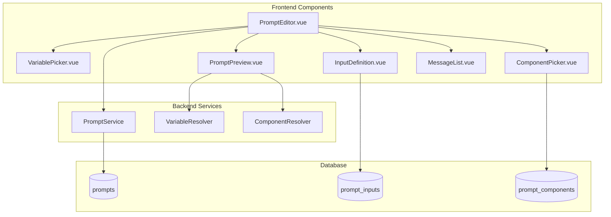

# Development Strategy: FG-05.2 Prompt Editor

## Phase 1: Feature Understanding

### What is Being Created/Managed?

The Prompt Editor is a comprehensive interface for creating and editing AI prompts with:

- Multi-tab organization (General, Instructions, Advanced, Description)
- Rich message editing (System + User/AI messages)
- Variable system with function syntax `{function_name(params)}`
- Prompt Inputs for dynamic user interaction before running
- Components for reusable prompt snippets `[[component_name]]`
- Model settings configuration per prompt
- Live preview with variable resolution

### Data Flow Analysis

| Feature | Owner (Creator) | Consumer (User) | Data Flow |

|---------|-----------------|-----------------|-----------|

| Prompt Content | Prompts/Index page | Workshop Chat, Editor | Create -> Store -> Use in AI calls |

| Variables | System (built-in) | Prompt Editor | Defined -> Inserted -> Resolved at runtime |

| Prompt Inputs | Prompts/Index page | Prompt execution modal | Define -> Store -> Prompt before run |

| Components | Prompts Components section | Prompt Editor | Create -> Store -> Insert `[[name]]` |

| Model Settings | Prompts/Index page | AI execution | Configure -> Store -> Apply to API calls |

---

## Phase 2: Gap Analysis

### Currently Implemented (in codebase)

- Basic Prompt Editor ([`PromptEditor.vue`](resources/js/components/prompts/PromptEditor.vue)) with:
  - Name, description, type fields
  - System/User message textareas
  - Simple variable insertion buttons `{{variable}}`
  - Basic model settings (temperature, max_tokens, top_p, frequency_penalty)
  - 3 tabs: Content, Settings, Preview
- Prompt Library page ([`Index.vue`](resources/js/pages/Prompts/Index.vue))
- Database tables: `prompts`, `prompt_folders`

### Missing Features for FG-05.2 (Gap Analysis)

#### Owner Side (Data Creation)

| Feature | Status | Priority |

|---------|--------|----------|

| Multi-tab interface (General/Instructions/Advanced/Description) | Partial - needs restructure | P0 |

| Variable picker with autocomplete | Missing - only simple buttons | P0 |

| Function-based variables `{scene.title}` syntax | Missing | P0 |

| Multiple User/AI messages | Missing | P1 |

| Prompt Inputs definition UI | Missing | P1 |

| Components selector/inserter | Missing | P1 |

| Syntax highlighting for variables | Missing | P1 |

| Prompt history/versioning | Missing | P2 |

| Token count display | Missing | P2 |

#### Consumer Side (Data Display)

| Feature | Status | Priority |

|---------|--------|----------|

| Preview tab with resolved variables | Partial - shows raw text | P0 |

| Prompt input form before execution | Missing | P0 |

| Variable documentation tooltips | Missing | P1 |

| Copy preview to clipboard | Missing | P2 |

#### Database Schema Missing

| Table | Status | Priority |

|-------|--------|----------|

| `prompt_inputs` | Missing | P1 |

| `prompt_components` | Missing | P1 |

| `prompt_personas` | Missing (FG-05.3) | N/A for this FG |

| `prompt_presets` | Missing (FG-05.3) | N/A for this FG |

---

## Phase 3: Implementation Strategy

### Architecture Overview



### File Changes Required

**New Files:**

```
resources/js/components/prompts/
├── editor/
│   ├── TabGeneral.vue           # Presets, Models, General Settings
│   ├── TabInstructions.vue      # System + User/AI messages
│   ├── TabAdvanced.vue          # Inputs + Components
│   ├── TabDescription.vue       # Description editor
│   ├── MessageList.vue          # Multiple message management
│   ├── MessageItem.vue          # Single message (User/AI)
│   └── VariableAutocomplete.vue # Autocomplete dropdown
├── VariablePicker.vue           # Variable selection modal
├── ComponentPicker.vue          # Component selection modal
├── InputDefinition.vue          # Define prompt inputs
├── InputField.vue               # Single input field editor
└── PromptPreviewPanel.vue       # Enhanced preview with resolution

app/Services/Prompts/
├── VariableResolver.php         # Resolve {function} syntax
└── ComponentResolver.php        # Resolve [[component]] syntax

database/migrations/
├── xxx_create_prompt_inputs_table.php
└── xxx_create_prompt_components_table.php
```

**Modified Files:**

- [`resources/js/components/prompts/PromptEditor.vue`](resources/js/components/prompts/PromptEditor.vue) - Complete refactor
- [`resources/js/components/prompts/PromptModal.vue`](resources/js/components/prompts/PromptModal.vue) - Add input form before execution
- [`resources/js/composables/usePrompts.ts`](resources/js/composables/usePrompts.ts) - Add inputs/components types
- [`resources/js/pages/Prompts/Index.vue`](resources/js/pages/Prompts/Index.vue) - Update to use new editor

---

## Phase 4: Implementation Todos

### Sprint 1 - Core Editor Restructure (P0)

1. **Database Schema Updates**

   - Create `prompt_inputs` migration
   - Create `prompt_components` migration
   - Add `messages` JSON column to `prompts` for multi-message support

2. **Refactor Prompt Editor Tabs**

   - Restructure from 3 tabs to 4 tabs (General, Instructions, Advanced, Description)
   - Create `TabGeneral.vue` - model selection, general settings
   - Create `TabInstructions.vue` - system + multiple user/AI messages
   - Create `TabAdvanced.vue` - inputs and components
   - Create `TabDescription.vue` - rich description editor

3. **Variable System Enhancement**

   - Implement function-based syntax `{scene.title}`, `{codex.characters}`
   - Create `VariableAutocomplete.vue` with fuzzy search
   - Create variable registry with all available functions (based on NovelCrafter reference)

### Sprint 2 - Advanced Features (P1)

4. **Multiple Messages Support**

   - Create `MessageList.vue` for managing system + user/AI messages
   - Create `MessageItem.vue` for individual message editing
   - Support message reordering via drag-drop
   - Message type toggle (User/AI)

5. **Prompt Inputs System**

   - Backend: Create `PromptInput` model and API endpoints
   - Frontend: Create `InputDefinition.vue` for defining inputs
   - Support input types: text, textarea, select, number, checkbox
   - Implement input defaults and required validation

6. **Prompt Components System**

   - Backend: Create `PromptComponent` model and API endpoints
   - Frontend: Create `ComponentPicker.vue` for inserting components
   - Syntax: `[[component_name]]` resolution at runtime

### Sprint 3 - Enhancement Features (P2)

7. **Enhanced Preview**

   - Create `PromptPreviewPanel.vue` with test context
   - Show resolved variables with actual/sample data
   - Display token count estimate
   - Add copy to clipboard functionality

8. **Quality of Life**

   - Syntax highlighting for variables in textareas
   - Variable documentation tooltips
   - Prompt history/versioning (optional)

---

## Phase 5: User Journeys

### Journey 1: Creating a New Prompt

1. User navigates to: `/prompts` (Prompt Library)
2. User clicks: "New" button in sidebar
3. User sees: Empty editor with 4 tabs
4. User fills:

   - **General Tab**: Name, type selection, model configuration
   - **Instructions Tab**: System message, adds User message with variables
   - **Advanced Tab**: Defines input fields (e.g., "word_count" dropdown)
   - **Description Tab**: Adds helpful notes

5. User clicks: "Create Prompt" button
6. System does: Validates and saves prompt to database
7. User sees: Success toast, prompt appears in sidebar list

### Journey 2: Inserting Variables

1. User is in: Instructions tab, editing a message
2. User types: `{` in the textarea
3. System shows: Autocomplete dropdown with available functions
4. User selects: `scene.title` from list
5. System inserts: `{scene.title}` at cursor position
6. User sees: Variable highlighted in textarea

### Journey 3: Previewing a Prompt

1. User clicks: Preview tab in editor
2. System shows: Preview panel with test context selector
3. User selects: A scene for context (optional)
4. System resolves: All `{variables}` and `[[components]]`
5. User sees: Final prompt as it would be sent to AI
6. User sees: Token count estimate
7. User can: Copy resolved prompt to clipboard

---

## Phase 6: Technical Considerations

### Variable Function Registry

Based on NovelCrafter reference, implement these function categories:

- **Acts**: `act`, `act.fullText`, `act.name`, `act.summary`
- **Chapters**: `chapter`, `chapter.fullText`, `chapter.summary`
- **Scenes**: `scene`, `scene.title`, `scene.summary`, `scene.fullText`
- **Codex**: `codex.characters`, `codex.locations`, `codex.context`
- **Context**: `textBefore`, `textAfter`, `storySoFar`
- **Composition**: `include`, `input`, `local`
- **Logic**: `ifs`, `and`, `or`, `isEmpty`
- **Text**: `asList`, `asMarkdown`, `wordCount`

### Mobile Considerations

- Tab navigation should be scrollable on mobile
- Variable picker should be a bottom sheet on mobile
- Message list should support touch drag-drop
- Preview panel should be full-screen capable

### Performance

- Lazy load variable autocomplete data
- Debounce preview resolution (expensive operation)
- Cache resolved components during session
