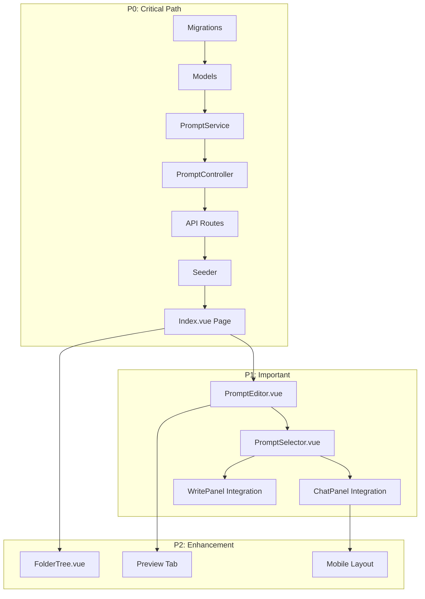

# FG-05.1: Prompt Library Core - Development Strategy

## Phase 1: Feature Understanding

### What Data is Being Created/Managed

- **Prompts**: Instructions sent to AI for various writing tasks
- **Prompt Types**: Scene Beat Completion, Scene Summarization, Text Replacement, Workshop Chat
- **Prompt Categories/Folders**: Organization structure for prompts
- **System/Default Prompts**: Built-in prompts that ship with the app

### Owner/Consumer Analysis

| Feature | Owner (Who Creates) | Consumer (Who Uses) | Data Flow |

|---------|---------------------|---------------------|-----------|

| Prompt Library | Writer via Settings/Prompts page | All AI features (Chat, Editor, Plan) | Create/Edit -> Store -> Select in context |

| Built-in Prompts | System (seeded) | Writer in any AI context | Seed -> Display -> Select/Clone |

| Custom Prompts | Writer via Prompt Editor | Writer in AI features | Create -> Store -> Use in Chat/Editor |

| Prompt Types | System defined | Writer when creating prompts | Define types -> Filter/categorize |

| Prompt Categories | Writer via Library | Writer in Library | Create folder -> Organize prompts |

---

## Phase 2: Cross-Frontend Impact Mapping

### Consumers (Where Prompts Are USED)

1. **Workshop Chat Panel** (`resources/js/components/workspace/ChatPanel.vue`)

   - Must select Workshop Chat prompts
   - Prompt picker needed in chat header/input

2. **Write Panel / Editor** (`resources/js/components/workspace/WritePanel.vue`)

   - Scene Beat Completion prompts for "generate prose"
   - Text Replacement prompts for selection actions
   - Summarization prompts for scene summaries

3. **Plan Panel** (`resources/js/components/workspace/PlanPanel.vue`)

   - Scene summarization prompts via actions menu

### Owner (Where Prompts Are CREATED/MANAGED)

4. **New Prompt Library Page** - `resources/js/Pages/Prompts/Index.vue`

   - Main interface for prompt CRUD
   - Split-panel layout (list + detail)

---

## Phase 3: Missing Implementation Detection

### Owner Side (Data Creation) - Needs Building

- [x] UI form/interface for creating data - SPECIFIED
- [x] Validation rules - SPECIFIED (prompt structure validation)
- [x] Edit/Update capability - SPECIFIED
- [x] Delete/Archive capability - SPECIFIED (cannot delete system prompts)
- [x] Preview before publishing - SPECIFIED (preview tab)
- [ ] **MISSING**: Bulk operations (duplicate multiple, bulk delete user prompts)

### Consumer Side (Data Display) - Needs Building

- [x] Where users will SEE this data - SPECIFIED (Library page)
- [x] How users will FIND this data - SPECIFIED (search, filter by type)
- [ ] **MISSING**: Prompt picker UI in ChatPanel header
- [ ] **MISSING**: Prompt picker in WritePanel for text actions
- [ ] **MISSING**: Prompt selector for summarization in PlanPanel
- [ ] **MISSING**: Mobile/responsive version of Prompt Library
- [x] Empty states - NEEDS IMPLEMENTATION
- [x] Loading states - NEEDS IMPLEMENTATION

### Integration Points - Needs Building

- [ ] API endpoints - SPECIFIED but not built
- [ ] Database schema - SPECIFIED but not migrated
- [ ] State management - NOT SPECIFIED (need composable)
- [ ] Navigation menu - NOT SPECIFIED (add to Settings or Sidebar)
- [ ] Search/filter - SPECIFIED
- [ ] Notification - NOT NEEDED for core

---

## Phase 4: Gap Analysis

### Critical Gaps Identified

1. **Prompt Library has no navigation entry**

   - Users create prompts BUT cannot find the Library
   - Solution: Add "Prompts" to Settings menu OR main sidebar

2. **Prompts created BUT no way to USE them in Chat/Editor**

   - Prompt picker components missing in consumer panels
   - Solution: Build `PromptSelector.vue` component for use in:
     - ChatPanel header (select chat prompt)
     - WritePanel context menu (select replacement prompts)
     - Scene card actions (select summarization prompt)

3. **No Default Prompt Selection UI**

   - Users can create prompts but can't set which is "default" for each type
   - Solution: Add default prompt configuration in Settings or Library

4. **System prompts seeding not defined**

   - Built-in prompts need initial database seed
   - Solution: Create `PromptSeeder.php` with starter prompts

---

## Phase 5: Implementation Sequencing

### Priority Matrix

**P0 (Critical - Feature Unusable Without)**

- Database migrations for `prompts`, `prompt_folders` tables
- `Prompt` and `PromptFolder` Eloquent models
- `PromptController` with CRUD endpoints
- `PromptService` for business logic
- Basic `Prompts/Index.vue` page (list view)
- System prompts seeder

**P1 (Important - Feature Incomplete Without)**

- Prompt editor with type selection
- Prompt filtering by type
- Search functionality
- `PromptSelector.vue` component
- Integration into ChatPanel
- Clone prompt functionality

**P2 (Enhancement - Can Ship Later)**

- Folder/category organization
- Drag-drop reordering
- Prompt descriptions
- Usage analytics
- Mobile optimization

### Build Sequence



---

## Phase 6: Detailed Recommendations

### New Pages/Routes Needed

- **Page**: `Prompts/Index.vue` - Prompt Library interface - **P0**
- **Route**: `GET /prompts` - Display library page
- **Route**: `GET|POST|PATCH|DELETE /api/prompts/*` - API CRUD

### Updates to Existing Pages

- **Settings/Index.vue**: Add "Prompts" category card linking to `/prompts` - **P0**
- **ChatPanel.vue**: Add prompt selector dropdown in header - **P1**
- **WritePanel.vue**: Add prompt picker for text replacement actions - **P1**

### Navigation/Menu Changes

- **Settings Index**: Add "Prompts" entry with library icon - **P0**
- **WorkspaceSidebar**: Optional quick-access to prompts (consider later)

### Component Library Additions

- `PromptCard.vue` - Display prompt in grid/list - **P0**
- `PromptEditor.vue` - Create/edit prompt form - **P0**
- `PromptSelector.vue` - Dropdown for selecting prompts (used in Chat/Editor) - **P1**
- `PromptTypeFilter.vue` - Filter by prompt type - **P1**
- `FolderTree.vue` - Folder organization - **P2**

---

## Phase 7: Example User Journeys

### Journey 1: Create Custom Chat Prompt

**Owner Journey (Creating):**

1. User navigates to: `/settings` -> clicks "Prompts"
2. User clicks: "+ New" button
3. User selects: "Workshop Chat" as type
4. User fills: Name, System message, User message template
5. System does: Validates, saves to `prompts` table
6. User sees: Success toast, prompt appears in list

**Consumer Journey (Using):**

1. User navigates to: `/workspace/{novelId}` -> Chat tab
2. User sees: Prompt selector in chat header showing current prompt
3. User clicks: Prompt selector dropdown
4. User sees: List of Workshop Chat prompts (system + custom)
5. User selects: Their custom prompt
6. User types: Message in chat input
7. System uses: Selected prompt's system/user message structure
8. User achieves: AI responds using their custom prompt style

### Journey 2: Clone and Customize Default Prompt

**Owner Journey:**

1. User navigates to: `/prompts`
2. User sees: List with "System" badge on default prompts
3. User clicks: "Clone" action on a default prompt
4. System does: Creates copy with "(Copy)" suffix, owned by user
5. User edits: Modifies the cloned prompt content
6. User saves: Updated prompt saved
7. User achieves: Custom version of default prompt

### Journey 3: Use Text Replacement Prompt in Editor

**Consumer Journey:**

1. User navigates to: `/workspace/{novelId}` -> Write tab
2. User selects: Text in the editor
3. User sees: Selection action menu appears
4. User clicks: "Transform" or specific action
5. User sees: Prompt picker with Text Replacement prompts
6. User selects: "Expand" or custom replacement prompt
7. System does: Sends selected text + prompt to AI
8. User sees: Transformed text suggestion
9. User achieves: Text improved using their chosen prompt

---

## Technical Architecture

### Backend Structure

```
app/
├── Services/Prompts/
│   ├── PromptService.php         # CRUD + business logic
│   └── PromptResolver.php        # Variable resolution (FG-05.2)
├── Models/
│   ├── Prompt.php
│   └── PromptFolder.php
├── Http/Controllers/
│   └── PromptController.php
└── Http/Requests/
    └── PromptRequest.php
```

### Frontend Structure

```
resources/js/
├── Pages/Prompts/
│   └── Index.vue                 # Main library page
├── Components/prompts/
│   ├── PromptCard.vue
│   ├── PromptEditor.vue
│   ├── PromptSelector.vue
│   ├── PromptTypeFilter.vue
│   └── PromptList.vue
└── composables/
    └── usePrompts.ts             # State management
```

### Database Tables

**`prompts`** - Core table (as specified in epic)

**`prompt_folders`** - Organization (P2)

---

## Key Files to Modify

### Backend (Create New)

- `database/migrations/*_create_prompts_table.php`
- `database/migrations/*_create_prompt_folders_table.php`
- `app/Models/Prompt.php`
- `app/Models/PromptFolder.php`
- `app/Services/Prompts/PromptService.php`
- `app/Http/Controllers/PromptController.php`
- `app/Http/Requests/PromptRequest.php`
- `database/seeders/PromptSeeder.php`
- `routes/spa-api.php` (add prompt routes)

### Frontend (Create New)

- `resources/js/Pages/Prompts/Index.vue`
- `resources/js/components/prompts/PromptCard.vue`
- `resources/js/components/prompts/PromptEditor.vue`
- `resources/js/components/prompts/PromptSelector.vue`
- `resources/js/composables/usePrompts.ts`

### Frontend (Modify Existing)

- `resources/js/Pages/Settings/Index.vue` - Add Prompts link
- `resources/js/components/workspace/ChatPanel.vue` - Add prompt selector (P1)

---

## Definition of Done for FG-05.1

- [ ] Migrations run, tables created
- [ ] Prompt model with relationships
- [ ] PromptService with CRUD
- [ ] API endpoints functional
- [ ] Prompts/Index.vue displays library
- [ ] Can create new prompt (all 4 types)
- [ ] Can edit prompt
- [ ] Can delete user prompts (not system)
- [ ] Can clone any prompt
- [ ] System prompts seeded
- [ ] Filter by type working
- [ ] Search working
- [ ] Navigation from Settings working
- [ ] Unit tests for PromptService
- [ ] Feature tests for API endpoints
