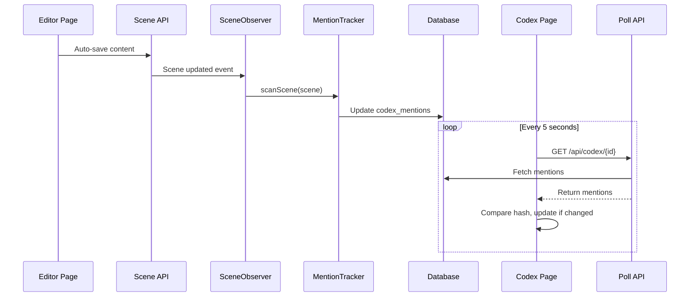

# Sprint 13 Codex V2 - Verification and Integration Testing Plan

## Current Implementation Status

Based on code analysis, all Sprint 13 features are **IMPLEMENTED**:

| Feature | Status | Implementation |

|---------|--------|----------------|

| US-12.1: Auto-scan Mentions | Done | `SceneObserver` + `MentionTracker` |

| US-12.2: Tracking Toggle | Done | `TrackingToggle.vue` component |

| US-12.3: Research Notes | Done | `ResearchTab.vue` with auto-save |

| US-12.8: Relations to AI Context | Done | `CodexContextBuilder` |

| F-12.2.2: External Links | Done | Full CRUD in `ResearchTab.vue` |

| Live Polling | Done | 5s interval in `Show.vue` |

---

## Architecture Overview



---

## Key Files to Verify

### Backend (Auto-Scan Flow)

- [`app/Providers/AppServiceProvider.php`](app/Providers/AppServiceProvider.php) - Observer registration
- [`app/Observers/SceneObserver.php`](app/Observers/SceneObserver.php) - Triggers on content change
- [`app/Services/Codex/MentionTracker.php`](app/Services/Codex/MentionTracker.php) - Synchronous scanning
- [`app/Services/Codex/CodexContextBuilder.php`](app/Services/Codex/CodexContextBuilder.php) - Relations cascade

### Frontend (Live Updates)

- [`resources/js/pages/Codex/Show.vue`](resources/js/pages/Codex/Show.vue) - Polling logic (lines 282-340)
- [`resources/js/components/codex/TrackingToggle.vue`](resources/js/components/codex/TrackingToggle.vue)
- [`resources/js/components/codex/ResearchTab.vue`](resources/js/components/codex/ResearchTab.vue)

---

## Phase 1: Unit Test Verification

Run existing tests to confirm all features work:

```bash
php artisan test --filter=CodexTest
```

Key test cases to verify:

- `test_mentions_are_tracked_on_scan` - Basic mention tracking
- `test_disabled_tracking_entry_not_scanned_for_mentions` - Tracking toggle
- `test_can_update_research_notes` - Research notes
- `test_can_add_external_link` - External links
- `test_ai_context_excludes_never_visibility_details` - AI visibility

---

## Phase 2: Integration Test - Auto-Update Flow

Create new integration test to verify the complete flow:

### Test: Scene Save Triggers Mention Update

```php
// tests/Feature/AutoMentionIntegrationTest.php
public function test_scene_save_automatically_updates_mentions(): void
{
    // 1. Create codex entry "Elena"
    // 2. Create scene with no mentions
    // 3. Update scene content to include "Elena"
    // 4. Assert mention was created automatically
    // 5. Update scene content to remove "Elena"
    // 6. Assert mention was removed automatically
}
```

### Test: Tracking Toggle Prevents Scanning

```php
public function test_disabled_tracking_prevents_auto_scan(): void
{
    // 1. Create entry with is_tracking_enabled = false
    // 2. Create scene mentioning the entry
    // 3. Assert NO mention record created
}
```

### Test: Relations Pull into AI Context

```php
public function test_related_entries_included_in_ai_context(): void
{
    // 1. Create entry A with entry B as relation
    // 2. Build context for entry A only
    // 3. Assert entry B is included (cascade depth 1)
}
```

---

## Phase 3: Manual Browser Testing

### Scenario 1: Auto-Mention Detection

1. Open Codex page with entry "Gandalf" (tracking enabled)
2. Open Editor in another tab
3. Type "Gandalf entered the room"
4. Wait 5-10 seconds (auto-save + polling)
5. Verify: Codex page shows new mention with "Live" indicator pulsing

**Expected Behavior:**

- No page refresh needed
- Mention count updates automatically
- "Live" badge shows polling is active

### Scenario 2: Research Notes Auto-Save

1. Open Codex entry
2. Click "Research" tab
3. Type notes in textarea
4. Wait 1 second (debounce)
5. Verify: "Saving..." indicator appears briefly
6. Refresh page - notes persisted

### Scenario 3: Tracking Toggle

1. Open entry "The" (common word)
2. Toggle "Track Mentions" OFF
3. Go to Editor, type "The wizard"
4. Return to Codex entry
5. Verify: No mention detected (tracking disabled)

### Scenario 4: External Links

1. Add external link to entry
2. Verify link opens in new tab
3. Edit link title/URL
4. Delete link
5. Verify all CRUD operations work

---

## Phase 4: Performance Validation

### Benchmark: Mention Scan Speed

Target: Less than 500ms per scene scan (per EPIC requirements)

```php
// Test with large content
public function test_mention_scan_performance(): void
{
    $entry = CodexEntry::factory()->create([...]);
    $scene = Scene::factory()->create([
        'content' => $this->generateLargeContent(10000), // 10k words
    ]);

    $start = microtime(true);
    app(MentionTracker::class)->scanScene($scene);
    $duration = (microtime(true) - $start) * 1000;

    $this->assertLessThan(500, $duration);
}
```

### Benchmark: Polling Efficiency

- Verify polling pauses when tab is hidden
- Verify hash comparison prevents unnecessary reloads
- Check network tab for API call frequency

---

## Phase 5: Edge Case Testing

1. **Empty Scene**: Scene with no content should clear all mentions
2. **Alias Matching**: Entry "Elena" with alias "The Shadow Mage" - both should match
3. **Case Insensitivity**: "elena", "ELENA", "Elena" all match
4. **Word Boundaries**: "Elena's" matches "Elena", but "Elenara" does not
5. **Multiple Mentions**: "Elena talked to Elena" = count of 2
6. **Unicode Names**: Chinese/Japanese character names work correctly

---

## Phase 6: NovelCrafter Parity Checklist

Based on [Aliases & Mentions](https://www.novelcrafter.com/help/docs/codex/aliases):

- [x] Name and aliases highlighted in manuscript
- [x] Mentions tab shows all scenes with mentions
- [x] Can disable tracking per entry ("Track this entry by name/alias")
- [x] Mentions update automatically when scenes change

Based on [Codex Relations](https://www.novelcrafter.com/help/docs/codex/codex-relations):

- [x] Related entries auto-pulled into AI context
- [x] Cascade depth configurable (1-3 levels)
- [x] Circular reference prevention

---

## Fixes If Issues Found

### If Auto-Scan Not Working

1. Check `AppServiceProvider::boot()` registers observer
2. Verify `Scene::wasChanged('content')` returns true
3. Check for exceptions in Laravel log

### If Polling Not Updating

1. Verify API endpoint `/api/codex/{id}` returns mentions
2. Check `getMentionHash()` function in Show.vue
3. Confirm `document.hidden` check not blocking

### If Performance Issues

1. Add database indexes if missing
2. Consider batching for novels with 500+ entries
3. Profile with Laravel Debugbar

---

## Success Criteria

- [x] All existing tests pass
- [ ] New integration test passes
- [ ] Manual browser testing successful
- [ ] Mention scan under 500ms
- [ ] Polling works across tabs
- [ ] NovelCrafter parity achieved
