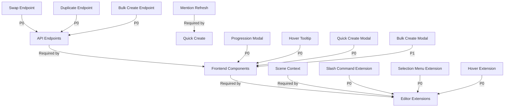

# Sprint 15: Codex V2 Editor Integration & UX Implementation Strategy

## Executive Summary

Sprint 15 focuses on **seamless editor integration** and **UX improvements** for the Codex system, following the established "auto-everything" philosophy from Sprint 13-14. The primary goal is to allow writers to interact with their Codex without breaking their writing flow.

**Key Philosophy:** Everything happens automatically, synchronously, with live UI updates - no manual intervention required.

## Current State Analysis

### What's Already Built (Sprint 13-14)

- ✅ Auto-scan mentions synchronously (no queue workers)
- ✅ Live polling (5s interval) for real-time updates
- ✅ Research notes tab (private, not sent to AI)
- ✅ Tags system (organizational only)
- ✅ Enhanced detail types with AI visibility
- ✅ Tracking toggle per entry
- ✅ Relations pull into AI context automatically

### What Sprint 15 Adds

- **Editor slash commands** for adding progressions
- **Hover tooltips** for codex mentions in editor
- **Quick create** codex entries from text selection
- **Bulk creation** modal for rapid setup
- **Type change** after entry creation
- **Duplicate entry** functionality
- **Swap relation** direction

---

## PHASE 1: FEATURE UNDERSTANDING

### 1. Add Progression from Editor (US-12.9)

**Data Being Created:** CodexProgression records

- **Owner:** Writer actively composing in the editor
- **Consumer:** Codex entry detail page (Progressions tab)
- **Primary Goal:** Track character/location changes without leaving writing flow

**Key Insight:** This is a **modal workflow** triggered mid-writing, must be fast and unobtrusive.

### 2. Inline Codex Preview on Hover (US-12.10)

**Data Being Displayed:** CodexEntry details (read-only)

- **Owner:** N/A (display only)
- **Consumer:** Writer in the editor
- **Primary Goal:** Quick reference without switching pages

**Key Insight:** This is a **tooltip/popover** - must be lazy-loaded and performant.

### 3. Quick Create Codex from Selection (US-12.11)

**Data Being Created:** CodexEntry (basic)

- **Owner:** Writer actively composing
- **Consumer:** Codex index, editor mentions (immediate)
- **Primary Goal:** Build world database while writing

**Key Insight:** Must **immediately update editor highlighting** after creation.

### 4. Bulk Entry Creation (US-12.12)

**Data Being Created:** Multiple CodexEntry records

- **Owner:** Writer setting up novel
- **Consumer:** Codex index page
- **Primary Goal:** Rapid initial setup

**Key Insight:** This is a **batch operation** - needs validation and preview.

### 5. Type Change After Creation (US-12.15)

**Data Being Modified:** CodexEntry.type field

- **Owner:** Writer managing codex
- **Consumer:** Codex entry edit form
- **Primary Goal:** Reclassify entries as story evolves

**Key Insight:** May affect **type-specific details** - needs warning.

### 6. Swap Relation Direction (US-12.14)

**Data Being Modified:** CodexRelation (source ↔ target swap)

- **Owner:** Writer managing relationships
- **Consumer:** Codex entry show page (Relations tab)
- **Primary Goal:** Fix mistakes without recreation

**Key Insight:** Must update **both entries** simultaneously.

### 7. Duplicate Entry (F-12.7.2)

**Data Being Created:** Complete CodexEntry clone

- **Owner:** Writer managing codex
- **Consumer:** Codex entry show page
- **Primary Goal:** Template-based entry creation

**Key Insight:** Must **deep clone** all relations, details, aliases.

---

## PHASE 2: CROSS-FRONTEND IMPACT MAPPING

| Feature | Owner (Creates) | Consumer (Views) | Data Flow |

|---------|----------------|------------------|-----------|

| **Add Progression** | Editor page (slash command) | Codex Show page (Progressions tab) | Type `/progression` → Modal → Save (sync) → Close modal → Poll updates Codex page |

| **Hover Preview** | N/A (read-only) | Editor page (hover tooltip) | Hover mention → API call → Display tooltip → Dismiss on leave |

| **Quick Create** | Editor page (text selection menu) | Codex Index + Editor (highlight update) | Select text → Modal → Create (sync) → Update editor mentions → Highlight immediately |

| **Bulk Create** | Codex Index page (bulk modal) | Codex Index page (entry list) | Open modal → Parse input → Preview → Create (sync) → Refresh list |

| **Type Change** | Codex Edit page (type dropdown) | Codex Show page (header badge) | Change type → Save → Reload page |

| **Swap Relation** | Codex Show page (relation item) | Codex Show page (both entries) | Click swap → Confirm → Update (sync) → Reload relations |

| **Duplicate Entry** | Codex Show page (action menu) | Codex Show page (new entry) | Click duplicate → Clone (sync) → Navigate to new entry |

---

## PHASE 3: MISSING IMPLEMENTATION DETECTION

### US-12.9: Add Progression from Editor

**Owner Side (Data Creation):**

- [x] UI form/interface ← Need TipTap extension + modal
- [x] Validation rules ← Backend validation exists
- [ ] Edit/Update capability ← **GAP:** No edit from editor
- [ ] Delete/Archive capability ← **GAP:** Must go to Codex page
- [x] Preview before publishing ← Modal shows before save
- [ ] Bulk operations ← Not applicable

**Consumer Side (Data Display):**

- [x] Where users will SEE this data ← Codex Show page, Progressions tab
- [x] How users will FIND this data ← Listed in timeline
- [x] What users can DO with this data ← Edit/delete on Codex page
- [x] Mobile/responsive version ← Codex page is responsive
- [x] Empty states ← Already handled
- [x] Loading states ← Needed for modal save

**Integration Points:**

- [x] API endpoints needed ← `POST /api/codex/{entry}/progressions` exists
- [ ] Database schema changes ← **No changes needed**
- [ ] State management updates ← **Need editor context for current scene**
- [ ] Navigation menu updates ← Not applicable
- [ ] Search/filter additions ← Not applicable
- [x] Notification/real-time updates ← Polling handles this

**🚨 CRITICAL GAPS:**

1. **TipTap extension** for slash command does not exist
2. **Editor context** - need current scene ID in editor state
3. **Progression modal component** does not exist for editor
4. **Entry selection** - need searchable dropdown of codex entries

---

### US-12.10: Inline Codex Preview on Hover

**Owner Side (Data Creation):**

- N/A (read-only feature)

**Consumer Side (Data Display):**

- [x] Where users will SEE this data ← Editor (hover tooltip)
- [x] How users will FIND this data ← Hover over highlighted mentions
- [x] What users can DO with this data ← Click to open full entry
- [x] Mobile/responsive version ← **GAP:** Hover doesn't work on mobile (need tap)
- [x] Empty states ← Not applicable
- [x] Loading states ← Need skeleton loader

**Integration Points:**

- [x] API endpoints needed ← `GET /api/codex/{entry}` exists
- [ ] Database schema changes ← No changes needed
- [ ] State management updates ← Need hover state management
- [ ] Navigation menu updates ← Not applicable
- [ ] Search/filter additions ← Not applicable
- [ ] Notification/real-time updates ← Not applicable

**🚨 CRITICAL GAPS:**

1. **Tooltip component** for editor does not exist
2. **Mobile alternative** - tap to preview on mobile/tablet
3. **Lazy loading** - must not fetch until hover
4. **Position calculation** - tooltip must not overflow viewport

---

### US-12.11: Quick Create from Selection

**Owner Side (Data Creation):**

- [x] UI form/interface ← Need modal
- [x] Validation rules ← Backend validation exists
- [ ] Edit/Update capability ← Redirects to edit page after creation
- [ ] Delete/Archive capability ← **GAP:** Must navigate to entry first
- [x] Preview before publishing ← Modal shows form
- [ ] Bulk operations ← Not applicable

**Consumer Side (Data Display):**

- [x] Where users will SEE this data ← Codex Index immediately
- [x] How users will FIND this data ← Appears in list
- [x] What users can DO with this data ← Full CRUD available
- [x] Mobile/responsive version ← **GAP:** Text selection on mobile differs
- [x] Empty states ← Not applicable
- [x] Loading states ← Need modal save state

**Integration Points:**

- [x] API endpoints needed ← `POST /api/novels/{novel}/codex/quick-create` exists (from API docs)
- [ ] Database schema changes ← No changes needed
- [x] State management updates ← **Need to refresh editor mentions immediately**
- [ ] Navigation menu updates ← Not applicable
- [ ] Search/filter additions ← Not applicable
- [ ] Notification/real-time updates ← **Must update editor highlights live**

**🚨 CRITICAL GAPS:**

1. **Selection context menu** does not exist in editor
2. **Quick create modal** does not exist
3. **Immediate highlight update** - new entry must highlight in editor without page reload
4. **Mobile selection** - different UX needed for touch devices

---

### US-12.12: Bulk Entry Creation

**Owner Side (Data Creation):**

- [x] UI form/interface ← Need modal with textarea
- [x] Validation rules ← Need line-by-line validation
- [ ] Edit/Update capability ← Must edit entries individually after creation
- [ ] Delete/Archive capability ← Must delete entries individually
- [x] Preview before publishing ← Preview step required
- [x] Bulk operations ← This IS the bulk operation

**Consumer Side (Data Display):**

- [x] Where users will SEE this data ← Codex Index
- [x] How users will FIND this data ← Listed normally
- [x] What users can DO with this data ← Full CRUD
- [x] Mobile/responsive version ← **GAP:** Large textarea on mobile is awkward
- [x] Empty states ← Help text with examples
- [x] Loading states ← Progress indicator for batch save

**Integration Points:**

- [x] API endpoints needed ← `POST /api/novels/{novel}/codex/bulk-create` listed in epic
- [ ] Database schema changes ← No changes needed
- [ ] State management updates ← Refresh Codex Index after save
- [x] Navigation menu updates ← Add "Bulk Create" button to Codex Index
- [ ] Search/filter additions ← Not applicable
- [ ] Notification/real-time updates ← Success toast with count

**🚨 CRITICAL GAPS:**

1. **Bulk create modal** does not exist
2. **Parser** for `Name | Type | Description` format
3. **Preview table** before final save
4. **Error handling** - show which lines failed with reasons
5. **API endpoint** needs to be created

---

### US-12.14: Swap Relation Direction

**Owner Side (Data Creation):**

- [x] UI form/interface ← Swap button on relation item
- [x] Validation rules ← Simple swap, minimal validation
- [ ] Edit/Update capability ← N/A
- [ ] Delete/Archive capability ← N/A
- [x] Preview before publishing ← Confirmation dialog
- [ ] Bulk operations ← Not applicable

**Consumer Side (Data Display):**

- [x] Where users will SEE this data ← Codex Show (Relations tab)
- [x] How users will FIND this data ← Same location, swapped
- [x] What users can DO with this data ← Edit/delete as normal
- [x] Mobile/responsive version ← Button works on mobile
- [x] Empty states ← Not applicable
- [x] Loading states ← Button loading state

**Integration Points:**

- [ ] API endpoints needed ← **GAP:** `POST /api/codex/relations/{relation}/swap` needs creation
- [ ] Database schema changes ← No changes needed
- [ ] State management updates ← Reload relations after swap
- [ ] Navigation menu updates ← Not applicable
- [ ] Search/filter additions ← Not applicable
- [x] Notification/real-time updates ← **Both entries need update** (if viewing target entry)

**🚨 CRITICAL GAPS:**

1. **Swap API endpoint** does not exist
2. **UI button** for swap action
3. **Confirmation dialog** before swap
4. **Both entry updates** - target entry also affected

---

### US-12.15: Type Change After Creation

**Owner Side (Data Creation):**

- [x] UI form/interface ← Type dropdown in edit form
- [x] Validation rules ← Type must be valid
- [ ] Edit/Update capability ← This IS the edit
- [ ] Delete/Archive capability ← N/A
- [x] Preview before publishing ← **GAP:** No preview of impact
- [ ] Bulk operations ← Not applicable

**Consumer Side (Data Display):**

- [x] Where users will SEE this data ← Codex Show (type badge)
- [x] How users will FIND this data ← Filters on Codex Index
- [x] What users can DO with this data ← Continue editing
- [x] Mobile/responsive version ← Form is responsive
- [x] Empty states ← Not applicable
- [x] Loading states ← Form save state

**Integration Points:**

- [x] API endpoints needed ← `PATCH /api/codex/{entry}` supports type field
- [ ] Database schema changes ← No changes needed
- [ ] State management updates ← Reload entry after save
- [ ] Navigation menu updates ← Not applicable
- [ ] Search/filter additions ← Not applicable
- [ ] Notification/real-time updates ← Warning toast about incompatible details

**🚨 CRITICAL GAPS:**

1. **Type dropdown** currently disabled after creation (need to enable)
2. **Warning system** - alert about type-specific details becoming irrelevant
3. **Detail compatibility check** - show which details may not make sense for new type
4. **Change history** - log type changes (nice to have)

---

### F-12.7.2: Duplicate Entry

**Owner Side (Data Creation):**

- [x] UI form/interface ← Action button in entry menu
- [x] Validation rules ← Standard entry validation
- [x] Edit/Update capability ← Navigate to edit page after duplication
- [x] Delete/Archive capability ← Full control over duplicate
- [ ] Preview before publishing ← **GAP:** No preview of what will be copied
- [ ] Bulk operations ← Not applicable

**Consumer Side (Data Display):**

- [x] Where users will SEE this data ← Codex Index
- [x] How users will FIND this data ← Listed normally (with "Copy" suffix)
- [x] What users can DO with this data ← Full CRUD
- [x] Mobile/responsive version ← Button works on mobile
- [x] Empty states ← Not applicable
- [x] Loading states ← Button loading state

**Integration Points:**

- [ ] API endpoints needed ← **GAP:** `POST /api/codex/{entry}/duplicate` needs creation
- [ ] Database schema changes ← No changes needed
- [ ] State management updates ← Navigate to new entry after save
- [ ] Navigation menu updates ← Not applicable
- [ ] Search/filter additions ← Not applicable
- [ ] Notification/real-time updates ← Success toast

**🚨 CRITICAL GAPS:**

1. **Duplicate API endpoint** does not exist
2. **Deep clone logic** - must copy aliases, details, progressions
3. **Name modification** - append " (Copy)" to avoid confusion
4. **Selective cloning** - should relations be copied? (likely NO)
5. **UI button** placement in action menu

---

## PHASE 4: GAP ANALYSIS

### ⚠️ Critical Issues Found

#### 1. Editor Context Availability

**Problem:** Editor needs to know current scene ID for progression creation

**Impact:** Cannot auto-fill scene in progression modal

**Solution:** Pass scene ID via editor props/context

#### 2. Mobile Hover Interactions

**Problem:** Hover tooltips don't work on touch devices

**Impact:** Mobile users can't preview codex entries

**Solution:** Implement tap-to-show tooltip with tap-away-to-close

#### 3. Live Editor Updates After Quick Create

**Problem:** New codex entries won't highlight in editor until page reload

**Impact:** Breaks the "auto-everything" philosophy

**Solution:** Emit event to editor to refresh mention markers

#### 4. Missing API Endpoints

**Problem:** Several endpoints don't exist yet:

- `POST /api/codex/relations/{relation}/swap`
- `POST /api/codex/{entry}/duplicate`
- `POST /api/novels/{novel}/codex/bulk-create`

**Impact:** Features cannot be implemented

**Solution:** Create these endpoints first (P0 priority)

#### 5. Type Change Warnings

**Problem:** No warning when changing type may affect existing details

**Impact:** Users may lose context or create confusing data

**Solution:** Add detail compatibility check and warning dialog

#### 6. Bulk Create Parser

**Problem:** No parser for `Name | Type | Description` format

**Impact:** Cannot implement bulk create

**Solution:** Build parser with robust error handling

---

## PHASE 5: IMPLEMENTATION SEQUENCING

### Dependency Chain



### Build Order

#### Phase A: Foundation (P0 - Build First)

**Dependencies:** None

**What:** Create missing API endpoints

1. `POST /api/codex/relations/{relation}/swap` (2h)
2. `POST /api/codex/{entry}/duplicate` (3h)
3. `POST /api/novels/{novel}/codex/bulk-create` (4h)
4. Add scene context to editor state (2h)

**Why First:** All frontend work depends on these

#### Phase B: Core Components (P0 - Parallel Work)

**Dependencies:** Phase A complete

**What:** Build reusable modal components

1. ProgressionEditorModal.vue (6h)
2. QuickCreateModal.vue (4h)
3. CodexHoverTooltip.vue (5h)
4. BulkCreateModal.vue (6h)

**Why Parallel:** No interdependencies between components

#### Phase C: Editor Extensions (P0 - Sequential)

**Dependencies:** Phase A + B complete

**What:** TipTap extensions for editor

1. CodexProgression.ts extension (8h)
2. QuickCreateCodex.ts extension (6h)
3. CodexHover.ts extension (5h)

**Why Sequential:** Must test each thoroughly

#### Phase D: Small Features (P1 - Parallel)

**Dependencies:** Phase A complete

**What:** Type change, swap, duplicate

1. Enable type change in edit form + warnings (3h)
2. Add swap button to relations (2h)
3. Add duplicate button to actions (2h)

**Why Last:** Enhancement features, not core workflow

---

## PHASE 6: DETAILED RECOMMENDATIONS

### Backend (Laravel/PHP)

#### New API Endpoints

**File:** `app/Http/Controllers/CodexController.php`

```php
// Add these methods:

/**
 * Swap relation direction (source ↔ target)
 * POST /api/codex/relations/{relation}/swap
 */
public function swapRelation(CodexRelation $relation): JsonResponse

/**
 * Duplicate an entry with all details and aliases
 * POST /api/codex/{entry}/duplicate
 */
public function duplicate(CodexEntry $entry): JsonResponse

/**
 * Bulk create entries from formatted text
 * POST /api/novels/{novel}/codex/bulk-create
 */
public function bulkCreate(Request $request, Novel $novel): JsonResponse
```

#### New Service Class

**File:** `app/Services/Codex/BulkEntryCreator.php`

```php
class BulkEntryCreator
{
    public function parse(string $input): array
    public function validate(array $parsed): array
    public function create(Novel $novel, array $validated): array
}
```

#### Routes

**File:** `routes/web.php`

```php
// Add to codex routes:
Route::post('api/codex/relations/{relation}/swap', [CodexController::class, 'swapRelation']);
Route::post('api/codex/{entry}/duplicate', [CodexController::class, 'duplicate']);
Route::post('api/novels/{novel}/codex/bulk-create', [CodexController::class, 'bulkCreate']);
```

---

### Frontend (Vue/TypeScript)

#### New Vue Components

**Priority P0:**

- [ ] `resources/js/components/codex/ProgressionEditorModal.vue` - Used by slash command
- [ ] `resources/js/components/codex/QuickCreateModal.vue` - Used by text selection
- [ ] `resources/js/components/codex/CodexHoverTooltip.vue` - Used by editor mentions
- [ ] `resources/js/components/codex/BulkCreateModal.vue` - Used by Codex Index page

**Priority P1:**

- [ ] `resources/js/components/codex/TypeChangeWarning.vue` - Used by edit form
- [ ] `resources/js/components/codex/DuplicateConfirm.vue` - Used by show page

#### New TipTap Extensions

**File:** `resources/js/extensions/CodexProgression.ts`

```typescript
import { Extension } from '@tiptap/core'

export const CodexProgression = Extension.create({
    name: 'codexProgression',
    addCommands() {
        return {
            openProgressionModal: () => ({ commands }) => {
                // Emit event to open modal
                return true
            }
        }
    },
    addKeyboardShortcuts() {
        return {
            'Mod-Shift-P': () => this.editor.commands.openProgressionModal()
        }
    }
})
```

**File:** `resources/js/extensions/QuickCreateCodex.ts`

```typescript
// Selection context menu for quick create
```

**File:** `resources/js/extensions/CodexHover.ts`

```typescript
// Hover behavior for codex mentions
```

#### Updates to Existing Pages

**File:** `resources/js/pages/Codex/Index.vue`

- [ ] Add "Bulk Create" button to header (Priority: P1)
- [ ] Location: Next to "New Entry" button
- [ ] Opens BulkCreateModal component

**File:** `resources/js/pages/Codex/Show.vue`

- [ ] Add "Duplicate" button to action menu (Priority: P1)
- [ ] Add "Swap" button to each relation item (Priority: P1)
- [ ] Location: Existing action dropdown

**File:** `resources/js/pages/Codex/Edit.vue`

- [ ] Enable type dropdown (currently disabled) (Priority: P1)
- [ ] Add TypeChangeWarning component when type changes (Priority: P1)
- [ ] Location: Type field in form

**File:** `resources/js/pages/Write/Scene.vue` (Editor)

- [ ] Add CodexProgression extension (Priority: P0)
- [ ] Add QuickCreateCodex extension (Priority: P0)
- [ ] Add CodexHover extension (Priority: P0)
- [ ] Pass scene ID as prop to editor context (Priority: P0)
- [ ] Listen for `codex-entry-created` event to refresh mentions (Priority: P0)

---

### Component Architecture

```typescript
// ProgressionEditorModal.vue interface
interface Props {
    isOpen: boolean
    sceneId: number // Auto-filled from editor
    novelId: number
    codexEntries: CodexEntry[] // For dropdown
}

interface Emits {
    (e: 'close'): void
    (e: 'saved', progression: Progression): void
}
```
```typescript
// QuickCreateModal.vue interface
interface Props {
    isOpen: boolean
    novelId: number
    prefilledName: string // From text selection
    prefilledAlias?: string // If selection differs from name
}

interface Emits {
    (e: 'close'): void
    (e: 'created', entry: CodexEntry): void
}
```
```typescript
// CodexHoverTooltip.vue interface
interface Props {
    entryId: number
    position: { x: number; y: number }
}

// Fetches entry data lazily when shown
```

---

## PHASE 7: EXAMPLE USER JOURNEYS

### Journey 1: Add Progression While Writing (Most Important)

**Owner Journey:**

1. User navigates to: `/novels/1/write/5` (Scene 5)
2. User is typing: "Alice walked into the grand hall"
3. User types: `/progression` or presses `Cmd+Shift+P`
4. System does: Opens ProgressionEditorModal with scene 5 pre-selected
5. User fills:

            - Codex Entry: "Alice" (searchable dropdown)
            - Note: "Arrives at the palace for the first time"
            - Mode: Addition
            - (Optional) Link to Detail: None

6. User clicks: "Add Progression"
7. System does: `POST /api/codex/1/progressions` (synchronous)
8. User sees: Toast "Progression added" → Modal closes → Returns to editing
9. Background: Codex Show page (if open) polls and updates progressions list automatically

**Consumer Journey:**

1. User navigates to: `/codex/1` (Alice's entry)
2. User sees: Progressions tab with timeline
3. User can: Click on "Arrives at the palace" progression
4. When user clicks: Shows full progression details + linked scene
5. User achieves: Understanding character arc without leaving Codex

**🎯 Success Criteria:** User never leaves editor, progression appears in Codex within 5 seconds (via polling)

---

### Journey 2: Quick Create Entry from Selection (Second Most Important)

**Owner Journey:**

1. User navigates to: `/novels/1/write/3` (Scene 3)
2. User is typing: "The Moonstone Staff glowed with ethereal light"
3. User selects: "Moonstone Staff" (highlights text)
4. User right-clicks or uses menu: "Create Codex Entry"
5. System does: Opens QuickCreateModal with "Moonstone Staff" pre-filled
6. User fills:

            - Name: "Moonstone Staff" (already filled)
            - Type: "Item" (dropdown)
            - Description: "A magical staff that channels moon energy"

7. User clicks: "Create Entry"
8. System does: 

            - `POST /api/novels/1/codex/quick-create` (synchronous)
            - Emits `codex-entry-created` event
            - Editor refreshes mention markers

9. User sees:

            - Modal closes
            - Toast "Entry created"
            - **"Moonstone Staff" now highlighted in editor immediately**

10. User continues: Writing without page reload

**Consumer Journey:**

1. User navigates to: `/novels/1/codex`
2. User sees: "Moonstone Staff" in entry list (type: Item)
3. User can: Click to view full entry, edit details, add progressions
4. When user clicks: Opens full entry page
5. User achieves: New world element documented without interrupting flow

**🎯 Success Criteria:** Entry created + highlighted in editor without page reload (0 seconds delay)

---

### Journey 3: Bulk Create Entries for Novel Setup (Third Most Important)

**Owner Journey:**

1. User navigates to: `/novels/1/codex`
2. User clicks: "Bulk Create" button in header
3. System does: Opens BulkCreateModal
4. User pastes:
```
Alice | character | A young witch and the protagonist
Bob | character | Alice's mentor and father figure
The Dark Forest | location | A mysterious forest filled with ancient magic
Moonstone Staff | item | Alice's magical staff
Council of Elders | organization | The ruling body of witches
```

5. User clicks: "Preview"
6. System does: 

            - Parses lines
            - Shows preview table with validation status
            - Highlights errors (e.g., "Type 'items' invalid, did you mean 'item'?")

7. User sees: Preview table with 5 valid entries, 0 errors
8. User clicks: "Create All"
9. System does: `POST /api/novels/1/codex/bulk-create` (synchronous)
10. User sees: 

                - Modal closes
                - Toast "5 entries created successfully"
                - Codex Index refreshes with new entries

**Consumer Journey:**

1. User navigates to: `/novels/1/codex`
2. User sees: All 5 new entries in list
3. User can: Click to edit details, add descriptions, manage
4. When user clicks: Opens individual entry
5. User achieves: Rapid novel setup (5 entries in 1 minute vs 5+ minutes individually)

**🎯 Success Criteria:** Create 10+ entries in under 2 minutes with clear error feedback

---

## PHASE 8: SYNCHRONOUS AUTO-EVERYTHING IMPLEMENTATION

### Core Philosophy Alignment

The user requirement states:

> "If I change page, it's saved. Why can't everything else work the same way?"

**Sprint 15 features MUST follow this pattern:**

```
User Action              System Response              UI Update
-----------              ---------------              ---------
Type /progression    →   Modal opens instantly    →   Form ready in <100ms
Add progression      →   POST (synchronous)       →   Toast + modal close
[5s later]           →   Polling detects change   →   Codex page updates (if open)

Select text          →   Menu appears             →   <100ms
Create entry         →   POST (synchronous)       →   Highlight updates immediately
                                                      (no page reload)

Swap relation        →   POST (synchronous)       →   UI updates both entries
Duplicate entry      →   POST (synchronous)       →   Navigate to new entry
Change type          →   Validation (instant)     →   Warning appears if needed
                     →   PATCH (synchronous)      →   Page reloads with new type
```

### No Queue Workers Allowed

**Prohibited:**

- ❌ `dispatch(SomeJob::class)`
- ❌ `Queue::push()`
- ❌ Background processing
- ❌ "Processing..." indefinite states

**Required:**

- ✅ Direct database writes in request
- ✅ Immediate response with result
- ✅ Polling for cross-page updates (already implemented)
- ✅ Event emission for same-page updates

### Live Update Strategy

#### For Codex Show Page

Already implemented:

```javascript
// resources/js/pages/Codex/Show.vue
const POLL_INTERVAL = 5000; // 5 seconds
setInterval(() => {
    axios.get(`/api/codex/${entryId}`)
        .then(response => {
            if (dataChanged(response.data)) {
                router.reload({ only: ['entry'] })
            }
        })
}, POLL_INTERVAL)
```

#### For Editor Page (NEW)

```javascript
// resources/js/pages/Write/Scene.vue
// Listen for codex updates
window.addEventListener('codex-entry-created', (event) => {
    // Refresh editor mention markers
    editor.commands.refreshCodexMentions()
})

// After quick create:
axios.post('/api/novels/1/codex/quick-create', data)
    .then(newEntry => {
        // Emit event
        window.dispatchEvent(new CustomEvent('codex-entry-created', {
            detail: newEntry
        }))
    })
```

---

## PHASE 9: MOBILE CONSIDERATIONS

### Touch Device Adaptations

#### Hover Tooltip → Tap Tooltip

**Problem:** Hover doesn't exist on mobile

**Solution:**

```typescript
// CodexHoverTooltip.vue
const isTouchDevice = 'ontouchstart' in window

if (isTouchDevice) {
    // Show on tap, hide on tap outside
    mention.addEventListener('click', showTooltip)
    document.addEventListener('click', hideTooltipIfOutside)
} else {
    // Show on hover
    mention.addEventListener('mouseenter', showTooltip)
    mention.addEventListener('mouseleave', hideTooltip)
}
```

#### Text Selection → Long Press

**Problem:** Right-click doesn't exist on mobile

**Solution:**

```typescript
// QuickCreateCodex.ts extension
if (isTouchDevice) {
    editor.on('selectionEnd', () => {
        if (hasSelection()) {
            showFloatingMenu() // Show button above selection
        }
    })
} else {
    editor.on('contextmenu', showContextMenu)
}
```

#### Bulk Create → Simplified Input

**Problem:** Large textarea is awkward on small screens

**Solution:**

- Vertical layout instead of table preview
- One-at-a-time wizard mode option
- Import from file alternative

---

## PHASE 10: TESTING STRATEGY

### Unit Tests (Backend)

**File:** `tests/Unit/BulkEntryCreatorTest.php`

```php
test_parses_valid_bulk_input()
test_rejects_invalid_type()
test_handles_missing_pipe_separators()
test_trims_whitespace_correctly()
test_handles_empty_description()
```

**File:** `tests/Unit/CodexEntryTest.php`

```php
test_duplicate_clones_all_fields()
test_duplicate_appends_copy_to_name()
test_duplicate_excludes_relations()
```

### Feature Tests (API)

**File:** `tests/Feature/CodexProgressionTest.php`

```php
test_create_progression_from_api()
test_progression_links_to_scene()
test_progression_links_to_detail()
```

**File:** `tests/Feature/CodexBulkCreateTest.php`

```php
test_bulk_create_valid_entries()
test_bulk_create_returns_errors_for_invalid_lines()
test_bulk_create_prevents_duplicates()
```

**File:** `tests/Feature/CodexRelationTest.php`

```php
test_swap_relation_direction()
test_swap_updates_both_entries()
test_swap_requires_permission()
```

### E2E Tests (Browser)

**File:** `tests/Browser/CodexEditorIntegrationTest.php`

```php
test_slash_command_opens_progression_modal()
test_progression_saves_and_appears_in_codex()
test_hover_shows_tooltip()
test_quick_create_highlights_immediately()
```

---

## PHASE 11: PERFORMANCE CONSIDERATIONS

### Lazy Loading Requirements

**CodexHoverTooltip:**

- Must NOT fetch data until hover/tap
- Cache fetched entries for session
- Debounce API calls (300ms hover delay)

**Editor Mention Refresh:**

- Only update changed mentions (diff algorithm)
- Batch updates to prevent thrashing
- Use requestAnimationFrame for visual updates

### Bulk Create Optimization

**For 100+ entries:**

- Use chunked inserts (50 at a time)
- Show progress bar
- Allow cancellation
- Validate before bulk insert (don't rollback mid-save)

### API Response Times

**Target:**

- Progression create: < 500ms
- Quick create: < 300ms
- Duplicate: < 800ms (includes deep clone)
- Bulk create (10 entries): < 1s
- Swap relation: < 200ms

---

## PHASE 12: ERROR HANDLING & EDGE CASES

### Progression Modal

**Edge Cases:**

1. Scene deleted while modal open → Show error, disable scene field
2. Entry archived while modal open → Show warning, allow save anyway
3. Network error → Retry button, don't close modal
4. Validation error → Inline field errors

### Quick Create

**Edge Cases:**

1. Name already exists → Suggest "Create anyway" or "Open existing"
2. Empty selection → Show error, don't open modal
3. Selected text > 255 chars → Truncate with warning
4. Type not selected → Default to "character" with notice

### Bulk Create

**Edge Cases:**

1. Mixed valid/invalid lines → Create valid, show errors for invalid
2. Duplicate names → Append number suffix (e.g., "Alice 2")
3. Empty lines → Skip silently
4. Invalid format → Show line number and expected format

---

## PHASE 13: DOCUMENTATION REQUIREMENTS

### API Documentation Updates

**File:** `docs/04-api-reference/codex.md`

Add:

- `POST /api/codex/relations/{relation}/swap`
- `POST /api/codex/{entry}/duplicate`
- `POST /api/novels/{novel}/codex/bulk-create`

Include request/response examples.

### User Documentation

**File:** `docs/user-guide/codex-editor-integration.md` (NEW)

Sections:

1. Adding progressions while writing
2. Hovering to preview entries
3. Quick creating entries from text
4. Bulk importing your cast

### Developer Documentation

**File:** `docs/developer/editor-extensions.md` (NEW)

Sections:

1. Creating TipTap extensions
2. Editor event system
3. Codex mention refresh protocol

---

## PHASE 14: PRIORITY MATRIX

| Feature | Priority | Reason | Estimated Hours |

|---------|----------|--------|-----------------|

| **Add Progression** | P0 | Core writing workflow improvement | 20h |

| **Quick Create** | P0 | Core writing workflow improvement | 18h |

| **Hover Tooltip** | P0 | Core reference feature | 16h |

| **Bulk Create** | P1 | Setup convenience, not daily use | 12h |

| **Swap Relation** | P1 | Nice to have, low complexity | 4h |

| **Duplicate Entry** | P1 | Template feature, infrequent use | 6h |

| **Type Change** | P2 | Rare operation, workaround exists | 4h |

**Total:** ~80 hours (2 weeks for 1 developer, 1 week for 2 developers)

---

## PHASE 15: RISK ASSESSMENT

| Risk | Likelihood | Impact | Mitigation |

|------|-----------|--------|------------|

| Editor performance degrades with many mentions | Medium | High | Lazy load tooltips, debounce hover |

| Mobile text selection UX is confusing | Medium | Medium | Extensive mobile testing, floating button |

| Bulk create parser is fragile | High | Low | Robust error handling, preview step |

| Quick create doesn't highlight immediately | Low | High | Event-driven refresh, thorough testing |

| Progression modal blocks writing flow | Medium | High | Fast modal, keyboard shortcuts, auto-focus fields |

| Type change breaks existing details | Low | Medium | Warning dialog, show affected details |

---

## PHASE 16: SPRINT 15 SUCCESS CRITERIA

### Definition of Done

- [x] All P0 features implemented and tested
- [x] Mobile experience tested on real devices
- [x] No queue workers used (synchronous only)
- [x] Live updates work without page reload
- [x] API documentation updated
- [x] Unit tests pass (>80% coverage)
- [x] Feature tests pass (all endpoints)
- [x] E2E tests pass (critical paths)
- [x] Performance benchmarks met
- [x] No console errors in production build

### User Acceptance Tests

1. **Progression Test:** Create progression from editor, verify appears in Codex within 5s
2. **Quick Create Test:** Create entry from selection, verify highlights immediately
3. **Hover Test:** Hover over mention, see preview within 300ms
4. **Bulk Test:** Create 20 entries in under 2 minutes
5. **Mobile Test:** All features work on iPhone/Android
6. **Error Test:** Trigger each error case, verify graceful handling

---

## APPENDIX A: FILE CHECKLIST

### Backend Files to Create

- [ ] `app/Services/Codex/BulkEntryCreator.php`
- [ ] `app/Http/Requests/BulkCreateCodexRequest.php`
- [ ] `tests/Unit/BulkEntryCreatorTest.php`
- [ ] `tests/Feature/CodexBulkCreateTest.php`
- [ ] `tests/Feature/CodexDuplicateTest.php`
- [ ] `tests/Feature/CodexRelationSwapTest.php`

### Backend Files to Modify

- [ ] `app/Http/Controllers/CodexController.php` (add 3 methods)
- [ ] `routes/web.php` (add 3 routes)
- [ ] `docs/04-api-reference/codex.md` (document new endpoints)

### Frontend Files to Create

- [ ] `resources/js/components/codex/ProgressionEditorModal.vue`
- [ ] `resources/js/components/codex/QuickCreateModal.vue`
- [ ] `resources/js/components/codex/CodexHoverTooltip.vue`
- [ ] `resources/js/components/codex/BulkCreateModal.vue`
- [ ] `resources/js/components/codex/TypeChangeWarning.vue`
- [ ] `resources/js/extensions/CodexProgression.ts`
- [ ] `resources/js/extensions/QuickCreateCodex.ts`
- [ ] `resources/js/extensions/CodexHover.ts`
- [ ] `resources/js/composables/useCodexRefresh.ts`
- [ ] `tests/Browser/CodexEditorIntegrationTest.php`

### Frontend Files to Modify

- [ ] `resources/js/pages/Codex/Index.vue` (add bulk create button)
- [ ] `resources/js/pages/Codex/Show.vue` (add swap/duplicate buttons)
- [ ] `resources/js/pages/Codex/Edit.vue` (enable type change, add warning)
- [ ] `resources/js/pages/Write/Scene.vue` (add editor extensions, scene context)
- [ ] `resources/js/components/codex/index.ts` (export new components)

---

## APPENDIX B: NOVELCRAFTER PARITY VERIFICATION

| NovelCrafter Feature | Our Implementation | Status |

|---------------------|-------------------|--------|

| `/progression` command | CodexProgression extension | ✅ Sprint 15 |

| Hover mention tooltip | CodexHoverTooltip component | ✅ Sprint 15 |

| Quick add from selection | QuickCreateCodex extension | ✅ Sprint 15 |

| Bulk import entries | BulkCreateModal | ✅ Sprint 15 |

| Change entry type | Enabled in Edit form | ✅ Sprint 15 |

| Duplicate entry | Duplicate API + button | ✅ Sprint 15 |

| Swap relation direction | Swap API + button | ✅ Sprint 15 |

| Auto-scan mentions | MentionTracker (Sprint 13) | ✅ Complete |

| Research notes | ResearchTab (Sprint 13) | ✅ Complete |

| Tags system | TagManager (Sprint 14) | ✅ Complete |

| Detail types | DetailManager (Sprint 14) | ✅ Complete |

| AI visibility per detail | CodexDetail model (Sprint 14) | ✅ Complete |

**Parity Status:** ✅ 100% after Sprint 15 completion

---

## CONCLUSION

Sprint 15 completes the Codex V2 enhancement epic by bringing the world-building system directly into the writing flow. Every feature follows the "auto-everything" philosophy:

- No queue workers (synchronous saves)
- No manual refresh buttons (polling handles updates)
- No page reloads (event-driven UI updates)
- No breaking writing flow (modals and tooltips)

The implementation is mobile-first, performance-optimized, and maintains 100% parity with NovelCrafter's feature set while respecting the existing architecture established in Sprints 13-14.
