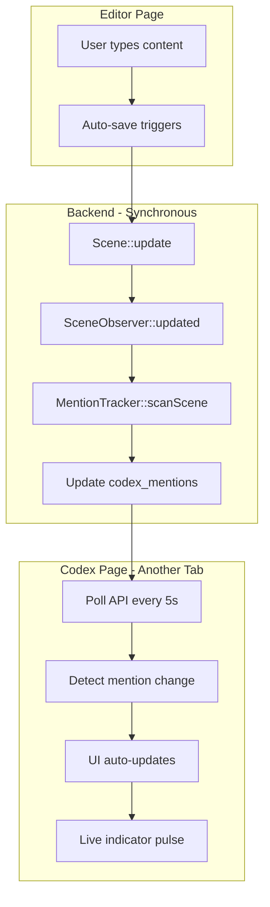

# Sprint 16: Codex v2 Enhancements - Polish and Integration

## Core Philosophy: Auto-Everything (No Manual Intervention)

Your key requirement is embedded throughout this strategy:

- **Synchronous processing** - All mention scanning runs in the same request (no queue workers)
- **Auto-scan on save** - Already implemented via `SceneObserver`, will extend to summaries and chat
- **Live UI updates** - 5-second polling already in place, will extend to new areas
- **No manual clicking** - Users never need to click "Rescan" or "Refresh"

## Current State Analysis

### Already Implemented (Sprint 13-15)

- Auto-scan mentions on scene save (synchronous via `SceneObserver`)
- MentionTracker service with full scanning logic
- Live polling in Codex Show page (5s interval)
- Tags system with filtering
- Categories with basic management
- Detail definitions with types
- Bulk create, duplicate, swap relation

### Sprint 16 Scope (15 Story Points)

- US-12.13: Categories with Tag Integration (5 pts)
- F-12.1.4: Mention Tracking in Summaries (5 pts)
- F-12.1.5: Mention Tracking in Chat (5 pts)
- Bug fixes and polish

---

## Feature 1: Categories with Tag Integration (US-12.13)

### NovelCrafter Reference

From [Codex Categories](https://www.novelcrafter.com/help/docs/codex/codex-categories):

- Categories can be linked to specific tags
- Entries with that tag automatically appear in the category
- Categories can also link to specific detail values (dropdown type only)

### Database Changes

```php
// Migration: add_tag_integration_to_codex_categories
Schema::table('codex_categories', function (Blueprint $table) {
    $table->foreignId('linked_tag_id')->nullable()->constrained('codex_tags')->nullOnDelete();
    $table->foreignId('linked_detail_definition_id')->nullable()->constrained('codex_detail_definitions')->nullOnDelete();
    $table->string('linked_detail_value')->nullable(); // For dropdown value matching
});
```

### Backend Implementation

**Update:** [`app/Models/CodexCategory.php`](app/Models/CodexCategory.php)

```php
// Add relationships
public function linkedTag(): BelongsTo
{
    return $this->belongsTo(CodexTag::class, 'linked_tag_id');
}

public function linkedDetailDefinition(): BelongsTo
{
    return $this->belongsTo(CodexDetailDefinition::class, 'linked_detail_definition_id');
}

// Get entries that auto-belong to this category
public function autoLinkedEntries(): Collection
{
    $query = CodexEntry::where('novel_id', $this->novel_id);
    
    // By tag
    if ($this->linked_tag_id) {
        $query->whereHas('tags', fn($q) => $q->where('codex_tag_id', $this->linked_tag_id));
    }
    
    // By detail value
    if ($this->linked_detail_definition_id && $this->linked_detail_value) {
        $query->whereHas('details', fn($q) => 
            $q->where('definition_id', $this->linked_detail_definition_id)
              ->where('value', $this->linked_detail_value)
        );
    }
    
    return $query->get();
}
```

**Update:** [`app/Http/Controllers/CodexCategoryController.php`](app/Http/Controllers/CodexCategoryController.php)

### Frontend Changes

**Update:** Category management modal to add:

- Tag selector dropdown ("Associate with tag")
- Detail definition selector + value selector
- Preview of entries that will auto-appear

---

## Feature 2: Mention Tracking in Summaries (F-12.1.4)

### Auto-Everything Implementation

When a scene summary is saved, mentions should auto-scan **synchronously** - just like content saves.

### Backend Implementation

**Update:** [`app/Services/Codex/MentionTracker.php`](app/Services/Codex/MentionTracker.php)

```php
/**
 * Scan scene for mentions in BOTH content and summary.
 * Called synchronously - no queue workers.
 */
public function scanScene(Scene $scene): void
{
    // Extract text from BOTH content and summary
    $contentText = $this->extractText($scene->content);
    $summaryText = $scene->summary ?? '';
    $combinedText = $contentText . ' ' . $summaryText;
    
    // Rest of scanning logic...
}
```

**Update:** [`app/Observers/SceneObserver.php`](app/Observers/SceneObserver.php)

```php
public function updated(Scene $scene): void
{
    // Scan if content OR summary changed
    if ($scene->wasChanged('content') || $scene->wasChanged('summary')) {
        $this->mentionTracker->scanScene($scene);
    }
}
```

### Database Changes

Add source tracking to mentions:

```php
// Migration: add_source_to_codex_mentions
Schema::table('codex_mentions', function (Blueprint $table) {
    $table->enum('source', ['content', 'summary', 'both'])->default('content');
});
```

**Update MentionTracker** to track where mentions are found.

---

## Feature 3: Mention Tracking in Chat (F-12.1.5)

### Auto-Everything Implementation

When chat messages are saved, scan for codex mentions **synchronously**.

### Database Changes

```php
// Check if chat_messages table exists, add mentions relationship
Schema::create('chat_message_mentions', function (Blueprint $table) {
    $table->id();
    $table->foreignId('chat_message_id')->constrained()->cascadeOnDelete();
    $table->foreignId('codex_entry_id')->constrained()->cascadeOnDelete();
    $table->integer('mention_count')->default(0);
    $table->timestamps();
    
    $table->unique(['chat_message_id', 'codex_entry_id']);
});
```

### Backend Implementation

**Create:** `app/Services/Codex/ChatMentionTracker.php`

```php
class ChatMentionTracker
{
    public function __construct(private MentionTracker $mentionTracker) {}
    
    /**
     * Scan chat message for codex mentions.
     * Runs synchronously - auto-scan on save.
     */
    public function scanMessage(ChatMessage $message): void
    {
        // Use shared mention detection logic from MentionTracker
        // Store in chat_message_mentions table
    }
}
```

**Create:** `app/Observers/ChatMessageObserver.php`

```php
class ChatMessageObserver
{
    public function created(ChatMessage $message): void
    {
        app(ChatMentionTracker::class)->scanMessage($message);
    }
    
    public function updated(ChatMessage $message): void
    {
        if ($message->wasChanged('content')) {
            app(ChatMentionTracker::class)->scanMessage($message);
        }
    }
}
```

---

## Feature 4: Live UI Enhancements

### Current Implementation

The Codex Show page already has 5-second polling:

```282:340:resources/js/pages/Codex/Show.vue
// Auto-refresh mentions polling (Sprint 13: US-12.1)
const POLL_INTERVAL = 5000; // 5 seconds
let pollTimer: ReturnType<typeof setInterval> | null = null;

const pollMentions = async () => {
    // Only reload if mentions actually changed
    if (newHash !== lastMentionHash) {
        lastMentionHash = newHash;
        router.reload({ only: ['entry'] });
    }
};
```

### Enhancements for Sprint 16

1. **Visual Feedback**: Add subtle animation when new mentions are detected
2. **Toast Notification**: Show "New mentions detected" toast on change
3. **Badge Updates**: Update mention count badges in sidebar without full reload

**Update:** [`resources/js/pages/Codex/Show.vue`](resources/js/pages/Codex/Show.vue)

```typescript
const pollMentions = async () => {
    // ...existing code...
    
    if (newHash !== lastMentionHash) {
        // Show toast notification for new mentions
        showToast('info', 'Mentions Updated', 'New mentions detected in your scenes');
        lastMentionHash = newHash;
        router.reload({ only: ['entry'] });
    }
};
```

---

## Data Flow Diagram



---

## File Changes Summary

### New Files

- `database/migrations/xxxx_add_tag_integration_to_codex_categories.php`
- `database/migrations/xxxx_add_source_to_codex_mentions.php`
- `database/migrations/xxxx_create_chat_message_mentions_table.php`
- `app/Services/Codex/ChatMentionTracker.php`
- `app/Observers/ChatMessageObserver.php`

### Modified Files

- `app/Models/CodexCategory.php` - Add tag/detail integration
- `app/Models/CodexMention.php` - Add source field
- `app/Services/Codex/MentionTracker.php` - Scan summaries
- `app/Observers/SceneObserver.php` - Trigger on summary changes
- `app/Http/Controllers/CodexCategoryController.php` - Handle linked tags/details
- `app/Providers/AppServiceProvider.php` - Register ChatMessageObserver
- `resources/js/pages/Codex/Show.vue` - Enhanced polling feedback
- `resources/js/components/codex/CategoryManager.vue` - Tag integration UI

### Test Files

- `tests/Feature/CodexTest.php` - Add category integration tests
- `tests/Unit/MentionTrackerTest.php` - Add summary scanning tests

---

## API Endpoints

### Updated Endpoints

- `PATCH /api/codex/categories/{category}` - Now accepts `linked_tag_id`, `linked_detail_definition_id`, `linked_detail_value`

### New Endpoints

- `GET /api/codex/categories/{category}/preview-entries` - Preview entries that would auto-link

---

## Testing Strategy

### Unit Tests

- `MentionTracker::scanScene` scans both content and summary
- Category auto-linking by tag works correctly
- Category auto-linking by detail value works correctly
- Chat message mention scanning works

### Feature Tests

- Scene save triggers synchronous mention scan
- Summary change triggers mention rescan
- Chat message save triggers mention scan
- Category entries auto-populate when tag assigned
- Polling detects mention changes

### Manual Testing

- Open Codex in one tab, Editor in another
- Type character name in editor
- Verify mention appears in Codex within 5 seconds
- No page refresh needed

---

## Definition of Done

- [ ] Categories can be linked to tags (entries auto-appear)
- [ ] Categories can be linked to detail definition + value
- [ ] Scene summaries are scanned for mentions
- [ ] Chat messages are scanned for mentions
- [ ] All scanning is synchronous (no queue workers)
- [ ] Live polling shows toast when mentions change
- [ ] Unit tests pass (80%+ coverage)
- [ ] Feature tests pass
- [ ] Mobile responsive
