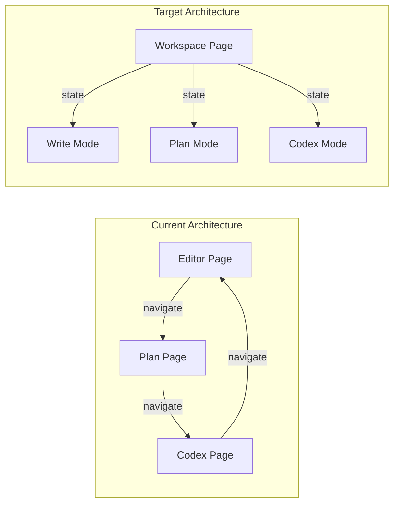

# Unified Workspace Layout - Implementation Plan

## Overview

Transform the current multi-page architecture into a single unified workspace inspired by [Novelcrafter's App Layout](https://www.novelcrafter.com/help/docs/app/app-layout). The workspace will have:

- Persistent sidebar with pinnable tools
- Mode switching (Write/Plan/Codex) without page navigation  
- Full modals for Codex entry CRUD
- All context preserved when switching modes

## Current vs Target Architecture



## Key Files to Create/Modify

### New Files

- `resources/js/pages/Workspace/Index.vue` - Main unified workspace page
- `resources/js/components/workspace/WorkspaceSidebar.vue` - Persistent sidebar with tools
- `resources/js/components/workspace/ModeNavigation.vue` - Top mode switcher (Write/Plan/Codex)
- `resources/js/components/workspace/WritePanel.vue` - Write mode main panel
- `resources/js/components/workspace/PlanPanel.vue` - Plan mode main panel  
- `resources/js/components/workspace/CodexPanel.vue` - Codex mode main panel
- `resources/js/components/codex/CodexEntryModal.vue` - Full modal for viewing/editing entries
- `resources/js/components/codex/CodexCreateModal.vue` - Modal for creating new entries
- `resources/js/composables/useWorkspaceState.ts` - Composable for workspace state management
- `app/Http/Controllers/WorkspaceController.php` - Backend controller for unified data

### Files to Modify

- [routes/web.php](routes/web.php) - Add workspace route, keep legacy routes for backwards compatibility
- [resources/js/components/editor/EditorSidebar.vue](resources/js/components/editor/EditorSidebar.vue) - Refactor into WorkspaceSidebar

## Phase 1: Backend - Unified Data Endpoint

Create `WorkspaceController.php` that returns all necessary data:

```php
// app/Http/Controllers/WorkspaceController.php
public function show(Novel $novel, ?Scene $scene = null): Response
{
    return Inertia::render('Workspace/Index', [
        'novel' => $novel->only(['id', 'title', 'series_id']),
        'chapters' => $this->getChapters($novel),
        'activeScene' => $scene ? $this->formatScene($scene) : $this->getDefaultScene($novel),
        'labels' => $novel->labels,
        'acts' => $novel->acts,
        // Codex data loaded via API on-demand to keep initial load fast
    ]);
}
```

Route structure:

```php
Route::get('novels/{novel}/workspace', [WorkspaceController::class, 'show'])->name('workspace.show');
Route::get('novels/{novel}/workspace/{scene}', [WorkspaceController::class, 'show'])->name('workspace.scene');
```

## Phase 2: Workspace State Management

Create composable to manage workspace state:

```typescript
// resources/js/composables/useWorkspaceState.ts
export function useWorkspaceState() {
    const mode = ref<'write' | 'plan' | 'codex'>('write');
    const sidebarTools = ref<Set<string>>(new Set(['scenes']));
    const pinnedTools = ref<Set<string>>(new Set());
    
    // Persist state to localStorage
    const persistState = () => { ... };
    
    return { mode, sidebarTools, pinnedTools, setMode, toggleTool, pinTool };
}
```

## Phase 3: Main Workspace Component

Structure of [Workspace/Index.vue](resources/js/pages/Workspace/Index.vue):

```
+------------------------------------------------------------------+
|  Header: Novel Title    [Write] [Plan] [Codex]     Settings Exit |
+-------------+----------------------------------------------------+
|             |                                                    |
|  SIDEBAR    |              MAIN PANEL                            |
|  (Pinnable) |              (Based on mode)                       |
|             |                                                    |
|  Scenes     |   WritePanel  - TipTap Editor                      |
|  Codex      |   PlanPanel   - Scene cards grid                   |
|  Notes      |   CodexPanel  - Entry list/grid                    |
|  AI Chat    |                                                    |
|             |                                                    |
+-------------+----------------------------------------------------+
```

Key behavior:

- Mode switching updates `mode` ref, conditionally renders panel
- Scene changes update URL via `router.push()` without full page reload
- Codex entries open in `CodexEntryModal`

## Phase 4: Sidebar Tools System

The sidebar will have expandable/collapsible tool sections:

- **Scenes** (always visible): Chapter/scene tree from current EditorSidebar
- **Codex** (toggleable): Quick access list, search, create button
- **Notes** (toggleable): Scene notes quick editor
- **AI Chat** (future): Chat interface

Each tool can be "pinned" to stay open:

```vue
<WorkspaceSidebar>
    <SidebarTool name="scenes" :pinned="pinnedTools.has('scenes')">
        <SceneTree :chapters="chapters" @select="handleSceneSelect" />
    </SidebarTool>
    <SidebarTool name="codex" :pinned="pinnedTools.has('codex')">
        <CodexQuickList :novel-id="novel.id" @select="openCodexModal" />
    </SidebarTool>
</WorkspaceSidebar>
```

## Phase 5: Mode Panels

### WritePanel

Reuse existing components:

- [TipTapEditor.vue](resources/js/components/editor/TipTapEditor.vue)
- [EditorToolbar.vue](resources/js/components/editor/EditorToolbar.vue)
- [MentionTooltip.vue](resources/js/components/editor/MentionTooltip.vue)

### PlanPanel  

Adapt from [Plan/Index.vue](resources/js/pages/Plan/Index.vue):

- Scene cards grid with drag-drop
- View switching (Grid/Matrix/Outline)
- Search and filters

### CodexPanel

Adapt from [Codex/Index.vue](resources/js/pages/Codex/Index.vue):

- Entry grid/list view
- Type and tag filters
- Click opens modal instead of navigating

## Phase 6: Codex Modal System

Full-featured modal for Codex CRUD:

```vue
<!-- CodexEntryModal.vue -->
<Modal size="full" :show="show">
    <template v-if="entry">
        <ModalHeader>
            <EntryTypeIcon :type="entry.type" />
            <h2>{{ entry.name }}</h2>
        </ModalHeader>
        <ModalBody>
            <Tabs>
                <Tab name="details">
                    <AliasManager />
                    <DetailList />
                </Tab>
                <Tab name="relations">
                    <RelationManager />
                </Tab>
                <Tab name="progressions">
                    <ProgressionManager />
                </Tab>
                <Tab name="research">
                    <ResearchTab />
                </Tab>
            </Tabs>
        </ModalBody>
    </template>
</Modal>
```

## Phase 7: URL State Sync

Keep URLs meaningful for sharing/bookmarking:

- `/novels/{id}/workspace` - Write mode, first scene
- `/novels/{id}/workspace/{sceneId}` - Write mode, specific scene
- `/novels/{id}/workspace?mode=plan` - Plan mode
- `/novels/{id}/workspace?mode=codex` - Codex mode
- `/novels/{id}/workspace?mode=codex&entry={entryId}` - Codex with modal open

Use `router.push()` with `preserveState: true` to update URL without reload.

## Phase 8: Migration Path

1. Create new Workspace page alongside existing pages
2. Add feature flag or user preference to use new layout
3. Update dashboard links to point to workspace
4. Deprecate but keep old pages working (for backwards compatibility)
5. Eventually remove old pages after user migration

## Data Flow

```mermaid
sequenceDiagram
    participant User
    participant Workspace
    participant API
    participant Laravel
    
    User->>Workspace: Load /novels/1/workspace
    Laravel->>Workspace: Initial data (novel, chapters, scene)
    
    User->>Workspace: Click "Codex" mode
    Workspace->>Workspace: setMode('codex')
    Workspace->>API: GET /api/novels/1/codex
    API->>Workspace: Codex entries (lazy loaded)
    
    User->>Workspace: Click entry "Elena"
    Workspace->>API: GET /api/codex/5
    API->>Workspace: Full entry data
    Workspace->>Workspace: Open CodexEntryModal
    
    User->>Workspace: Click "Write" mode
    Workspace->>Workspace: setMode('write')
    Note: No API call, scene data already loaded
```

## Component Hierarchy

```
Workspace/Index.vue
├── WorkspaceHeader.vue
│   └── ModeNavigation.vue
├── WorkspaceSidebar.vue
│   ├── SidebarTool (Scenes)
│   │   └── SceneTree.vue
│   ├── SidebarTool (Codex)
│   │   └── CodexQuickList.vue
│   └── SidebarTool (Notes)
├── MainPanel (conditional)
│   ├── WritePanel.vue (mode=write)
│   │   ├── EditorToolbar.vue
│   │   └── TipTapEditor.vue
│   ├── PlanPanel.vue (mode=plan)
│   │   ├── PlanViewSwitcher.vue
│   │   └── ChapterGroup.vue (reused)
│   └── CodexPanel.vue (mode=codex)
│       └── CodexEntryGrid.vue
└── Modals
    ├── CodexEntryModal.vue
    ├── CodexCreateModal.vue
    └── QuickCreateModal.vue (existing)
```

## Risks and Mitigations

- **Risk**: Large initial bundle size
  - **Mitigation**: Lazy load mode panels with `defineAsyncComponent`

- **Risk**: Complex state management
  - **Mitigation**: Use composables, keep state minimal, leverage existing API endpoints

- **Risk**: Breaking existing bookmarks
  - **Mitigation**: Keep legacy routes working with redirects

## Testing Strategy

- Unit tests for `useWorkspaceState` composable
- Feature tests for WorkspaceController
- E2E tests for mode switching and modal interactions
- Verify all existing functionality works in new layout
