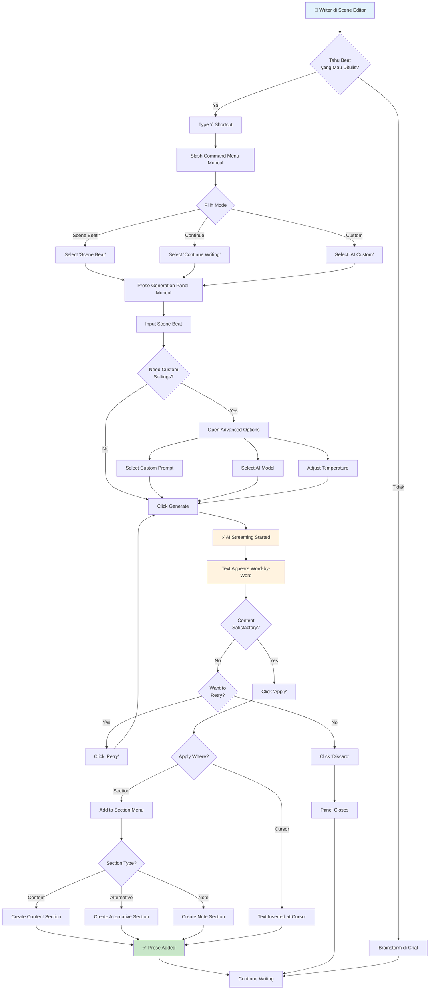

# User Journey: Prose Generation from Scene Beat

**Feature:** FG-06.2 - AI Writing Features  
**User Type:** Writer  
**Date:** 2026-01-04

---

## Journey Overview

Writer menggunakan AI untuk menggenerate prose dari scene beat atau outline, memungkinkan rapid drafting dengan AI assistance.

---

## User Journey Map



---

## Detailed Steps

### Phase 1: Initiation

#### Step 1: Open Slash Commands
**Action:** Writer types `/` in editor  
**System Response:**
- Slash command menu appears instantly
- AI commands shown at top with purple icons
- Shows: "Scene Beat", "Continue Writing", "AI Custom"

**User State:** Deciding which mode to use

---

#### Step 2: Select Generation Mode
**Action:** Writer selects mode (Scene Beat / Continue / Custom)  
**System Response:**
- ProseGenerationPanel appears at bottom-center
- Panel shows appropriate input fields for mode
- Focus set to beat textarea (for scene_beat mode)

**User State:** Ready to input beat/instructions

---

### Phase 2: Input & Configuration

#### Step 3: Input Scene Beat
**Action:** Writer types scene beat  
**Example Input:**
```
Elena discovers the hidden letter in the drawer. 
Emotional reaction - betrayal and shock.
```

**System Response:**
- Character count shows (optional)
- Generate button becomes enabled
- Additional instructions field visible

**User State:** Beat entered, ready to generate

---

#### Step 4: (Optional) Advanced Settings
**Action:** Click "Advanced options"  
**System Response:**
- Prompt selector dropdown appears
- Connection selector appears
- Model settings (if applicable)

**Options Shown:**
- **Prompts:** Default Prose Generator, Dialogue-Heavy, Action Scene
- **Connections:** OpenAI GPT-4, Anthropic Claude (user's active connections)

**User State:** Custom settings selected

---

### Phase 3: Generation

#### Step 5: Generate Prose
**Action:** Click "Generate" button (or Ctrl+Enter)  
**System Response:**
- Generate button shows loading spinner
- "Stop" button appears
- Streaming output container appears

**User State:** Waiting for AI generation

---

#### Step 6: Streaming Output
**System Behavior:**
- First chunk arrives within 2-3 seconds
- Text appears character-by-character
- Typing indicator (pulsing cursor) visible
- Can scroll if output long

**Example Output (streaming):**
```
Elena's fingers trembled as they brushed against the 
brittle paper hidden beneath the false bottom. The 
letter's edges had yellowed with age...
```

**User State:** Reading generated prose in real-time

---

### Phase 4: Decision & Action

#### Step 7A: Apply Generated Text
**Action:** Click "Apply" button  
**System Response:**
- Generated text inserted at cursor position
- Editor scroll to inserted text
- Word count updated
- Panel closes

**Result:** Prose integrated into manuscript

---

#### Step 7B: Add to Section
**Action:** Click "Section" dropdown → Select section type  
**System Response:**
- New section created with selected type
- Generated text placed in section
- Section header shows (e.g., "Alternative")
- Panel closes

**Result:** Prose added as separate section

---

#### Step 7C: Retry Generation
**Action:** Click "Retry" button  
**System Response:**
- Previous output cleared
- New generation started with same settings
- New streaming output appears

**User State:** Waiting for new generation

---

#### Step 7D: Discard Generated Text
**Action:** Click "Discard" button  
**System Response:**
- Generated text cleared
- Panel closes
- Editor focus restored

**User State:** Back to normal editing

---

## Alternative Paths

### Path A: Continue Writing Mode
**Trigger:** Writer at end of scene, unsure how to continue

```
1. Writer positions cursor at end of paragraph
2. Types '/continue'
3. ProseGenerationPanel opens in Continue mode
4. (Optional) Add guidance: "Build tension"
5. Click Generate
6. AI continues naturally from current context
7. Review → Apply or Retry
```

**Context Used:**
- Previous 2000 words before cursor
- Scene summary/beats
- Codex entries mentioned in scene
- Novel POV, genre, tense

---

### Path B: Abort During Generation
**Trigger:** Generation taking too long or wrong direction

```
1. Generation in progress
2. Writer clicks "Stop" button
3. Streaming stops immediately
4. Partial text remains
5. Can: Retry, Edit partial, or Discard
```

---

### Path C: Error Recovery
**Trigger:** AI connection fails or times out

```
1. Generation fails with error message
2. User sees: "Failed to generate prose: [reason]"
3. Options: Retry, Change connection, Close
4. Writer selects different connection
5. Clicks Retry → Generation restarts
```

---

## Success Metrics

| Metric | Target | Actual |
|--------|--------|--------|
| Time to first chunk | < 3s | TBD |
| Generation completion rate | > 90% | TBD |
| Apply rate (vs Discard) | > 70% | TBD |
| Retry rate | < 30% | TBD |

---

## Pain Points & Solutions

| Pain Point | Solution |
|------------|----------|
| Slow streaming | Optimize context size, use faster models |
| Wrong style/voice | Custom prompts, better context building |
| Network timeout | Retry logic, connection status indicator |
| Unsure what to write | Built-in mode examples, tooltips |

---

## Related Journeys

- **Text Replacement:** [Text Replacement Flow](./text-replacement-flow.md)
- **Chat Brainstorming:** [Workshop Chat Flow](../chat/brainstorming-flow.md)

---

*Last Updated: 2026-01-04*
