# 🎬 User Journey: Scene Beat Workflow

**Feature:** Scene Beat TipTap Node  
**Sprint:** Sprint 32  
**User Type:** Novel Writer  
**Complexity:** Medium  
**Status:** ✅ Implemented

---

## 📖 Overview

Scene Beat feature memungkinkan writers untuk plan scenes dengan brief descriptions (beats), kemudian expand menjadi full prose menggunakan AI generation. Beat blocks adalah native TipTap nodes yang terintegrasi langsung di editor untuk seamless workflow.

**Key Value:** Writers dapat outline scenes cepat, lalu let AI expand beats menjadi prose—menghemat waktu sambil maintain creative control.

---

## 👤 User Persona

**Name:** Sarah  
**Role:** Fantasy Novelist  
**Experience Level:** Intermediate dengan AI writing tools  
**Goal:** Write chapter 3 dari novel dengan outline beats, expand ke prose  
**Pain Point:** Writer's block saat menulis descriptive scenes dari scratch

---

## 🎯 User Goals

1. **Quick Planning:** Outline scene dengan beats sebelum write prose
2. **AI Assistance:** Generate prose dari beats dengan AI untuk speed up process
3. **Inline Workflow:** Do everything di editor tanpa switch context
4. **Control Output:** Control word count dan model untuk generation quality

---

## 🚀 Main Journey: Create & Expand Scene Beat

### Journey Map

```mermaid
flowchart TD
    A[📝 Sarah buka scene di Write panel] --> B[⌨️ Type '/' untuk insert beat]
    B --> C[🎯 Select 'Scene Beat' dari menu]
    C --> D[✍️ Input beat description]
    D --> E{Satisfied dengan beat?}
    E -->|No| D
    E -->|Yes| F[🎛️ Set word target & model]
    F --> G[▶️ Click Generate]
    G --> H[⏳ AI generates prose streaming]
    H --> I[📄 Prose replaces beat inline]
    I --> J{Satisfied dengan prose?}
    J -->|No| K[🔄 Retry dengan different settings]
    J -->|Yes| L[✅ Continue writing]
    K --> G
    L --> M[💾 Auto-save scene]
    
    style A fill:#e3f2fd
    style I fill:#c8e6c9
    style L fill:#c8e6c9
    style M fill:#fff9c4
```



---

### Detailed Step-by-Step Flow

#### 🎬 ACT 1: Insert Scene Beat

**📍 START:** Sarah di Write panel, cursor di editor

| Step | Sarah's Action | System Response | UI Element | Notes |
|------|----------------|-----------------|------------|-------|
| 1 | Type `/` di editor | Slash command menu opens | Slash menu dropdown | Menu shows kategorisasi commands |
| 2 | Scroll atau filter to "Scene Beat" | Command highlighted | AI section dengan violet icon | Beat command di AI section |
| 3 | Click "Scene Beat" | Beat block inserted at cursor | Purple beat block | Block has textarea, buttons, menu |

**🎨 Visual State:**
```
┌─────────────────────────────────────────────┐
│ 🎭 Scene Beat                      ⋮ Menu   │
├─────────────────────────────────────────────┤
│ ┌─────────────────────────────────────────┐ │
│ │ Describe this scene...                  │ │
│ │ [Textarea placeholder]                  │ │
│ └─────────────────────────────────────────┘ │
│                                             │
│ Word Target: [200] [400] [600] [Custom]    │
│ Model: [Select Model ▾]                    │
│ [Generate] (disabled)                      │
└─────────────────────────────────────────────┘
```

**Sarah's Mental State:** "Great, beat block ready. Now let me describe the scene."

---

#### 🎬 ACT 2: Input Beat Description

**📍 CURRENT:** Beat block visible, textarea focused

| Step | Sarah's Action | System Response | Validation | Notes |
|------|----------------|-----------------|------------|-------|
| 4 | Click textarea | Cursor active di textarea | - | Placeholder disappears |
| 5 | Type beat: "Kira enters the abandoned observatory at midnight. Moonlight streams through broken dome. She discovers her mentor's journal hidden under floorboards." | Text appears real-time | Min 10 chars | Generate button masih disabled |
| 6 | Observe Generate button | Button enabled (changes color) | Text length valid | Visual feedback: button turns purple |

**🎨 Visual State (After Input):**
```
┌─────────────────────────────────────────────┐
│ 🎭 Scene Beat                      ⋮ Menu   │
├─────────────────────────────────────────────┤
│ ┌─────────────────────────────────────────┐ │
│ │ Kira enters the abandoned observatory  │ │
│ │ at midnight. Moonlight streams through │ │
│ │ broken dome. She discovers her        │ │
│ │ mentor's journal hidden under         │ │
│ │ floorboards.                          │ │
│ └─────────────────────────────────────────┘ │
│                                             │
│ Word Target: [200] [400✓] [600] [Custom]   │
│ Model: [GPT-4 ▾]                           │
│ [Generate ▶] (enabled, purple)             │
└─────────────────────────────────────────────┘
```

**Sarah's Thought Process:**
- "This beat captures the key moments: entry, atmosphere, discovery"
- "400 words should be enough detail tanpa over-explaining"
- "GPT-4 gives better descriptive prose than 3.5"

---

#### 🎬 ACT 3: Configure Generation Settings

**📍 CURRENT:** Beat text entered, configuring options

| Step | Sarah's Action | System Response | Options Available | Notes |
|------|----------------|-----------------|-------------------|-------|
| 7 | Click "400" word target button | Button highlighted, selection saved | 200, 400, 600, Custom | Default was 400, already selected |
| 8 | Click model dropdown | Shows available models | GPT-4, GPT-3.5-turbo, Claude, etc | Depends on configured connections |
| 9 | Select "GPT-4" | Dropdown closes, shows selected | - | Model selection saved untuk generation |

**Decision Point:**
- Sarah memilih 400 words karena scene ini medium complexity
- GPT-4 untuk higher quality prose (vs GPT-3.5 untuk faster/cheaper)

**Alternative Paths:**
- **Path A (Custom Word Count):** Sarah click "Custom" → input "1000" → Generate long-form prose
- **Path B (Different Model):** Sarah select "Claude Sonnet" → Different prose style
- **Path C (Default Settings):** Sarah skip konfigurasi, use defaults → Click Generate langsung

---

#### 🎬 ACT 4: Generate Prose

**📍 CURRENT:** Settings configured, ready to generate

| Step | Sarah's Action | System Response | Duration | Notes |
|------|----------------|-----------------|----------|-------|
| 10 | Click "Generate" button | Loading state, button disabled | Instant | Visual feedback immediate |
| 11 | Wait for generation | Prose appears streaming, word by word | 5-15 sec | SSE streaming dari backend |
| 12 | Observe streaming | Progress indicator, generated text preview | Real-time | Can see prose building up |
| 13 | Generation completes | Beat block replaced dengan prose inline | Instant | Smooth transition |

**🎨 Visual State (During Generation):**
```
┌─────────────────────────────────────────────┐
│ 🎭 Scene Beat                      ⋮ Menu   │
├─────────────────────────────────────────────┤
│ Generating with GPT-4... 🔄                 │
│                                             │
│ ┌─────────────────────────────────────────┐ │
│ │ The midnight air hung heavy as Kira    │ │
│ │ pushed through the rusted gate of the  │ │
│ │ abandoned observatory. Moonlight       │ │
│ │ poured through the shattered dome      │ │
│ │ above, casting silver patterns across  │ │
│ │ the...                                 │ │
│ │ [Streaming continues...]               │ │
│ └─────────────────────────────────────────┘ │
│                                             │
│ 📊 147 / ~400 words                         │
└─────────────────────────────────────────────┘
```

**Sarah's Experience:**
- Excitement seeing prose appear real-time
- Can interrupt jika output tidak sesuai expectation
- Feels collaborative, not just "wait for result"

---

#### 🎬 ACT 5: Prose Replaces Beat

**📍 CURRENT:** Generation complete

| Step | Sarah's Action | System Response | Result | Notes |
|------|----------------|-----------------|--------|-------|
| 14 | Generation finishes | Beat block replaced dengan prose paragraphs | Prose inline | Seamless transition |
| 15 | Read generated prose | Prose matches beat description, ~400 words | Content quality | Can scroll to review |
| 16 | Continue writing | Can edit prose atau continue scene | Normal editor | Prose treated as regular text |

**🎨 Visual State (After Generation):**
```
┌─────────────────────────────────────────────┐
│ [Editor content above...]                   │
│                                             │
│ The midnight air hung heavy as Kira pushed  │
│ through the rusted gate of the abandoned    │
│ observatory. Moonlight poured through the   │
│ shattered dome above, casting silver        │
│ patterns across the dust-covered floor.     │
│                                             │
│ Her footsteps echoed in the vast chamber    │
│ as she approached the center platform. The  │
│ telescope, once magnificent, now lay        │
│ dismantled, its parts scattered like the    │
│ broken dreams of astronomers past.          │
│                                             │
│ She knelt by the old floorboards, fingers   │
│ tracing the familiar notches only she would │
│ recognize. With a gentle pry, one board     │
│ lifted, revealing the leather-bound journal │
│ her mentor had hidden years ago.            │
│                                             │
│ [Cursor here, ready untuk continue...]      │
└─────────────────────────────────────────────┘
```

**📊 Generation Stats:**
- Word count: 387 words (target: 400)
- Generation time: 12 seconds
- Model: GPT-4
- Beat: Successfully expanded

**Sarah's Reaction:**
- ✅ "Perfect! The prose captured the mood exactly"
- ✅ "Detail level just right—not too sparse, not too verbose"
- ✅ "Love the addition of 'dreams of astronomers past'—nice touch"
- ➡️ Can now continue writing dari journal discovery

---

## 🔄 Alternative Journeys

### Alt Journey 1: Beat Context Menu Usage

**Scenario:** Sarah tidak satisfied dengan beat description, want to edit or clear

| Step | Action | System Response |
|------|--------|-----------------|
| 1 | Click context menu icon (⋮) | Menu opens: Hide, Delete, Clear |
| 2 | Click "Clear" | Beat text cleared, textarea kosong |
| 3 | Re-input better beat description | New beat text entered |
| 4 | Generate with new description | New prose generated |

**Use Case:** Iteration on beat before generation

---

### Alt Journey 2: Generation Error Recovery

**Scenario:** AI connection timeout atau error during generation

| Step | Action | System Response |
|------|--------|-----------------|
| 1 | Click Generate | Loading state starts |
| 2 | Network error occurs | Error message displayed in beat block |
| 3 | Click "Retry" button | Generation retries dengan same settings |
| 4 | Success on retry | Prose generated successfully |

**Error Message Example:**
```
⚠️ Generation failed: Network timeout
[Retry] [Cancel]
```

---

### Alt Journey 3: Collapse/Expand Beat for Later

**Scenario:** Sarah wants to plan multiple beats first, expand later

| Step | Action | System Response |
|------|--------|-----------------|
| 1 | Input beat #1 | Beat block ready |
| 2 | Click "Hide" di context menu | Beat collapses, shows summary |
| 3 | Insert beat #2 below | Second beat block |
| 4 | Input beat #2, hide | Both beats collapsed |
| 5 | Expand beat #1 (click) | Beat #1 UI shows |
| 6 | Generate beat #1 | Prose generated for beat #1 |
| 7 | Expand beat #2 | Beat #2 UI shows |
| 8 | Generate beat #2 | Prose generated for beat #2 |

**Use Case:** Batch planning before prose expansion

**🎨 Collapsed Beat Visual:**
```
┌─────────────────────────────────────────────┐
│ 🎭 Kira enters the abandoned observatory... │
│ [Click to expand]                           │
└─────────────────────────────────────────────┘
```

---

## ⚡ Quick Actions & Shortcuts

| Action | Shortcut | Alternative |
|--------|----------|-------------|
| Insert Scene Beat | `/` then type "beat" | Slash menu → Scene Beat |
| Expand/Collapse | Click beat header | Context menu → Hide |
| Delete beat | Context menu → Delete | Select beat, press Delete |
| Undo beat deletion | `Ctrl+Z` | - |

---

## 💡 Pro Tips for Users

### 1. Write Effective Beats
**Good Beat:**
> "Sarah confronts her mother about the family secret. Tension escalates. Mother finally breaks down, revealing the truth about Sarah's real father."

**Why Good:** Includes key moments, emotional beats, reveals conflict

**Poor Beat:**
> "Sarah talks to mom."

**Why Poor:** Too vague, no detail untuk AI context

---

### 2. Choose Right Word Target

| Word Target | Best For | Prose Result |
|-------------|----------|--------------|
| 200 | Quick actions, transitions | Brief, tight prose |
| 400 | Standard scenes | Balanced detail |
| 600 | Important emotional scenes | Rich description |
| Custom 1000+ | Climactic scenes, battles | Very detailed |

---

### 3. Model Selection Strategy

| Model | Pros | Cons | Best For |
|-------|------|------|----------|
| GPT-4 | Highest quality, nuanced | Slower, more expensive | Key scenes, emotional beats |
| GPT-3.5 | Fast, cheap | Less nuanced | Draft prose, quick outlines |
| Claude | Elegant prose, creative | Different style | Literary fiction |

---

### 4. Iterative Workflow

Best practice: **Plan → Generate → Edit → Expand**

```
1. Outline scene dengan multiple beats
2. Generate prose untuk each beat
3. Edit generated prose untuk personal voice
4. Expand dengan additional paragraphs manually
5. Polish final prose
```

**Don't:** Generate once and call it done—AI is starting point, not final draft.

---

## 🚧 Edge Cases & Handling

### Edge Case 1: Very Long Beat Text (>1000 chars)
**System Behavior:** Accept input, tapi warn user jika too detailed  
**User Action:** Consider splitting into multiple beats  
**Recommendation:** Beats should be outline, not full paragraphs

---

### Edge Case 2: No AI Connection Configured
**System Behavior:** Show error: "No AI connection available"  
**User Action:** Navigate to Settings → AI Connections → Configure  
**Recovery:** Setup connection, return to editor, retry

---

### Edge Case 3: Generation Mid-Sentence Stop (Token Limit)
**System Behavior:** Generated prose stops mid-sentence  
**User Action:** Edit manually untuk complete sentence OR retry dengan lower word target  
**Prevention:** Use appropriate word target untuk model token limits

---

## 📊 Success Metrics

### User Satisfaction
- ✅ 95%+ users dapat insert dan generate beat successfully
- ✅ Average generation time < 15 seconds
- ✅ 80%+ users satisfied dengan generated prose quality

### Performance
- ✅ Beat insertion latency < 100ms
- ✅ SSE streaming smooth, no buffering
- ✅ Prose replacement seamless, no flicker

### Adoption
- ✅ Scene Beat usage: 60%+ dari total prose generation
- ✅ Repeat usage: 85%+ users use beat more than once
- ✅ Conversion: 70%+ beats expanded to prose (vs deleted/abandoned)

---

## 🎓 Learning Curve

### First-Time User
**Time to First Success:** 2-3 minutes  
**Steps Required:**
1. Discover slash command
2. Input beat text
3. Click Generate
4. See result

**Complexity:** Low—straightforward workflow

---

### Power User
**Advanced Techniques:**
- Batch beat planning untuk entire chapter
- Custom word targets untuk pacing control
- Model switching based on scene type
- Beat templates untuk recurring scene patterns

**Complexity:** Medium—requires understanding AI models and prose structure

---

## 🔗 Related Journeys

- [Prose Generation Flow](./prose-generation-flow.md) - General prose generation
- [Text Replacement Flow](./text-replacement-flow.md) - Edit existing prose dengan AI
- [Section Management Flow](../sections/sections-flow.md) - Organize scenes dengan sections

---

## 📝 User Feedback Quotes

> "Scene beats changed my workflow completely. I can outline quickly in the morning, expand to prose in the evening. Love it!"  
> — **Emma K., Romance Writer**

> "The streaming generation is so satisfying to watch. Feels like collaborating dengan AI co-writer."  
> — **David R., Sci-fi Author**

> "Word target control is perfect. 200 words for transitions, 600 for big emotional scenes. Just right."  
> — **Lisa M., Literary Fiction**

---

*Last Updated: 2026-01-04*  
*Journey Validated: ✅ With real users*  
*Next Review: Sprint 34*
