# User Journey: Text Replacement with AI

**Feature:** FG-06.2 - AI Writing Features  
**User Type:** Writer  
**Date:** 2026-01-04

---

## Journey Overview

Writer menggunakan AI untuk transform existing text (expand, rephrase, shorten) dengan preview before/after untuk quality control.

---

## User Journey Map

```mermaid
flowchart TD
    A[📝 Writer di Scene Editor] --> B[Select Text<br/>4+ words]
    
    B --> C{Selection<br/>Valid?}
    
    C -->|< 4 words| D[Warning:<br/>Select 4+ words]
    C -->|≥ 4 words| E[🎯 Replacement Menu Appears]
    
    D --> B
    
    E --> F{Choose<br/>Transformation}
    
    F -->|Expand| G[Expand Dropdown]
    F -->|Rephrase| H[Rephrase Dropdown]
    F -->|Shorten| I[Shorten Dropdown]
    
    G --> J[Select Amount:<br/>Slightly/Double/Triple]
    J --> K[Select Method:<br/>Sensory/Inner/Desc/Dialogue]
    
    H --> L[Select Option:<br/>Different Words/Show/etc]
    
    I --> M[Select Amount:<br/>Half/Quarter/Paragraph]
    
    K --> N[⚡ Preview Panel Opens]
    L --> N
    M --> N
    
    N --> O[Original Text Shown]
    O --> P[AI Streaming Started]
    P --> Q[Transformed Text Appears]
    
    Q --> R{Quality<br/>Check}
    
    R -->|Good| S[Click 'Accept']
    R -->|Bad| T{Want to<br/>Retry?}
    
    T -->|Yes| U[Click 'Retry']
    T -->|No| V[Click 'Cancel']
    
    U --> P
    V --> W[Preview Closes]
    
    S --> X[Original Text Replaced]
    X --> Y[✅ Edit Complete]
    
    W --> Z[Back to Editing]
    
    style A fill:#e3f2fd
    style E fill:#fff3e0
    style N fill:#fff3e0
    style X fill:#c8e6c9
    style Y fill:#c8e6c9
```



---

## Detailed Steps

### Phase 1: Selection & Menu

#### Step 1: Select Text
**Action:** Writer selects text with mouse/keyboard  
**Minimum:** 4 words  
**Example Selection:**
```
"She walked into the room and sat down."
```

**System Response:**
- Selection highlighting visible
- If < 4 words: No menu appears
- If ≥ 4 words: Replacement menu triggers

**User State:** Text selected, waiting for menu

---

#### Step 2: Replacement Menu Appears
**System Behavior:**
- Menu appears above selection (centered)
- Floating bubble with 3 main options
- Purple/violet accent color (AI feature)
- Has close button (X)

**Menu Options:**
- 🔼 **Expand** (with dropdown arrow)
- 🔄 **Rephrase** (with dropdown arrow)
- 🔽 **Shorten** (with dropdown arrow)

**User State:** Choosing transformation type

---

### Phase 2: Transformation Selection

#### Step 3A: Expand Options
**Action:** Click "Expand" button  
**Dropdown Shows:**

**Amount:**
- Slightly (~25-50%)
- Double ⭐ (recommended)
- Triple

**Method:**
- Add sensory details
- Add inner thoughts
- More description
- Add dialogue

**User Choice Example:** Double + Sensory details

---

#### Step 3B: Rephrase Options
**Action:** Click "Rephrase" button  
**Dropdown Shows:**
- Use different words
- Show, don't tell ⭐
- Add inner thoughts
- Convert to dialogue
- Passive to active voice
- Rephrase naturally (default)

**User Choice Example:** Show, don't tell

---

#### Step 3C: Shorten Options
**Action:** Click "Shorten" button  
**Dropdown Shows:**
- Half ⭐ (recommended)
- Quarter
- Single Paragraph

**User Choice Example:** Half

---

### Phase 3: Preview & Approval

#### Step 4: Preview Panel Opens
**System Behavior:**
- Fullscreen modal overlay (semi-transparent background)
- Two-column layout (desktop) or stacked (mobile)
- Header: "Text Replacement"

**Layout:**
```
┌─────────────────────────────────────────┐
│ Text Replacement               [✕]     │
├─────────────────────────────────────────┤
│ Original              │ Replacement     │
│ ─────────             │ ─────────       │
│ She walked into       │ ⚡ Generating... │
│ the room and sat      │                 │
│ down.                 │                 │
│                       │                 │
├─────────────────────────────────────────┤
│        [Cancel]  [Retry]  [Accept] ✓   │
└─────────────────────────────────────────┘
```

**User State:** Waiting for transformation

---

#### Step 5: Streaming Transformation
**System Behavior:**
- AI generation starts immediately
- Text streams in word-by-word
- Typing indicator (pulsing cursor) visible
- Can stop with "Stop" button

**Example Output (for "Expand + Sensory"):**
```
Original:
"She walked into the room and sat down."

Transformed (streaming):
"She hesitated at the threshold, the musty smell 
of old books filling her lungs. The hardwood floor 
creaked beneath her boots as she crossed to the 
worn leather chair and sank into its embrace."
```

**User State:** Reading transformation in real-time

---

#### Step 6: Quality Review
**User Actions:**
- Read transformed text
- Compare with original
- Decide: Accept, Retry, or Cancel

**Decision Factors:**
- ✅ Maintains original meaning?
- ✅ Matches story voice/style?
- ✅ Improves prose quality?
- ✅ Appropriate length?

---

### Phase 4: Final Action

#### Step 7A: Accept Transformation
**Action:** Click "Accept" button  
**System Response:**
- Original text replaced with transformed version
- Preview panel closes
- Selection cleared
- Editor refocused
- Word count updated

**Result:** ✅ Text successfully transformed

---

#### Step 7B: Retry Transformation
**Action:** Click "Retry" button  
**System Response:**
- Previous transformation cleared
- New generation starts with same settings
- Different output (due to AI randomness)

**Use Case:** First output wasn't quite right, try again

---

#### Step 7C: Cancel Transformation
**Action:** Click "Cancel" button  
**System Response:**
- Preview panel closes
- Original text unchanged
- Selection cleared

**Result:** No changes made

---

## Alternative Paths

### Path A: Quick Expand (No Preview Method Selection)
```
1. Select text (4+ words)
2. Replacement menu appears
3. Click "Expand" → Select "Double" (without method)
4. Preview opens with default expansion
5. Accept → Text replaced
```

**Speed:** Fastest path for common use case

---

### Path B: Custom Instructions
**Future Enhancement:**
```
1. Select text
2. Replacement menu → "More Options"
3. "Tweak and Generate" field
4. Enter: "Make it more suspenseful"
5. Generate → Preview → Accept
```

---

### Path C: Abort During Generation
```
1. Transformation in progress
2. Writer realizes wrong choice
3. Click "Stop" button
4. Generation stops
5. Can: Retry with different option, or Cancel
```

---

### Path D: Mobile Flow
```
1. Long-press to select text
2. Replacement menu appears (smaller)
3. Tap transformation option
4. Fullscreen preview (stacked layout)
5. Scroll to see original vs transformed
6. Tap "Accept"
```

**Mobile Optimizations:**
- Larger touch targets
- Simplified dropdowns
- Vertical layout for preview
- Gesture-friendly

---

## Use Case Examples

### Example 1: Expand Sparse Description
**Original:**
```
The house was old and creaky.
```

**Writer Action:** Expand → Double → Sensory details

**Result:**
```
The Victorian house loomed before her, its weathered 
clapboards groaning against the wind. Each step on 
the warped porch boards released a symphony of 
protests, echoing through the decades of neglect.
```

---

### Example 2: Show Don't Tell
**Original:**
```
She was angry at him for lying.
```

**Writer Action:** Rephrase → Show, don't tell

**Result:**
```
Her jaw clenched as his words sank in. The coffee 
mug trembled in her white-knuckled grip, and she 
set it down hard enough to slosh liquid over the rim. 
She couldn't even look at him.
```

---

### Example 3: Shorten Verbose Passage
**Original:**
```
He walked slowly and carefully across the room, 
taking his time to avoid making any sudden movements 
or sounds that might wake up the sleeping baby in 
the crib near the window.
```

**Writer Action:** Shorten → Half

**Result:**
```
He tiptoed across the room, careful not to wake 
the sleeping baby.
```

---

## Success Metrics

| Metric | Target | Actual |
|--------|--------|--------|
| Selection to preview time | < 2s | TBD |
| Transformation accept rate | > 75% | TBD |
| Retry rate | < 20% | TBD |
| Feature usage frequency | Daily | TBD |

---

## Pain Points & Solutions

| Pain Point | Solution |
|------------|----------|
| Hard to select exact text | Visual selection feedback |
| Menu blocks view | Position above selection |
| Wrong transformation choice | Easy to cancel & retry |
| Preview too small | Fullscreen modal |
| Mobile menu too small | Larger touch targets |

---

## Related Journeys

- **Prose Generation:** [Prose Generation Flow](./prose-generation-flow.md)
- **Format Menu:** (Future) AI options in bubble menu

---

*Last Updated: 2026-01-04*
