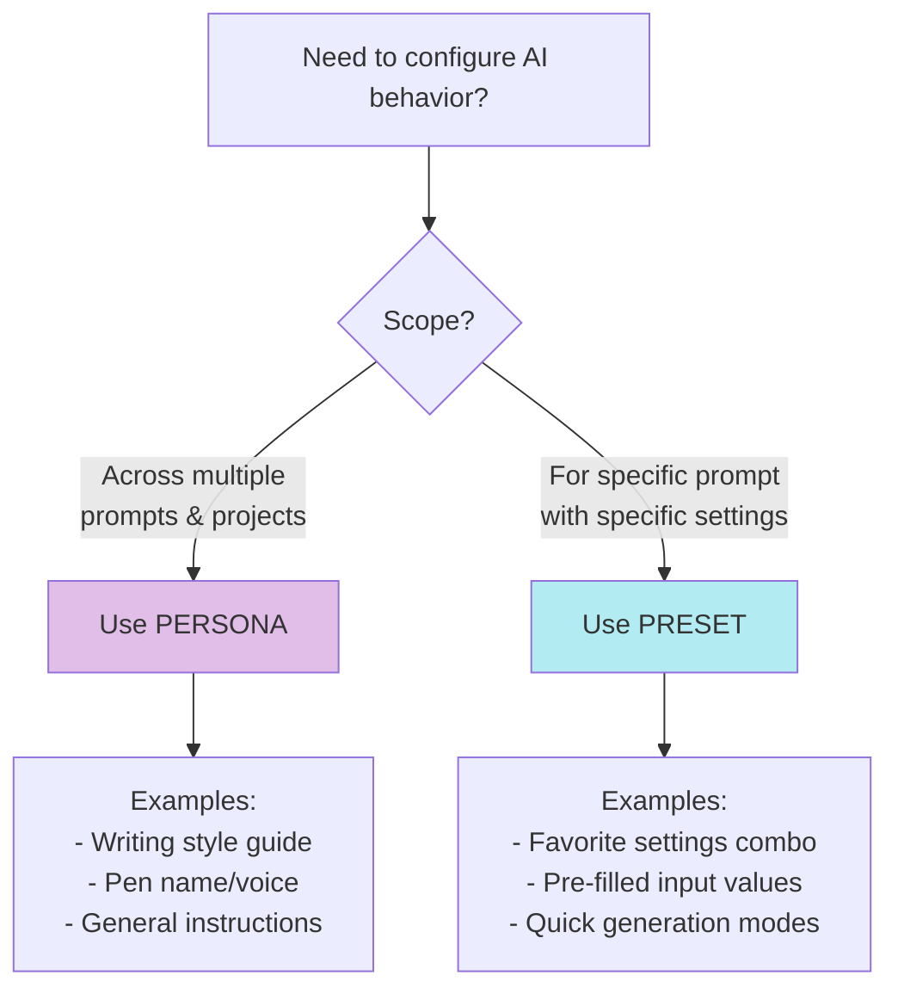

# User Journeys: Personas & Presets

**Feature:** Prompt Personas & Presets  
**Date:** 2026-01-03

---

## Journey 1: Writer Creates a Personal Writing Style Persona

### Scenario
Sarah adalah penulis yang ingin semua AI responses mengikuti gaya penulisan kasualnya across all chat prompts dan scene beat completions.

### Steps

```
📍 START: Workspace Page (/novels/{novel}/workspace)
    │
    ├─▶ Look at: Sidebar → "Prompts" Section
    │   └─ See tabs: [Prompts] [Personas]
    │
    ├─▶ Click: "Personas" tab
    │   └─ See: Empty state atau list of existing personas
    │   └─ See: "+ New Persona" button
    │
    ├─▶ Click: "+ New Persona"
    │   └─ Modal opens: PersonaEditor
    │   └─ See fields:
    │       • Name (required)
    │       • Description (optional)
    │       • System Message (required, with markdown support)
    │       • Interaction Types (checkboxes)
    │       • Project Scope info
    │       • "Set as default" toggle
    │
    ├─▶ Fill: 
    │   • Name: "My Casual Style"
    │   • Description: "Conversational writing for all prompts"
    │   • System Message: "Write in a friendly, conversational tone..."
    │
    ├─▶ Select: Interaction Types
    │   • ✓ Workshop Chat
    │   • ✓ Scene Beat Completion
    │   • ☐ Text Replacement
    │   • ☐ Scene Summarization
    │
    ├─▶ Toggle: "Set as default" = ON
    │
    ├─▶ Click: "Create Persona"
    │   └─ Loading state shown
    │   └─ API: POST /api/prompt-personas
    │   └─ Success toast: "Persona created successfully"
    │   └─ Modal closes
    │
    └─▶ Result: 
        • Persona appears in Personas list
        • Badge "Default" shown
        • Persona akan auto-apply ke chat dan prose prompts
        
✅ END: Persona created & active
```

### Key UX Elements
- **Visual Feedback:** Toast notification on success
- **Default Badge:** Clear indicator untuk default personas
- **Markdown Support:** Rich text for system messages
- **Mobile:** Full-screen modal on mobile devices

---

## Journey 2: Writer Edits Existing Persona

### Scenario
Sarah ingin update system message dari persona yang sudah dibuat.

### Steps

```
📍 START: Workspace → Personas Tab
    │
    ├─▶ See: List of personas
    │   └─ Each card shows:
    │       • Persona name
    │       • Description (if any)
    │       • Interaction type chips
    │       • Edit button (on hover)
    │
    ├─▶ Hover: Over "My Casual Style" persona card
    │   └─ Edit button (pencil icon) appears
    │
    ├─▶ Click: Edit button
    │   └─ PersonaEditor modal opens
    │   └─ All fields pre-filled with existing data
    │
    ├─▶ Modify: System Message
    │   • Update instructions...
    │   └─ "Unsaved" badge appears on modal header
    │
    ├─▶ Click: "Save Changes"
    │   └─ API: PATCH /api/prompt-personas/{id}
    │   └─ Success toast: "Persona updated successfully"
    │   └─ Modal closes
    │
    └─▶ Result: Updated persona in list

✅ END: Persona updated
```

### Edge Cases Handled
- **Unsaved Changes:** Warning modal if closing with unsaved changes
- **Archive:** Button available dalam edit modal
- **Delete:** Confirmation modal before permanent delete

---

## Journey 3: Writer Creates Prompt Preset for Quick Settings

### Scenario
John punya prompt "Character Development" yang sering digunakan dengan temperature tinggi dan specific input values. Dia ingin save konfigurasi ini sebagai preset.

### Steps

```
📍 START: Prompt Library (/prompts) atau Workspace
    │
    ├─▶ Open: Prompt "Character Development"
    │   └─ PromptModal opens
    │
    ├─▶ Navigate: To "General" tab
    │   └─ See sections:
    │       • Name & Type
    │       • Presets (if editing existing prompt)
    │       • Model Settings
    │
    ├─▶ See: "Presets" Section
    │   └─ Title: "Presets"
    │   └─ Description: "Quick-apply saved model settings..."
    │   └─ Button: "+ New Preset"
    │   └─ List: Existing presets (if any)
    │
    ├─▶ Click: "+ New Preset"
    │   └─ PresetEditor modal opens over PromptModal
    │   └─ Fields pre-filled with current prompt settings
    │
    ├─▶ Fill: Preset Details
    │   • Name: "High Creativity Setup"
    │   • Model: "gpt-4"
    │   • Temperature: 0.9
    │   • Max Tokens: 2048
    │   • Top P: 1.0
    │   • Frequency Penalty: 0.5
    │   • Presence Penalty: 0.5
    │
    ├─▶ Add: Stop Sequences
    │   • Type "END" → Click "Add"
    │   • Chip appears with X button
    │
    ├─▶ Fill: Saved Input Values (if prompt has inputs)
    │   • Character Name: "Elena"
    │   • Setting: "Medieval Fantasy"
    │   • Tone: "Dramatic"
    │
    ├─▶ Toggle: "Set as default preset" = ON
    │
    ├─▶ Click: "Create Preset"
    │   └─ API: POST /api/prompts/{promptId}/presets
    │   └─ Success toast: "Preset created successfully"
    │   └─ Modal closes
    │
    └─▶ Result: 
        • Preset appears in General tab preset list
        • Badge "Default" shown
        • Preset badge visible in Prompt Library

✅ END: Preset created & set as default
```

---

## Journey 4: Writer Applies Preset to Prompt

### Scenario
John ingin quickly apply preset "High Creativity Setup" ke prompt-nya.

### Steps

```
📍 START: Editing Prompt → General Tab
    │
    ├─▶ See: Presets Section
    │   └─ List of presets as buttons:
    │       • [High Creativity Setup] (Default badge)
    │       • [Fast Generation]
    │       • [Balanced Mode]
    │
    ├─▶ Click: "High Creativity Setup" preset button
    │   └─ Instant feedback:
    │       • Button highlighted
    │       • "Using preset: High Creativity Setup" indicator appears
    │       • Model settings auto-filled
    │
    ├─▶ Verify: Model Settings Section
    │   • Temperature: 0.9 ✓
    │   • Max Tokens: 2048 ✓
    │   • All other settings applied ✓
    │
    ├─▶ Optional: Manually change a setting
    │   • Change temperature to 0.7
    │   └─ "Using preset" indicator disappears
    │   └─ Settings remain (not re-applied)
    │
    └─▶ Result: Settings applied, ready to use

✅ END: Preset applied to prompt
```

### UX Highlights
- **Instant Apply:** No loading, immediate UI update
- **Visual Indicator:** Clear "using preset" feedback
- **Manual Override:** Changing settings clears preset indicator
- **Edit on Hover:** Pencil icon appears to edit preset

---

## Journey 5: Writer Manages Multiple Presets

### Scenario
Sarah punya beberapa presets untuk berbagai scenarios dan ingin manage them.

### Steps

```
📍 START: Prompt Editor → General Tab → Presets Section
    │
    ├─▶ See: Multiple presets
    │   • [High Creativity] (Default)
    │   • [Fast Mode]
    │   • [Balanced]
    │   • [Detailed Output]
    │
    ├─▶ Hover: Over "Fast Mode" preset
    │   └─ Edit button (pencil icon) appears
    │
    ├─▶ Click: Edit on "Fast Mode"
    │   └─ PresetEditor opens with data
    │
    ├─▶ See: Additional actions in editor
    │   • "Set as Default" button (if not default)
    │   • "Delete" button (red, bottom)
    │
    ├─▶ Action Option A: Set as Default
    │   • Click "Set as Default"
    │   • API: POST /api/prompt-presets/{id}/set-default
    │   • Success: Other presets lose default badge
    │   • This preset gets default badge
    │
    ├─▶ Action Option B: Delete Preset
    │   • Click "Delete"
    │   • Confirmation modal: "Are you sure?"
    │   • Click "Delete" to confirm
    │   • API: DELETE /api/prompt-presets/{id}
    │   • Success toast: "Preset deleted"
    │   • Preset removed from list
    │
    └─▶ Result: Presets managed successfully

✅ END: Preset management complete
```

---

## Journey 6: Persona vs Preset Decision Flow

### Scenario
User bingung kapan pakai Persona vs Preset.

### Decision Tree



### Examples

**Use PERSONA when:**
- Sarah wants all AI to know her pen name "J.K. Mystery"
- John wants consistent sci-fi tone across all chats
- Emma wants all scene completions to follow her style guide

**Use PRESET when:**
- Sarah has "Character Voice Generator" prompt → Create presets for each character
- John wants "Dialogue Generator" → "Witty Banter" preset vs "Serious Conversation" preset
- Emma wants "Plot Twist" prompt → "Subtle Hint" preset vs "Big Reveal" preset

---

## Journey 7: Mobile User Creates Persona

### Mobile-Specific Flow

```
📍 START: Mobile Workspace
    │
    ├─▶ Tap: Sidebar toggle (hamburger menu)
    │   └─ Sidebar slides in
    │
    ├─▶ Scroll: To "Prompts" section
    │   └─ Tap: "Personas" tab
    │
    ├─▶ Tap: "+ New Persona" button
    │   └─ Full-screen modal (mobile optimized)
    │   └─ All fields stack vertically
    │
    ├─▶ Fill: Form fields
    │   • Keyboard auto-appears for text inputs
    │   • Interaction types stack vertically
    │   • Large tap targets (44px minimum)
    │
    ├─▶ Scroll: To bottom
    │   └─ Sticky footer with action buttons
    │       • [Cancel] [Create Persona]
    │
    ├─▶ Tap: "Create Persona"
    │   └─ Success feedback
    │   └─ Modal closes with slide animation
    │
    └─▶ Result: Persona created on mobile

✅ END: Mobile persona creation successful
```

### Mobile UX Considerations
- **Full-Screen Modals:** Better for complex forms
- **Bottom Sheet for Presets:** Thumb-friendly on mobile
- **Vertical Stacking:** All checkboxes and fields stack
- **Large Tap Targets:** Minimum 44x44px for touch
- **Sticky Actions:** Buttons always visible at bottom

---

## Common Pain Points & Solutions

| Pain Point | Solution |
|------------|----------|
| "Too many presets cluttering the list" | Sort by usage, show max 5, "+ Show More" |
| "Forgot which persona is active" | Active personas shown in prompt preview |
| "Accidentally deleted preset" | Confirmation modal + undo toast option |
| "Don't know difference between persona/preset" | Tooltip on headers, help text, this guide |
| "Preset doesn't apply input values" | Clear indicator which fields are pre-filled |

---

## Related Documentation

- **API Reference:** [Personas & Presets API](../../04-api-reference/personas-presets.md)
- **Testing Guide:** [Personas & Presets Testing](../../06-testing/personas-presets-testing.md)
- **Sprint Documentation:** [Sprint 26: Personas & Presets](../../10-sprints/sprint-26-personas-presets.md)

---

*Last Updated: 2026-01-03*
