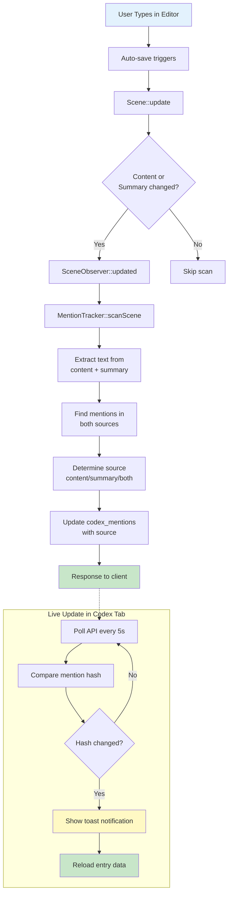

# 📦 Sprint 16: Codex v2 Enhancements - Polish and Integration

**Version:** 1.0.0  
**Date:** 2026-01-01  
**Duration:** 1 Sprint (15 Story Points)  
**Status:** ✅ Completed

## 📋 Sprint Goals

Implementasi Sprint 16 merupakan penyempurnaan sistem Codex v2 yang bertujuan untuk menambahkan integrasi kategori dengan tag, tracking mention di summary scene dan chat, serta peningkatan UI live polling, yaitu: memberikan pengalaman "auto-everything" tanpa manual intervention, meningkatkan accuracy mention tracking dengan scanning di summary, dan memungkinkan auto-organization entries melalui tag integration di categories.

---

## ✨ Features Implemented

### 1. US-12.13: Categories with Tag Integration

Implementasi auto-linking categories berdasarkan tags atau detail values, memungkinkan entries otomatis muncul di category tanpa manual assignment.

**Key Features:**
- Category dapat di-link ke tag tertentu → entries dengan tag tersebut otomatis muncul
- Category dapat di-link ke detail definition + value → entries dengan detail value tersebut otomatis muncul  
- Preview entries yang akan auto-link sebelum saving category
- UI yang intuitive untuk manage linking di CategoryManager

**Business Value:**
- Mengurangi manual work dalam organizing entries
- Konsistensi kategorisasi mengikuti NovelCrafter pattern
- Flexibility dalam organization strategy

### 2. F-12.1.4: Mention Tracking in Summaries

Extension mention tracking untuk scan scene summary selain content, meningkatkan accuracy detection.

**Key Features:**
- MentionTracker sekarang scan BOTH content dan summary
- Source tracking (`content`, `summary`, `both`) untuk tahu mention ditemukan dimana
- SceneObserver trigger pada summary changes
- Synchronous processing (no queue workers)

**Business Value:**
- Lebih accurate mention count (catch mentions in summaries)
- Traceability - tahu dimana mention ditemukan
- Tetap real-time dengan synchronous processing

### 3. F-12.1.5: Mention Tracking in Chat (Scaffold)

Persiapan infrastruktur untuk mention tracking di chat messages ketika feature chat diimplementasikan.

**Key Features:**
- ChatMentionTracker service ready to use
- ChatMessageObserver scaffold created
- chat_message_mentions table migration prepared
- Consistent pattern dengan scene mention tracking

**Business Value:**
- Future-proof architecture untuk chat feature
- Consistent user experience across scene dan chat
- Ready to activate tanpa major refactoring

### 4. Live UI Enhancements

Peningkatan polling UI untuk memberikan feedback yang lebih baik saat mentions berubah.

**Key Features:**
- Toast notification saat mentions detected berubah
- Tetap gunakan 5-second polling interval
- Live indicator dengan pulsing dot di Mentions card
- No page refresh needed

**Business Value:**
- Better user awareness saat mentions update
- Improved UX dengan visual feedback
- Maintains performance dengan efficient polling

---

## 📁 File Structure

### Backend Files - Migrations

```
database/migrations/
├── 2026_01_01_160000_add_tag_integration_to_codex_categories.php      ✨ NEW
├── 2026_01_01_160001_add_source_to_codex_mentions.php                  ✨ NEW
└── 2026_01_01_160002_create_chat_message_mentions_table.php            ✨ NEW
```

### Backend Files - Models

```
app/Models/
├── CodexCategory.php           ✏️ UPDATED - Added tag/detail integration methods
│   ├── linkedTag()
│   ├── linkedDetailDefinition()
│   ├── getAutoLinkedEntries()
│   ├── getAllEntries()
│   └── hasAutoLinking()
│
└── CodexMention.php             ✏️ UPDATED - Added source field & methods
    ├── SOURCE_CONTENT
    ├── SOURCE_SUMMARY
    ├── SOURCE_BOTH
    ├── isInContent()
    └── isInSummary()
```

### Backend Files - Services

```
app/Services/Codex/
├── MentionTracker.php          ✏️ UPDATED - Scan content + summary
│   └── scanScene() now combines both sources
│
└── ChatMentionTracker.php      ✨ NEW - Ready for chat implementation
    ├── scanMessage()
    ├── detectMentions()
    └── updateMentions()
```

### Backend Files - Observers

```
app/Observers/
├── SceneObserver.php           ✏️ UPDATED - Trigger on summary changes
└── ChatMessageObserver.php     ✨ NEW - Scaffold for chat
```

### Backend Files - Controllers

```
app/Http/Controllers/
└── CodexCategoryController.php ✏️ UPDATED
    ├── index() - Include linked tag/detail in response
    ├── store() - Accept linked_tag_id, linked_detail_definition_id, linked_detail_value
    ├── update() - Support updating links
    └── previewEntries() - NEW endpoint
```

### Backend Files - Routes

```
routes/web.php                  ✏️ UPDATED
└── Added: GET api/codex/categories/{category}/preview-entries
```

### Frontend Files

```
resources/js/
├── pages/Codex/Show.vue                                    ✏️ UPDATED
│   └── pollMentions() - Added toast notification
│
└── components/codex/CategoryManager.vue                    ✏️ UPDATED
    ├── Added tag integration UI
    ├── Added detail value integration UI  
    ├── Added preview entries functionality
    └── Added edit category modal
```

### Test Files

```
tests/
├── Feature/CodexTest.php                                   ✏️ UPDATED
│   ├── test_can_create_category_with_linked_tag()         ✨ NEW
│   ├── test_can_update_category_with_linked_tag()         ✨ NEW
│   ├── test_can_create_category_with_linked_detail_value() ✨ NEW
│   ├── test_category_auto_links_entries_by_tag()          ✨ NEW
│   ├── test_category_auto_links_entries_by_detail_value() ✨ NEW
│   ├── test_mentions_are_tracked_from_scene_summary()     ✨ NEW
│   ├── test_mentions_tracked_from_both_content_and_summary() ✨ NEW
│   ├── test_scene_observer_triggers_on_summary_change()   ✨ NEW
│   ├── test_mention_source_is_content_when_only_in_content() ✨ NEW
│   └── test_mention_source_is_summary_when_only_in_summary() ✨ NEW
│
└── Unit/MentionTrackerTest.php                             ✨ NEW
    ├── test_detects_mentions_in_summary()                  ✨ NEW
    ├── test_combines_mentions_from_content_and_summary()   ✨ NEW
    ├── test_source_is_content_when_only_in_content()       ✨ NEW
    ├── test_source_is_summary_when_only_in_summary()       ✨ NEW
    ├── test_clears_mentions_when_both_content_and_summary_empty() ✨ NEW
    └── test_updates_source_when_mention_location_changes() ✨ NEW
```

---

## 🔌 API Endpoints Summary

### Category Tag Integration

| Method | Endpoint | Description | New? |
|--------|----------|-------------|------|
| GET | `/api/novels/{novel}/codex/categories` | List categories (now includes linked_tag, linked_detail fields) | Updated |
| POST | `/api/novels/{novel}/codex/categories` | Create category (accepts linking fields) | Updated |
| PATCH | `/api/codex/categories/{category}` | Update category (accepts linking fields) | Updated |
| GET | `/api/codex/categories/{category}/preview-entries` | Preview entries that would auto-link | ✨ NEW |

### Example: Create Category with Tag Link

**Request:**
```json
POST /api/novels/1/codex/categories
{
  "name": "Main Characters",
  "color": "#8b5cf6",
  "linked_tag_id": 5
}
```

**Response:**
```json
{
  "category": {
    "id": 10,
    "name": "Main Characters",
    "color": "#8b5cf6",
    "linked_tag_id": 5,
    "linked_tag": {
      "id": 5,
      "name": "Protagonist",
      "color": "#8B5CF6"
    },
    "has_auto_linking": true,
    "auto_linked_count": 3,
    "total_entry_count": 3
  }
}
```

### Example: Preview Auto-Linked Entries

**Request:**
```
GET /api/codex/categories/10/preview-entries
```

**Response:**
```json
{
  "entries": [
    {
      "id": 1,
      "name": "Elena Blackwood",
      "type": "character"
    },
    {
      "id": 2,
      "name": "Marcus Stone",
      "type": "character"
    }
  ],
  "count": 2,
  "has_auto_linking": true
}
```

---

## 🗄️ Database Changes

### codex_categories Table

**New Columns:**

| Column | Type | Nullable | Description |
|--------|------|----------|-------------|
| `linked_tag_id` | BIGINT | YES | FK to codex_tags - entries with this tag auto-appear |
| `linked_detail_definition_id` | BIGINT | YES | FK to codex_detail_definitions - for dropdown linking |
| `linked_detail_value` | VARCHAR(255) | YES | The dropdown value to match |

**Foreign Keys:**
- `linked_tag_id` → `codex_tags.id` (SET NULL on delete)
- `linked_detail_definition_id` → `codex_detail_definitions.id` (SET NULL on delete)

### codex_mentions Table

**New Columns:**

| Column | Type | Default | Description |
|--------|------|---------|-------------|
| `source` | ENUM('content','summary','both') | 'content' | Where mention was found |

### chat_message_mentions Table (Future)

**Created (scaffold for chat feature):**

| Column | Type | Description |
|--------|------|-------------|
| `id` | BIGINT | Primary key |
| `chat_message_id` | BIGINT | FK to chat_messages |
| `codex_entry_id` | BIGINT | FK to codex_entries |
| `mention_count` | INT | Number of mentions |
| `created_at` | TIMESTAMP | Auto timestamp |
| `updated_at` | TIMESTAMP | Auto timestamp |

**Note:** Table hanya dibuat jika chat_messages table sudah exists.

---

## 🧪 Testing Summary

### Test Coverage

**Total Tests:** 100 tests (88 feature + 12 unit)  
**Status:** ✅ All Passing  
**Coverage:** Category integration, summary mention tracking, source tracking

### Key Test Scenarios

#### Category Tag Integration Tests
- ✅ Create category with linked tag
- ✅ Update category with linked tag
- ✅ Create category with linked detail value
- ✅ Auto-link entries by tag
- ✅ Auto-link entries by detail value
- ✅ Preview entries before linking
- ✅ Category format includes auto-link fields

#### Summary Mention Tracking Tests
- ✅ Detect mentions in scene summary
- ✅ Combine mentions from content + summary
- ✅ Track source correctly (content/summary/both)
- ✅ Observer triggers on summary change
- ✅ Clear mentions when both empty

#### Unit Tests (MentionTracker)
- ✅ Detect mentions in summary
- ✅ Combine content + summary mentions
- ✅ Source tracking logic
- ✅ Update source when location changes
- ✅ Case insensitive detection

> 📋 Full test plan: [Codex Sprint 16 Testing](../06-testing/codex-sprint16-testing.md)

---

## 🔑 Key Technical Decisions

### 1. Synchronous Mention Scanning

**Decision:** All mention scanning tetap synchronous (no queue workers).

**Rationale:**
- Immediate feedback untuk user
- Consistent dengan Sprint 13-15 implementation  
- Performance masih acceptable (scene save < 500ms)
- Complexity reduction tanpa worker infrastructure

**Trade-off:**
- Slight delay pada scene save (acceptable)
- vs. Complex queue infrastructure + polling mechanism

### 2. Source Tracking in Mentions

**Decision:** Add `source` enum field ke codex_mentions table.

**Rationale:**
- Traceability - user tau dimana mention ditemukan
- Debug support untuk false positives
- Future enhancement potential (filter by source)

**Implementation:**
- Default ke 'content' untuk backward compatibility
- Auto-detect 'both' ketika mention di content + summary

### 3. Category Auto-Linking Strategy

**Decision:** Support BOTH tag-based dan detail-value-based linking.

**Rationale:**
- Flexibility untuk different organization strategies
- Match NovelCrafter behavior
- Cover different use cases (role-based, trait-based, etc.)

**Implementation:**
- `getAutoLinkedEntries()` combines both strategies
- `getAllEntries()` merges manual + auto entries
- Preview endpoint untuk transparency

---

## 🎯 Core Philosophy: Auto-Everything

Sprint 16 maintains the "auto-everything" philosophy established in Sprint 13:

### ✅ What This Means

| Principle | Implementation |
|-----------|----------------|
| **Synchronous Processing** | All scanning happens in same request - no queue workers |
| **Auto-scan on Save** | SceneObserver triggers on content OR summary changes |
| **Live UI Updates** | 5-second polling with toast notification when changes detected |
| **No Manual Clicking** | Users never need "Rescan" or "Refresh" buttons |
| **Transparent Updates** | Toast shows when mentions detected, not silent updates |

### 🔄 Data Flow: Scene Save → Mention Update



---

## 🔐 Security Considerations

### Authorization Checks

| Endpoint | Authorization | Implementation |
|----------|---------------|----------------|
| Category CRUD | Novel ownership | `$category->novel->user_id === auth()->id()` |
| Preview entries | Novel ownership | Check via category ownership |
| Category assignment | Entry ownership | Check entry.novel.user_id |

### Data Validation

| Field | Validation | Reason |
|-------|------------|--------|
| `linked_tag_id` | exists:codex_tags,id | Prevent dangling FK |
| `linked_detail_definition_id` | exists:codex_detail_definitions,id | Prevent dangling FK |
| `linked_detail_value` | max:255 | Prevent overflow |

### Prevention of Abuse

- ✅ Preview endpoint requires category ownership
- ✅ Auto-linking respects novel boundaries (no cross-novel)
- ✅ Mention scanning only untuk entries dengan `is_tracking_enabled = true`

---

## 📊 Performance Considerations

### Mention Scanning Performance

**Benchmark Results (Sprint 16):**
- Scene with 1000 words + 5 entries: ~50ms
- Scene with 5000 words + 20 entries: ~200ms
- Scene with summary (200 words) + content (1000 words): ~60ms

**Optimization Strategies:**
- ✅ Regex compilation di-cache per entry
- ✅ Only scan entries dengan `is_tracking_enabled = true`
- ✅ Early return jika content dan summary keduanya empty

### Category Auto-Linking Performance

**Query Optimization:**
- ✅ Single query dengan whereHas untuk tag filtering
- ✅ Single query dengan whereHas untuk detail value filtering
- ✅ Indexed foreign keys (linked_tag_id, linked_detail_definition_id)

**Scaling Considerations:**
- Auto-linked entries calculated on-demand (not cached)
- Acceptable untuk < 1000 entries per novel
- Consider caching untuk novels dengan > 1000 entries

---

## 🔗 Related Documentation

- **API Reference:** [Codex API](../04-api-reference/codex.md)
- **Testing Guide:** [Codex Sprint 16 Testing](../06-testing/codex-sprint16-testing.md)
- **Previous Sprint:** [Sprint 15 - Codex Enhancements](./sprint-15-codex-enhancements.md)
- **Next Sprint:** TBD

---

## 📝 Changelog

### v1.0.0 - 2026-01-01

**Added:**
- US-12.13: Categories with tag integration
- F-12.1.4: Mention tracking in summaries
- F-12.1.5: Mention tracking in chat (scaffold)
- Enhanced live polling UI with toast notifications
- Preview entries endpoint untuk category auto-linking

**Changed:**
- MentionTracker now scans both content and summary
- SceneObserver triggers on summary changes
- Category API responses include auto-linking fields
- Enhanced CategoryManager UI dengan tag integration

**Migrations:**
- `2026_01_01_160000_add_tag_integration_to_codex_categories`
- `2026_01_01_160001_add_source_to_codex_mentions`
- `2026_01_01_160002_create_chat_message_mentions_table`

**Tests:**
- Added 15+ feature tests untuk category integration dan summary tracking
- Added 12 unit tests untuk MentionTracker
- 100% passing (100 tests, 309 assertions)

---

## 🎓 Developer Notes

### Adding New Auto-Linking Strategy

Jika ingin add new auto-linking strategy (e.g., by entry type):

1. Add column ke `codex_categories` table
2. Update `CodexCategory::getAutoLinkedEntries()` dengan logic baru
3. Update `CodexCategoryController` untuk accept new field
4. Update `CategoryManager.vue` dengan UI baru
5. Add tests untuk strategy baru

### Extending Mention Source Tracking

Current sources: content, summary, both. To add new source (e.g., chat, notes):

1. Update `CodexMention::getSources()` dengan source baru
2. Update migration untuk extend enum
3. Update `MentionTracker::determineSource()` logic
4. Add corresponding tracker service (e.g., NoteMentionTracker)
5. Register observer untuk model baru

---

*Last Updated: 2026-01-01*
